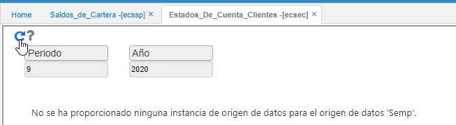
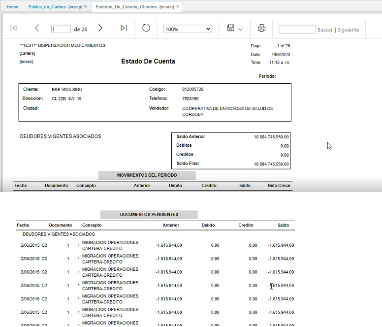

# Estados de cuenta clientes - ECSEC  

Para que los clientes puedan consultar los estados de cuenta en la aplicación ECSEC, es importante parametrizar previamente en la aplicación **Usuarios - SUSU**.  Al tercero que corresponda, se le debe entrar a asociar el NIT o cédula del cliente, tanto en el campo _Tercero_ como en el campo _Organización_.  

  

En la aplicación ECSEC los clientes pueden entrar a consultar el estado de cuenta, en donde podrán filtrar únicamente por _Periodo_ o por _Año_.  

  

El sistema muestra el Estado de cuenta:  cuál es el saldo, los movimientos del periodo y movimientos de meses anteriores.  

  

