---

layout: default
title: Formulario de Afiliados WEB
permalink: /Operacion/crm/portal/cliente/eemov
editable: si

---

# EEMOV - Formulario de Afiliados WEB

Consulta los procesos que puedes ejecutar desde EEMOV.

- [Explicación general de como usar EEMOV](http://docs.oasis.com/Operacion/crm/portal/cliente/eemov/#Explicación-general-de-como-usar-EEMOV)
- [Creación de nuevos afiliados](http://docs.oasis.com/Operacion/crm/portal/cliente/eemov/#Creación de nuevos afiliados)
- [Proceso de novedades para Régimen Subsidiado y Contributivo](http://docs.oasis.com/Operacion/crm/portal/cliente/eemov/#Proceso-de-novedades-para-Regímen-Subsidiado-y-Contributivo)
- [Proceso de translado para los Regímenes Subsidiado y Contributivo](http://docs.oasis.com/Operacion/crm/portal/cliente/eemov/#Proceso-de-translado-para-los-Regímenes-Subsidiado-y-Contributivo)
- [Proceso de portabilidad para el Régimen Subsidiado](http://docs.oasis.com/Operacion/crm/portal/cliente/eemov/#Proceso-de-portabilidad-para-el-Régimen-Subsidiado)

### [Explicación general de como usar EEMOV](http://docs.oasis.com/Operacion/crm/portal/cliente/eemov/#Explicación-general-de-como-usar-EEMOV)

La aplicación EEMOV nos permite realizar el registro de los diferentes movimientos referentes al aseguramiento de los afiliados en el sistema de información institucional. Diligenciamos los campos del formulario y damos click en _Guardar_.

**Documento:** en el campo documento, damos click en la lupa y seleccionamos el documento del movimiento que se desea generar. (FUI - formulario Único Novedad Internas, FUN – Formulario Único de Novedades, MC – Movimiento Contributivo, MS – Movimiento Subsidiado, NS – Novedad Salud).

**Número:** consecutivo asignado por el sistema al momento de guardar el registro, igualmente este número sirve para llamar un documento que se encuentre en estado ACTIVO y así poderlo editar nuevamente.  
**Concepto:** damos click en la lupa y seleccionamos el concepto por el cual se realiza el movimiento, por cada documento el sistema traerá diferentes conceptos. Ejemplo: (Documento MS Movimiento Contributivo – Concepto IN).  

**Ubicación:** seleccionamos del zoom la ubicación de donde se está llevando a cabo el movimiento.  

**Motivo:** seleccionamos del zoom el motivo correspondiente al movimiento que se genera. Los motivos también varían de acuerdo al documento y el concepto. En este ejemplo, seleccionaremos el motivo 2 (adición de beneficiario) para el documento MS con concepto IN.  

**Afiliado:** digitar o seleccionar del zoom el número de identificación del afiliado, de igual forma este campo nos brinda la opción de buscar en la Base de Datos según los criterios de búsqueda, siempre y cuando se mantenga un historial.  

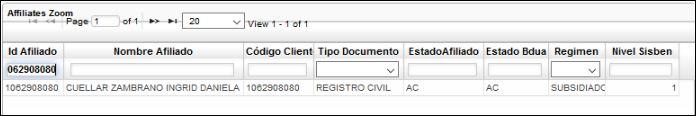

**Madre:** digitar o seleccionar del zoom el número de identificación de la madre del afiliado. Esto aplica cuando se registra un ingreso nuevo o beneficiario.  
**Beneficiarios:** digitar la cantidad de beneficiarios asociados al afiliado. El sistema solo contempla el ingreso de máximo 5 beneficiarios y de acuerdo a la cantidad ingresada, el sistema arroja los campos para ingresar los datos de cada beneficiario.  

Diligenciados todos los campos requeridos, damos click en el botón _Guardar_ y el sistema arrojará un mensaje de control indicando el número de consecutivo asignado al movimiento.  

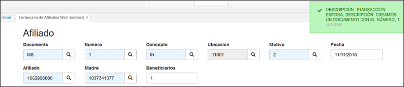  

* Descripción de los botones del formulario **EEMOV**  

  

1.	Nuevo: se agrega o crea un nuevo registro de Afiliado.  

2.	Al dar click en _Guardar_, la aplicación arrojará un formulario, en donde inicialmente seleccionaremos del zoom la condición del usuario que se registra y activaremos el flag para las declaraciones y autorizaciones según aplique.   

3.	Elimina detalle: realiza el borrado únicamente del detalle del afiliado.  

4.	Agregar beneficiario: despliega la venta donde solo edita cantidad.  

5.	Eliminar beneficiario: realiza el borrado de la cantidad de beneficiarios.   

6.	Imprime Encuesta, previa parametrizacion de EENC.  

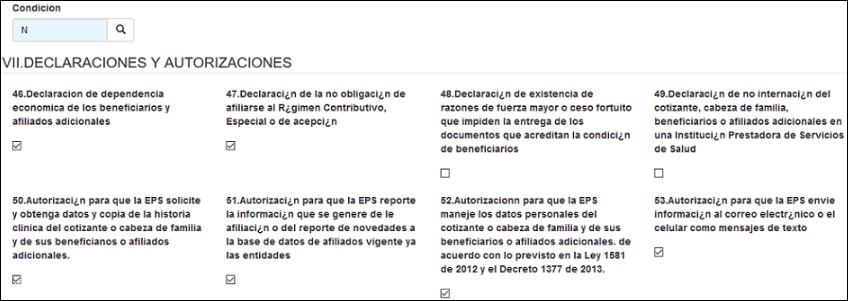

Seguidamente se encuentran los anexos, en donde digitaremos el número 1 en el campo del documento que se haya recibido por parte del afiliado, este campo se verá con una **X** en el formulario cuando se genere, también activaremos los flag de los demás anexos recibidos por parte del afiliado según se requieran.  

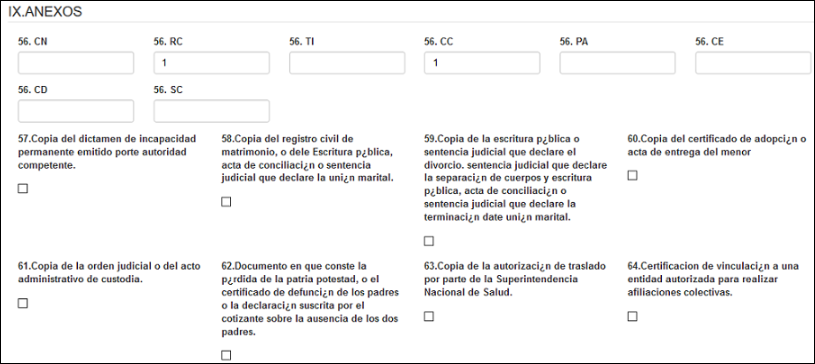

A continuación, se encuentran los campos para ingresar los datos del beneficiario.  

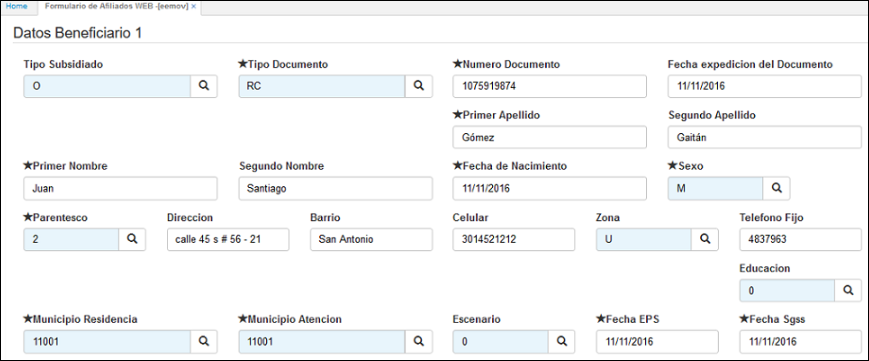

**Tipo subsidiado:** seleccionamos del zoom el tipo de subsidiado que es el beneficiario: Cabeza (Cotizante), Otro (Beneficiario).  

Diligenciados todos los datos del beneficiario, damos click en el botón 
_Guardar_.

A continuación adjuntamos los documentos: formulario único, copia del documento de identificación y encuesta del sisben. Estos documentos son de carácter obligatorio de acuerdo a la parametrización realizada en la aplicación [**BMOT – Motivos**](http://docs.oasiscom.com/Operacion/common/bsistema/bmot#parametrización-anexos-eemov) para el documento MS, concepto IN y motivo 2. (_Ver aplicación_)  

Damos click en el botón _Adjuntar_, elegimos la ruta donde se encuentran los soportes digitales del afiliado por norma y se proceden a cargar al sistema.  

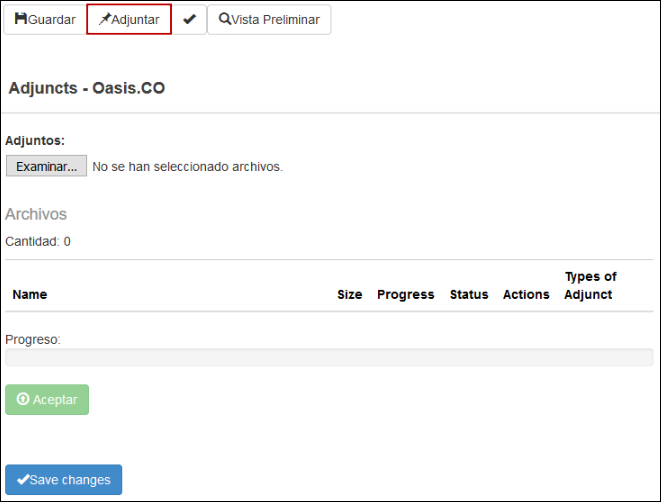

Seleccionamos de la ruta los documentos a cargar y asignamos el tipo de adjunto.  

Para cargar los documentos adjuntos damos click en el botón _Aceptar_.

Finalmente, para confirmar el cargue de los soportes damos click en el botón _Save changes_ (Guardar cambios).  

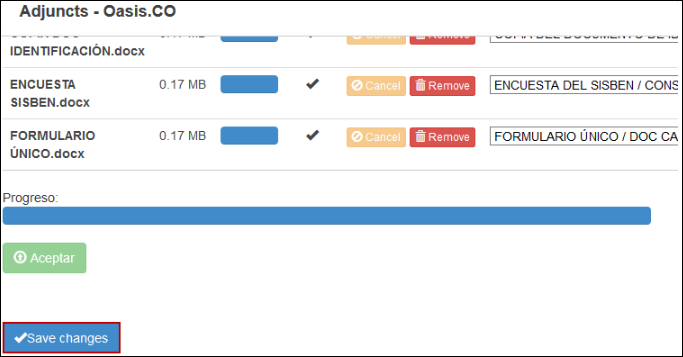

Al quedar cargados los documentos, estos se visualizarán de la siguiente manera:  

Cargados correctamente los documentos digitales, procesamos el formulario dando click en el botón  y a continuación, el sistema arrojará un mensaje indicando que la transacción fue exitosa.  

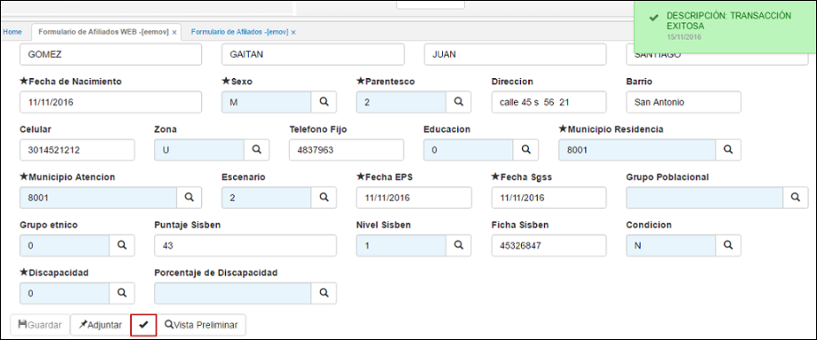

Los Movimientos de cada registro figuran en el Sistema de información OASISCOM en estado _Procesado_ y _No Reportado_, este estado le permite al responsable de los reportes de los archivos exportar los registros grabados en el sistema para su debido proceso ante el FOSYGA.  

Para confirmar el registro del movimiento realizado anteriormente, ingresamos a la aplicación [**EMOV – Formulario de Afiliados**](http://docs.oasiscom.com/Operacion/is/salud/eafiliacion/movafi/emov#confirmar-registro-generado-en-eemov) y filtramos por documento, consecutivo, ubicación y concepto. Allí verificamos que el registro se encuentre en estado procesado. (_Ver aplicación_)

Cuando un registro presenta algún inconveniente en sus datos, el responsable de los reportes de los archivos puede realizar una reversión de estado para hacer la modificación necesaria en la aplicación [**EBAF - Afiliados**](http://docs.oasiscom.com/Operacion/is/salud/eafiliacion/movafi/ebaf).

La aplicación EEMOV nos permite realizar el registro de los diferentes movimientos referentes al aseguramiento de los afiliados en el sistema de información institucional para los regímenes Subsidiado y Contributivo, aplicación en la cual se pueden realizar creación de nuevos afiliados, novedades y traslados para cada régimen.

A continuación, se explica el proceso para la creación de nuevos afiliados tanto para el Régimen Subsidiado como el Contributivo. 

Consulta los procedimientos que puedes ejecutar desde EEMOV

### [Creación de nuevos afiliados](http://docs.oasiscom.com/Operacion/crm/portal/cliente/eemov/#Creación-de-nuevos-afiliados)
Para la creación de nuevos afiliados se debe ingresar a la aplicación EEMOV y realizar un nuevo registro diligenciando cada uno de los campos como se indica a continuación:

	

**Documento:** En el campo documento, damos clic en la lupa y seleccionamos el documento del movimiento que se desea generar (FUN – Formulario Único de Novedades, 
MC – Movimiento Contributivo, MS – Movimiento Subsidiado, NS – Novedad Salud).

- Si se va a registrar un afiliado del Régimen Contributivo se debe seleccionar el                                    documento MC.
- Si se va a registrar un afiliado del Régimen Subsidiado se debe seleccionar el                                      documento MS.

**Número:** consecutivo asignado por el sistema al momento de guardar el registro, igualmente este número sirve para llamar un documento que se encuentre en estado ACTIVO y así poderlo editar nuevamente.

**Concepto:** se debe dar clic en la lupa y seleccionamos el concepto por el cual se realiza el movimiento, por cada documento el sistema traerá diferentes conceptos.

Para el caso de la creación de nuevos afiliados, para ambos documentos, se selecciona la opción IN.

**Ubicación:** seleccionamos del zoom la ubicación de donde se está llevando a cabo el movimiento.

**Motivo:** seleccionamos del zoom el motivo correspondiente al movimiento que se genera. Los motivos también varían de acuerdo con el documento y el concepto. En este ejemplo, seleccionaremos el motivo 2 (adición de beneficiario) para el documento MS con concepto IN.

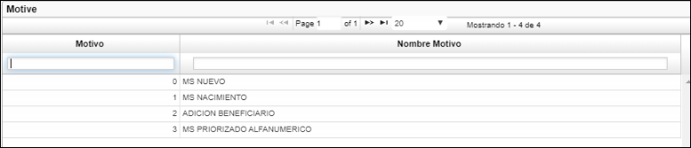

**Afiliado:** Seleccionamos del zoom el número de identificación del afiliado. De igual forma este campo nos brinda la opción de buscar en la Base de Datos según los criterios de búsqueda en el caso de que el usuario no se encuentre registrado allí, siempre y cuando se mantenga un historial.

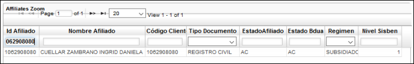

**Madre:** digitar o seleccionar del zoom el número de identificación de la madre del afiliado. Esto aplica cuando se registra un ingreso nuevo o beneficiario.

**Beneficiarios:** digitar la cantidad de beneficiarios asociados al afiliado. El sistema solo contempla el ingreso de máximo 5 beneficiarios.

Diligenciados todos los campos requeridos, damos clic en el botón Guardar y el sistema arrojará un mensaje de control indicando el número de consecutivo asignado al movimiento.

Inmediatamente luego de Guardar, se habilitan unos campos para ingresar los datos del usuario. Algunos campos del formulario cambian dependiendo del tipo de documento que haya sido ingresado.

Los campos que aparecen con el asterisco (*) se deben diligenciar obligatoriamente, al momento de dar clic el sistema valida. Los campos que aparecen resaltados en color azul tienen un filtro de consulta el cual se habilita dando doble clic.

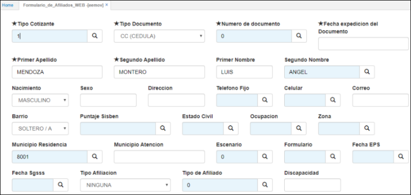

Inmediatamente después del formulario se encuentra el subtítulo **Vll. Declaraciones y autorizaciones.** Al poner el cursor sobre el recuadro de cada número aparece una leyenda y se selecciona según corresponda.

A continuación, aparece el subtítulo **IX. Anexos.** En los recuadros con espacio para diligenciar se debe indicar la cantidad de cada documento que se está anexando y en los demás recuadros, de acuerdo con la leyenda, se debe marcar según corresponda.

Dependiendo de la cantidad de beneficiarios que haya sido ingresada inicialmente, el sistema arroja un formulario para ingresar los datos por cada beneficiario.

Diligenciados todos los datos del beneficiario, damos clic en el botón Guardar.

A continuación, adjuntamos los documentos: formulario único, copia del documento de identificación y encuesta del Sisbén. Estos documentos son de carácter obligatorio de acuerdo a la parametrización realizada en la aplicación **BMOT – Motivos** para el documento MS, concepto IN y motivo 2. 

Damos clic en el botón Adjuntar, elegimos la ruta donde se encuentran los soportes digitales del afiliado por norma y se proceden a cargar al sistema.

Seleccionamos de la ruta los documentos a cargar y asignamos el tipo de adjunto.

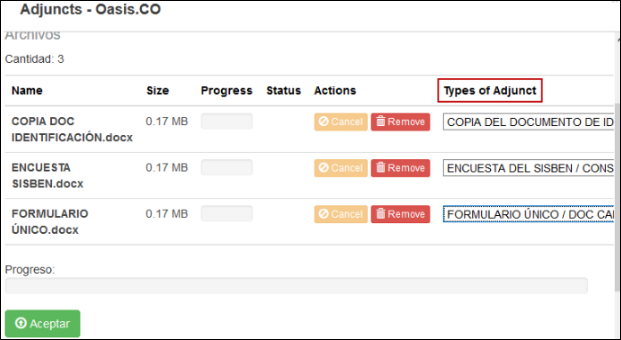

Para cargar los documentos adjuntos damos clic en el botón Aceptar.

Finalmente, para confirmar el cargue de los soportes damos clic en el botón Save changes (Guardar cambios).

Al quedar cargados los documentos, estos se visualizarán de la siguiente manera:

Cargados correctamente los documentos digitales, procesamos el formulario dando clic en el check y a continuación, el sistema arrojará un mensaje indicando que la transacción fue exitosa.

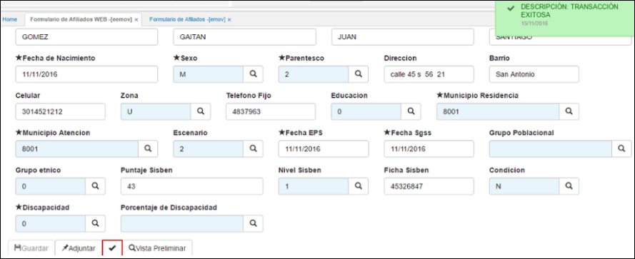

Los Movimientos de cada registro figuran en el Sistema de información OASISCOM en estado Procesado y No Reportado, este estado le permite al responsable de los reportes de los archivos exportar los registros grabados en el sistema para su debido proceso ante el FOSYGA.

Para confirmar el registro del movimiento realizado anteriormente, ingresamos a la aplicación **EMOV – Formulario de Afiliados** y filtramos por documento, consecutivo, ubicación y concepto. Allí verificamos que el registro se encuentre en estado procesado.

### [Proceso de novedades para Régimen Subsidiado y Contributivo](http://docs.oasis.com/operacion/crm/portal/cliente/eemov/#Proceso-de-novedades-para-Regímen-Subsidiado-y-Contributivo)

Para realizar novedades en ambos regímenes se debe ingresar a la aplicación EEMOV.
En este caso surgen dos opciones, la primera es para realizar una novedad para un único concepto y la segunda es para realizar múltiples novedades.

**Para realizar una novedad para un único concepto se debe realizar lo siguiente:**

**Documento:** en este campo, de las opciones que se despliegan al dar clic en la lupa, se debe seleccionar el documento NS-Novedad Salud.

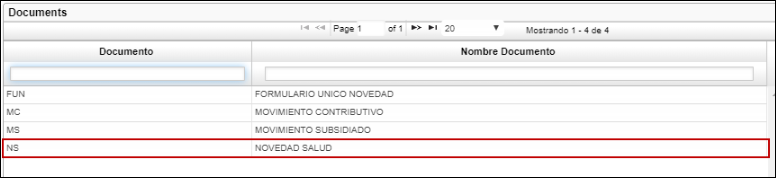

**Número:** consecutivo asignado por el sistema al momento de guardar el registro, igualmente este número sirve para llamar un documento que se encuentre en estado ACTIVO y así poderlo editar nuevamente.

**Concepto:** se debe dar clic en la lupa y seleccionar el concepto específico por el cual se realiza la novedad. Es importante tener en cuenta que los conceptos que inician por “n” son los que se pueden reportar. En este campo se despliegan las siguientes opciones:

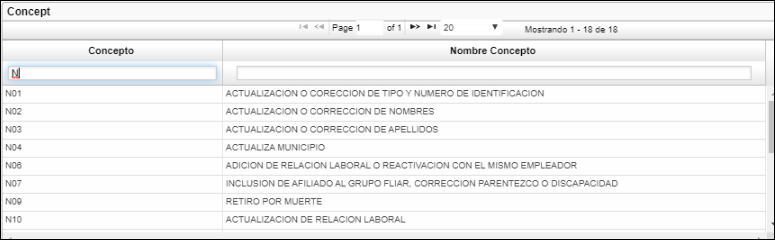

**Ubicación:** seleccionamos del zoom la ubicación de donde se está llevando a cabo el movimiento.

**Motivo:** en este campo el sistema arroja una opción dependiendo del concepto que haya sido seleccionado anteriormente, por ejemplo, si en el concepto se seleccionó la opción **N03-Actualización o corrección de apellidos,** el motivo que aparecerá será el siguiente:

Afiliado: se debe seleccionar el número de identificación del afiliado al cual se le realizará la novedad.

Diligenciados todos los campos requeridos, se debe dar clic en el botón Guardar y el sistema arrojará un mensaje de control indicando el número de consecutivo asignado al movimiento. 

Así mismo, se habilitan dos campos donde se puede realizar la acción que fue escogida en el concepto **N03 - Actualización o corrección de apellidos,** como se muestra a continuación:

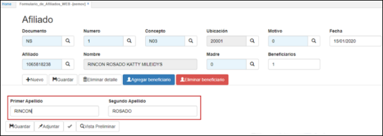

En los campos que se habilitan se debe realizar el cambio correspondiente, luego se da clic en Guardar, por ejemplo:

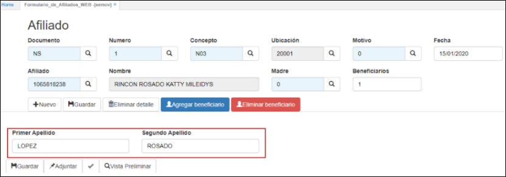

Con el cambio realizado se debe dar clic en guardar y el sistema arroja un mensaje indicando que la transacción realizada ha sido exitosa:

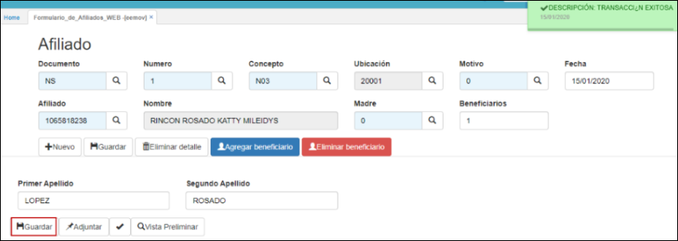

Después de que los cambios han sido guardados con éxito, nos dirigimos a la aplicación **EMOV- Formulario de Afiliados** para verificar que el cambio también aparezca allí. En esta aplicación se debe filtrar por documento NS y la fecha en la cual se realizó el cambio.

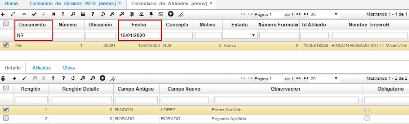

En la parte del detalle se puede verificar por cada renglón el campo antiguo (dato antes del cambio) y el cambio nuevo (luego de realizar el cambio):

A continuación, se procede a realizar la descarga de archivos en la aplicación **BINT,** diligenciando los campos de la siguiente manera:

**Publication:** se debe seleccionar el archivo #67 NS si el proceso corresponde al Régimen Subsidiado o archivo #57 si el proceso corresponde al Régimen Contributivo.

**Operation:** se escoge la opción Download (descargar).

**Fecha Final:** se diligencia la fecha hasta donde se desea que el sistema tome los datos (los datos son tomados a partir de la fecha que se diligencia y las fechas anteriores a esta), utilizando el formato día/mes/año, separado por un slash.

**Proceso Pre plano (P) Final (F):** en este campo se tiene la opción de diligenciar las letras “P” o “F” en mayúscula, al diligenciar la “P” el sistema descarga un archivo Pre-plano que permite verificar la información antes de enviar el archivo final a la entidad ADRES. Con la letra “F” el sistema descarga el archivo final para ser enviado.

Al completar los campos se da clic en *Accept* (Aceptar).

Al diligenciar la letra “P” se descarga el archivo Pre-Plano, para verificar que los datos contenidos en el archivo sean correctos.

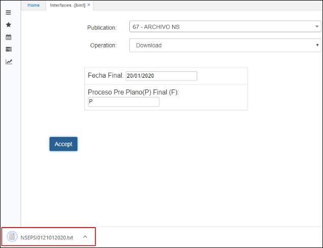

Al verificar los datos contenidos en el archivo, digitamos la letra “F” para realizar la descarga final, el cual descarga el mismo archivo del Pre-Plano, a diferencia que este genera unos cambios en la aplicación EMOV cambiando el status a *Reportado.*

**Para realizar múltiples novedades se debe realizar lo siguiente:**

**Documento:** en este campo, de las opciones que se despliegan al dar clic en la lupa, se debe seleccionar el documento FUN – Formulario Único Novedad.

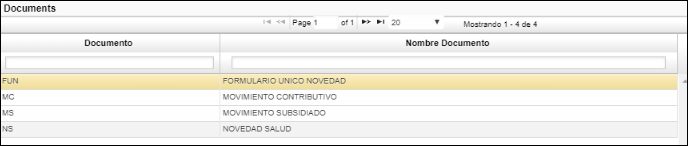

**Número:** consecutivo asignado por el sistema al momento de guardar el registro, igualmente este número sirve para llamar un documento que se encuentre en estado ACTIVO y así poderlo editar nuevamente.

**Concepto:** se debe dar clic en la lupa y seleccionar en la opción GEN- GENERALES.

**Ubicación:** seleccionamos del zoom la ubicación de donde se está llevando a cabo el movimiento.

**Motivo:** en este campo seleccionamos la opción que el sistema arroja: GENERALES EXTERNAS.

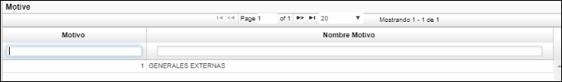

Afiliado: se debe seleccionar el número de identificación del afiliado al cual se le realizarán las novedades.

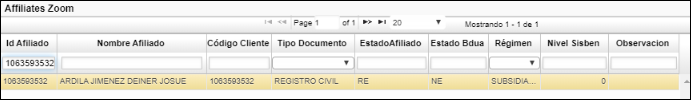

Diligenciados todos los campos requeridos, se debe dar clic en el botón *Guardar* y el sistema arrojará un mensaje de control indicando el número de consecutivo asignado al movimiento. 

Inmediatamente al dar clic en *Guardar* el sistema arroja un formulario con los datos del usuario.

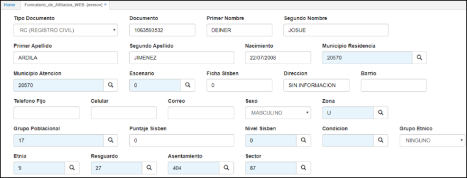

En los campos se procede a realizar los cambios y/o actualizaciones según las novedades:

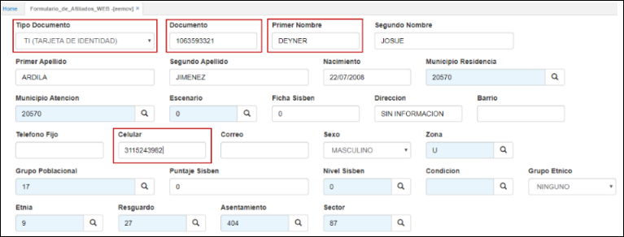

Al momento de finalizar los cambios y/o actualizaciones en los datos del usuario se procede a dar clic en *Guardar* y el sistema arroja un mensaje indicando que la transacción realizada ha sido exitosa.

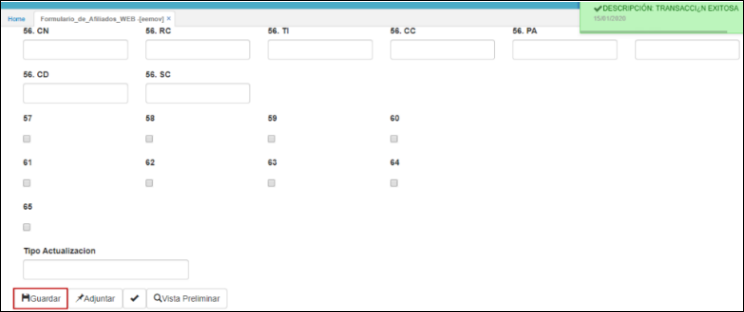

Después de que los cambios han sido guardados con éxito, nos dirigimos a la aplicación **EMOV- Formulario de Afiliados** para verificar que el cambio también aparezca allí. En esta aplicación se debe filtrar por documento FUN y la fecha en la cual se realizó el cambio.

En la parte del detalle se puede verificar por cada renglón el campo antiguo (dato antes del cambio) y el cambio nuevo (luego de realizar el cambio):

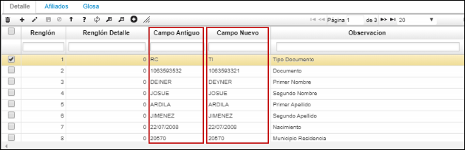

A continuación, se procede a realizar la descarga de archivos en la aplicación **BINT,** diligenciando los campos de la siguiente manera:

**Publication:** se debe seleccionar el archivo #67 NS si el proceso corresponde al Régimen Subsidiado o archivo #57 si el proceso corresponde al Régimen Contributivo.

**Operation:** se escoge la opción Download (descargar).

**Fecha Final:** se diligencia la fecha hasta donde se desea que el sistema tome los datos (los datos son tomados a partir de la fecha que se diligencia y las fechas anteriores a esta), utilizando el formato día/mes/año, separado por un slash.

**Proceso Pre plano (P) Final (F):** en este campo se tiene la opción de diligenciar las letras “P” o “F” en mayúscula, al diligenciar la “P” el sistema descarga un archivo Pre-plano que permite verificar la información antes de enviar el archivo final a la entidad ADRES. Con la letra “F” el sistema descarga el archivo final para ser enviado.

Al completar los campos se da clic en *Accept* (Aceptar).

Al diligenciar la letra “P” se descarga el archivo Pre-Plano, el cual permite verificar que los datos contenidos en el archivo sean correctos.

Al verificar los datos contenidos en el archivo, digitamos la letra “F” para realizar la descarga final del archivo, el cual descarga el mismo archivo del Pre-Plano, pero a diferencia, este genera unos cambios en la aplicación EMOV cambiando el status a *Reportado*.

### [Proceso de traslado para los Regímenes Subsidiado y Contributivo](http://docs.oasis.com/operacion/crm/portal/cliente/eemov/#Proceso-de-traslado-para-los-Regímenes-Subsidiado-y-Contributivo)

Para realizar el proceso de traslados se debe ingresar a la aplicación EEMOV y realizar un nuevo registro diligenciando cada uno de los campos como se indica a continuación:

**Documento:** En el campo documento, damos clic en la lupa y seleccionamos el documento del movimiento que se desea generar (FUN – Formulario Único de Novedades, MC – Movimiento Contributivo, MS – Movimiento Subsidiado, NS – Novedad Salud).
Si se va a realizar un traslado del Régimen Contributivo se debe seleccionar el documento MC.
Si se va a realizar un traslado del Régimen Subsidiado se debe seleccionar el documento MS.

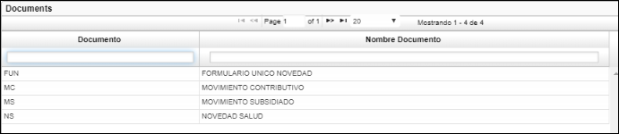

**Número:** consecutivo asignado por el sistema al momento de guardar el registro, igualmente este número sirve para llamar un documento que se encuentre en estado ACTIVO y así poderlo editar nuevamente.

**Concepto:** se debe dar clic en la lupa y seleccionamos el concepto por el cual se realiza el movimiento, por cada documento el sistema traerá diferentes conceptos.

Para el caso del proceso de traslado de afiliados, para ambos documentos (subsidiado y Contributivo), se selecciona la opción TR.

**Ubicación:** seleccionamos del zoom la ubicación de donde se está llevando a cabo el movimiento.

**Motivo:** seleccionamos del zoom el motivo correspondiente al movimiento que se genera. Los motivos también varían de acuerdo con el documento y el concepto. Las opciones que se muestran en la siguiente imagen corresponden al documento MS.

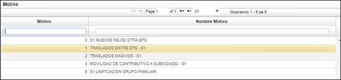

**Afiliado:** Seleccionamos del zoom el número de identificación del afiliado. De igual forma este campo nos brinda la opción de buscar en la Base de Datos según los criterios de búsqueda en el caso de que el usuario no se encuentre registrado allí, siempre y cuando se mantenga un historial.

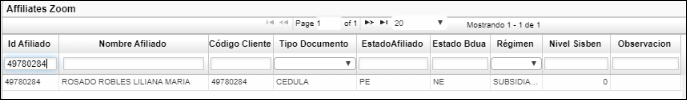

**Beneficiarios:** digitar la cantidad de beneficiarios asociados al afiliado. El sistema solo contempla el ingreso de máximo 5 beneficiarios.

Diligenciados todos los campos requeridos, damos clic en el botón *Guardar* y el sistema arrojará un mensaje de control indicando el número de consecutivo asignado al movimiento.

Luego de Guardar, se habilitan unos campos para ingresar los datos del usuario. Algunos campos del formulario cambian dependiendo del tipo de documento que haya sido ingresado.
Los campos que aparecen con el asterisco (*) se deben diligenciar obligatoriamente, al momento de dar clic el sistema valida. Los campos que aparecen resaltados en color azul tienen un filtro de consulta el cual se habilita dando doble clic.

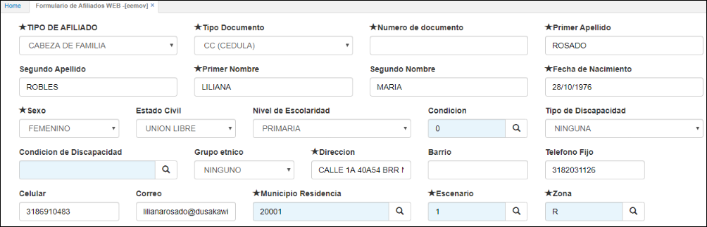

Inmediatamente después del formulario se encuentra el subtítulo **Vll. Declaraciones y autorizaciones.** Al poner el cursor sobre el recuadro de cada número aparece una leyenda y se selecciona según corresponda.

A continuación, aparece el subtítulo **IX. Anexos.** En los recuadros con espacio para diligenciar se debe indicar la cantidad de cada documento que se está anexando y en los demás recuadros, de acuerdo con la leyenda, se debe marcar según corresponda.

Dependiendo de la cantidad de beneficiarios que haya sido ingresada inicialmente, el sistema arroja un formulario para ingresar los datos por cada beneficiario.

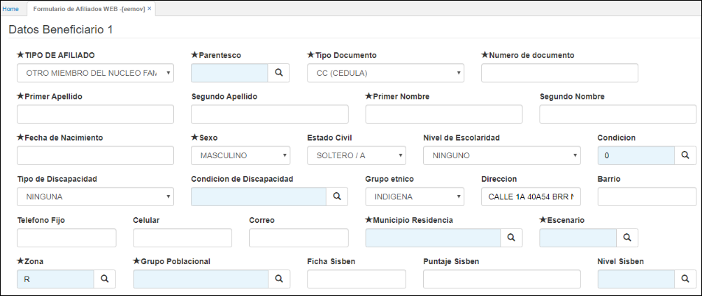

Diligenciados todos los datos del beneficiario, damos clic en el botón *Guardar*.

Nota: En caso de que el proceso de traslado requiera adjuntar archivos, el sistema tiene la opción para hacer este procedimiento:

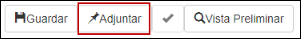

### [Proceso de portabilidad para el Régimen Subsidiado](http://docs.oasis.com/operacion/crm/portal/cliente/eemov/#Proceso-de-portabilidad-para-el-Régimen-Subsidiado)

En la aplicación EESON, se registran las solicitudes que realizan los afiliados para cambiar la IPS de atención entre ciudades. Para registrar una nueva solicitud, diligenciamos los campos del formulario y damos clic en el botón *guardar*.

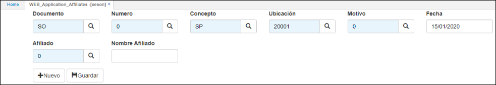

Documento: en el campo documento, damos clic en la lupa y seleccionamos SO – Solicitud Afiliado.

**Número:** consecutivo asignado por el sistema al momento de guardar el registro.

**Concepto:** damos clic en la lupa y seleccionamos el concepto por el cual se realiza la solicitud, SP – Portabilidad.

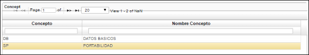

**Ubicación:** seleccionamos del zoom la ubicación de donde se está llevando a cabo la solicitud.

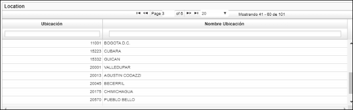

**Motivo:** seleccionamos del zoom el motivo correspondiente a la solicitud que se genera.

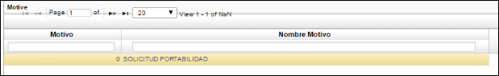

**Afiliado:** digitar o seleccionar del zoom el número de identificación del afiliado. Se debe validar en los campos *Estado Afiliado y Estado BDUA* que el afiliado se encuentre activo.

Diligenciados todos los campos requeridos, damos clic en el botón *guardar* y el sistema arrojará un mensaje de control indicando el número de consecutivo asignado a la solicitud, a su vez, desplegará un formulario para diligenciar todos los datos correspondientes al aportante.

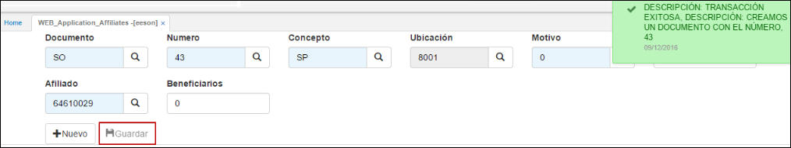

A continuación, procedemos a diligenciar el formulario.

Los nombres del afiliado los arrojará el sistema automáticamente.

**Tipo de medio:** dar clic en la lupa y seleccionar del zoom el tipo de medio por el cual se recibió la solicitud de portabilidad.

**Fecha de ingreso de portabilidad:** seleccionar del calendario la fecha desde la cual iniciará la portabilidad.

**Tiempo de emigración en meses:** tiempo en meses el cual el afiliado estará en portabilidad.

**Tiempo de emigración en días:** si el afiliado se encontrará en portabilidad por ejemplo 2 meses y 15 días, se digitarán los 15 días en este campo, si son meses completos dejar en blanco.

**Sabe el tiempo:** si el afiliado conoce el tiempo el cual se encontrará en portabilidad digitar el número 1, de no conocerlo digitar el número 0 y dejar en blanco los dos campos inmediatamente anteriores.

**Municipio receptor:** digitar o dar clic en la lupa y seleccionar del zoom el código del municipio en el cual será atendido el afiliado.

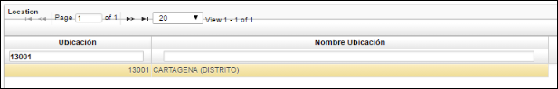

**Dirección de emigración:** digitar la dirección en la cual atenderán al afiliado
**Barrio de emigración:** indicar el barrio en el cual atenderán al afiliado.
**Celular:** número de celular del afiliado.
**Teléfono fijo:** número fijo del afiliado
**Correo:** correo electrónico del afiliado.
**Escenario receptor:** dar clic en la lupa y seleccionar la IPS en la cual atenderán al afiliado en el municipio receptor.

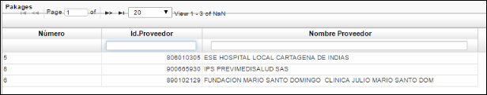

**Portabilidad:** siempre se deberá digitar el número 1, puesto que, esto activará en la aplicación EBAF – Afiliados el flag del campo *portabilidad.*

Diligenciado el formulario en su totalidad, damos clic en el botón *guardar* y el sistema arrojará un mensaje confirmando el registro.

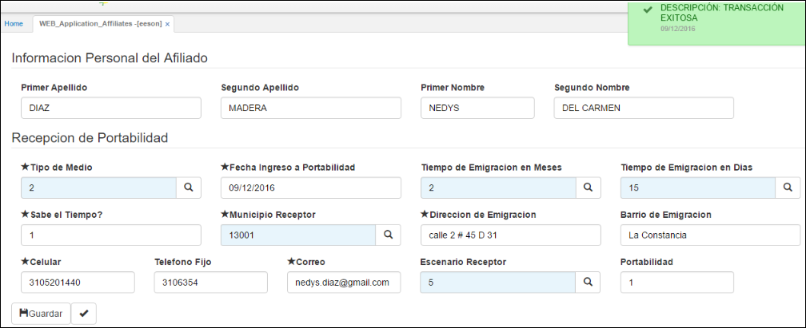

Ahora se debe procesar la solicitud dando clic en el botón. 

Luego, se debe ingresar a la aplicación ESON – Solicitud Afiliados a verificar el registro y que se encuentre en estado procesado, consultamos por número de consecutivo.

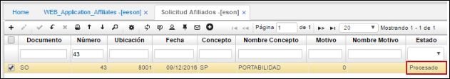

Ahora ingresamos a la aplicación EBAF – Afiliados a verificar que se haya activado el campo *portabilidad* y que en la pestaña *movimientos* se visualice la solicitud. Consultamos por número de identificación del afiliado.

