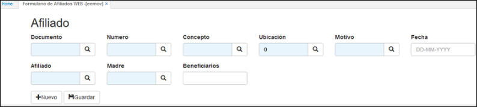
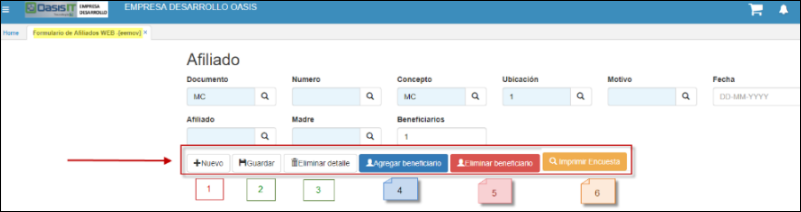

# EEMOV - Formulario de Afiliados WEB

La aplicación EEMOV nos permite realizar el registro de los diferentes movimientos referentes al aseguramiento de los afiliados en el sistema de información institucional. Diligenciamos los campos del formulario y damos click en _Guardar_.

**Documento:** en el campo documento, damos click en la lupa y seleccionamos el documento del movimiento que se desea generar. (FUI - formulario Único Novedad Internas, FUN – Formulario Único de Novedades, MC – Movimiento Contributivo, MS – Movimiento Subsidiado, NS – Novedad Salud).

**Número:** consecutivo asignado por el sistema al momento de guardar el registro, igualmente este número sirve para llamar un documento que se encuentre en estado ACTIVO y así poderlo editar nuevamente.  
**Concepto:** damos click en la lupa y seleccionamos el concepto por el cual se realiza el movimiento, por cada documento el sistema traerá diferentes conceptos. Ejemplo: (Documento MS Movimiento Contributivo – Concepto IN).  

**Ubicación:** seleccionamos del zoom la ubicación de donde se está llevando a cabo el movimiento.  

**Motivo:** seleccionamos del zoom el motivo correspondiente al movimiento que se genera. Los motivos también varían de acuerdo al documento y el concepto. En este ejemplo, seleccionaremos el motivo 2 (adición de beneficiario) para el documento MS con concepto IN.  

**Afiliado:** digitar o seleccionar del zoom el número de identificación del afiliado, de igual forma este campo nos brinda la opción de buscar en la Base de Datos según los criterios de búsqueda, siempre y cuando se mantenga un historial.  

**Madre:** digitar o seleccionar del zoom el número de identificación de la madre del afiliado. Esto aplica cuando se registra un ingreso nuevo o beneficiario.  
**Beneficiarios:** digitar la cantidad de beneficiarios asociados al afiliado. El sistema solo contempla el ingreso de máximo 5 beneficiarios y de acuerdo a la cantidad ingresada, el sistema arroja los campos para ingresar los datos de cada beneficiario.  

Diligenciados todos los campos requeridos, damos click en el botón _Guardar_ y el sistema arrojará un mensaje de control indicando el número de consecutivo asignado al movimiento.  

Al dar click en _Guardar_, la aplicación arrojará un formulario, en donde inicialmente seleccionaremos del zoom la condición del usuario que se registra y activaremos el flag para las declaraciones y autorizaciones según aplique.  

Seguidamente se encuentran los anexos, en donde digitaremos el número 1 en el campo del documento que se haya recibido por parte del afiliado, este campo se verá con una **X** en el formulario cuando se genere, también activaremos los flag de los demás anexos recibidos por parte del afiliado según se requieran.  

A continuación, se encuentran los campos para ingresar los datos del beneficiario.  

**Tipo subsidiado:** seleccionamos del zoom el tipo de subsidiado que es el beneficiario: Cabeza (Cotizante), Otro (Beneficiario).  

Diligenciados todos los datos del beneficiario, damos click en el botón 
_Guardar_.

A continuación, adjuntamos los documentos: formulario único, copia del documento de identificación y encuesta del sisben. Estos documentos son de carácter obligatorio de acuerdo a la parametrización realizada en la aplicación [**BMOT – Motivos**](http://docs.oasiscom.com/Operacion/common/bsistema/bmot#parametrización-anexos-EEMOV) para el documento MS, concepto IN y motivo 2.  

