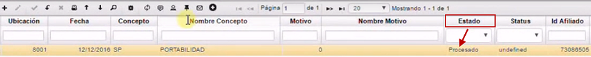

# Solicitud de Portabilidad - EESON

La aplicación EESON permite realizar una Solicitud de Portabilidad a un afiliado.  Para este proceso, se debe llenar un formulario.  

El primer campo que encontramos es _Documento_.  En este, se selecciona la opción _**SO**_, que hace referencia a _Solicitud de Afiliado_.  
El campo _Número_ se diligencia automáticamente.  
En el campo _Concepto_, se selecciona la opción _**SP**_ de _Solicitud de Portabilidad_.  
En el campo _Ubicación_, se abre el Zoom y se coloca la ubicación que corresponda.  
En el campo _Motivo_, se elige la opción 0 (cero).  
En el campo _Fecha_, la fecha de la solicitud.  
En el campo _Afiliado_, el afiliado correspondiente.  Es importante tener en cuenta que debe estar en estado _Activo_ en los campos _EstadoAfiliado_ y _Estado Bdua_.  

Diligenciados estos campos, se guarda el registro.  

  

En este momento, el sistema genera otro formulario llamado _Recepción de portabilidad_.  Algunos campos se diligencian de manera automática.  

El primer campo es _Tipo de medio_, en este se selecciona el tipo de medio por el que se recibió la solicitud.  
Se dilencia la _Fecha de ingreso_ a la portabilidad.  
El _Tiempo de emigración en días_.  
El siguiente campo _Sabe el tiempo?_.  Si se conoce el tiempo por el campo anterior, en este se diligencia el número 1.  Si no se conoce, se diligencia el número 0 (cero).  
En el campo _Municipio receptor_, se busca por el Zoom.  
_Dirección de Emigración_.  
_Barrio de emigración_.  
Datos personales como _Teléfono celular_, _Teléfono fijo_, _Correo electrónico_.  
En el campo _Escenario receptor_, selecciono en el Zoom el escenario que corresponda.  Cabe resaltar que los escenarios cambian dependiendo del municipio.  
Para finalizar, se encuentra el campo _Portabilidad_.  Aquí se debe diligenciar el número 1, que hace referencia a que el afiliado sí está en Portabilidad.  

Se guarda el registro.  

Ahora, se ingresa a la aplicación **Afiliados - EBAF**.  Se filtra por el número de documento del afiliado y se busca el campo _Portabilidad_, el cual no se encuentra activo, pero se activará una vez se procese el formulario en la aplicación **EESON**.  

  

Después de procesar, se valida el estado de la solicitud de portabilidad.  Para esto, se ingresa a la aplicación **Solicitud Afiliados - ESON**.  Se filtra por el número de la solicitud y se busca el campo _Estado_ para asegurarse que se encuentre como _Procesado_.   

  

Finalmente, se valida que en la aplicación **Afiliados - EBAF**, el campo de _Portabilidad_ esté activo.  Validado este campo, se termina el proceso de Solicitud de Portabilidad.  

  

