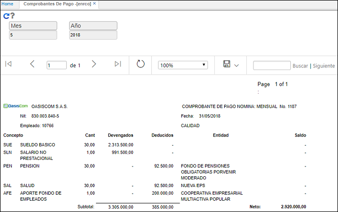
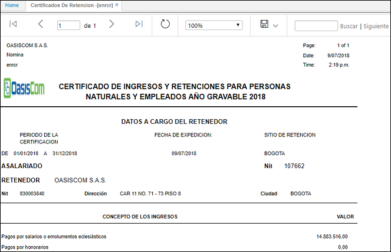
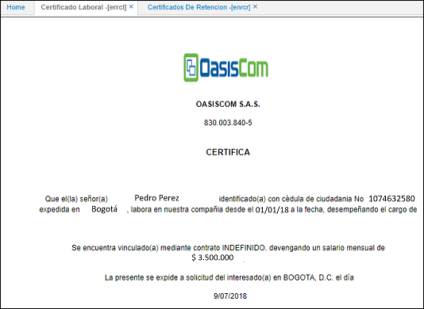

# EMPLEADOS

El portal de empleados consta de 3 aplicaciones en donde el usuario que inició sesión puede ver únicamente su información correspondiente a comprobante de pago, certificación de retención y certificado laboral, para poder consultas estas aplicaciones se debe crear un rol que se llame Portal de Empleados y otorgarle a los empleados permisos a estas aplicaciones, así mismo en el SUSU - Usuario se debe tener asociada la cédula a la persona que corresponde (campo tercero), esto con el fin que sólo se pueda ver la información del usuario que se logea:

**ENRCO - Comprobante de pago:** Se deben registrar los parámetros de periodo (mes) y año del cual se requiere consultar el comprobante d epago.

**ENRCR - Certificado de Retención:** Se debe registrar el filtro de fecha y año del cual se requiere consultar el certificado de retención.

**ERRCL - Certificado Laboral:** Al ingresar a la aplicación el sistema arroja el certificado laboral con la información del usuario previamente parametrizada en el módulo de nómina y recursos humanos.

