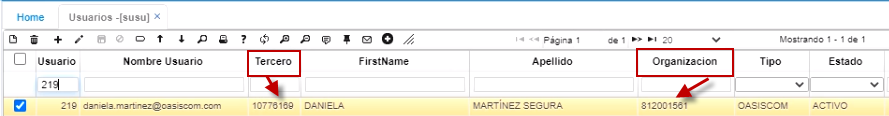
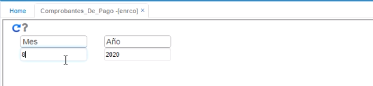
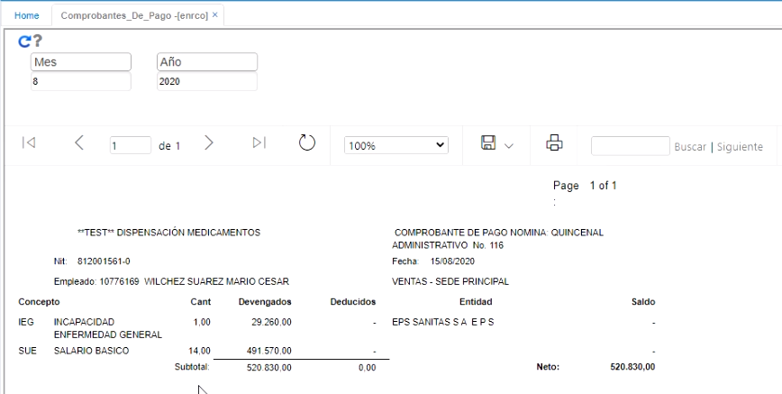

# Comprobantes de pago - ENRCO  

Para que los empleados puedan consultar sus comprobantes de pago en la aplicación ENRCO, es importante parametrizar previamente en la aplicación **Usuarios - SUSU**, en el campo _Tercero_, la cédula del empleado y en el campo _Organización_, el NIT de la organización a la cual pertenece.  

  

En esta ventana, el empleado puede consultar el comprobante de nómina del mes que requiera.  Tenga en cuenta que lo importante es que ya se haya generado la nómina que se quiere consultar.  

  

Aquí se puede consultar el comprobante de nómina con sus respectivos conceptos.  

   

