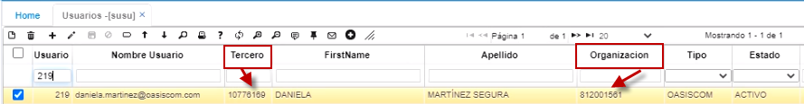
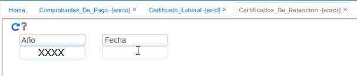
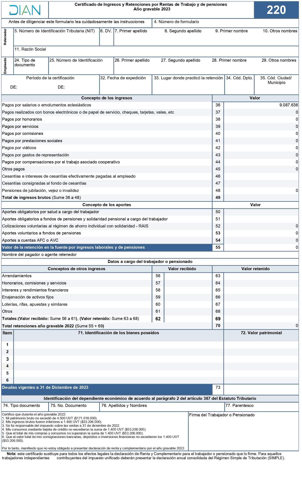

# Certificados de retención - ENRCR  

Para que los empleados puedan consultar sus certificados de retención en la aplicación ENRCR, es importante parametrizar previamente en la aplicación **Usuarios - SUSU**, en el campo _Tercero_, la cédula del empleado y en el campo _Organización_, el NIT de la organización a la cual pertenece.  

  

En esta aplicación, se debe registrar el filtro de fecha y año del cual se requiere consultar el certificado de retención.  

  

Aquí el empleado puede ver su correspondiente certificado de retención.  

