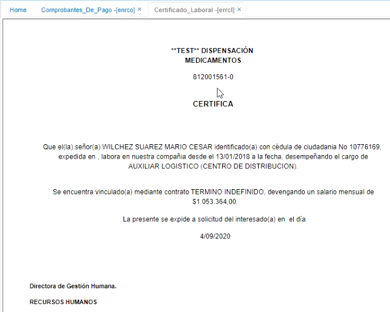

# Certificado laboral - ERRCL  

Para que los empleados puedan consultar su certificado laboral en la aplicación ERRCL, es importante parametrizar previamente en la aplicación **Usuarios - SUSU**, en el campo _Tercero_, la cédula del empleado y en el campo _Organización_, el NIT de la organización a la cual pertenece.  

  

En esta aplicación, el empleado puede ver su Certificado laboral con los respectivos datos: Entidad que emite el certificado, nombre, cédula, fecha en la que ingresó, cargo, tipo de contrato, salario.  Tenga en cuenta que esta información debe estar previamente parametrizada en el módulo de nómina y recursos humanos.  

