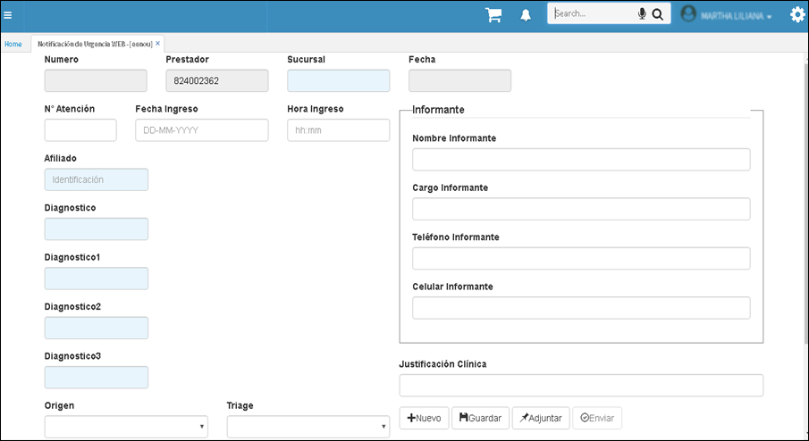
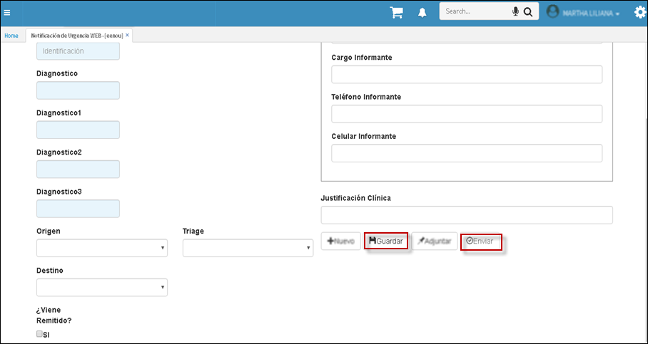

# EENOU - Aplicación de Notificación de Urgencias

En la aplicación **EENOU** se registran las urgencias de los pacientes. El prestador del servicio debe reistrar todas las notificaciones de urgencia, donde se debe especificar datos básicos del afiliado y  motivo de la urgencia. 

Luego de diligenciar los campos en su totalidad, es importante que se guarde la solicitud luego enviar, para que su solicitud quede guardada en el sistema.

