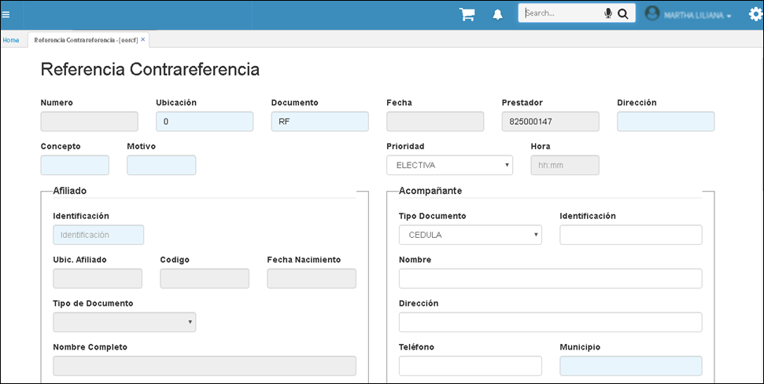

---
layout: default
title: Proveedores
permalink: /Operacion/crm/portal/proveedor/eercf
editable: si
---

# EERCF - Aplicación de Solicitud de Referencia

La aplicación de Referencia Contrareferencia es con el fin de, que los prestadores de servicio o IPS digiten el ingreso de pacientes, seguimiento y si se requiere solicitudes de traslado de los mismos. 

**Importante** diligenciar todos los datos y adjuntar los soportes necesarios para realizar el debido proceso.



Para verificar las solicitudes de Referencia Contrareferencia diligenciadas y enviadas, podrán ser consultadas en la aplicación [**EERCR**](http://docs.oasiscom.com/Operacion/crm/portal/proveedor/eercr).

