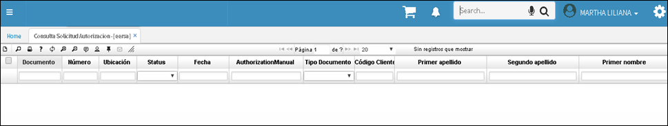
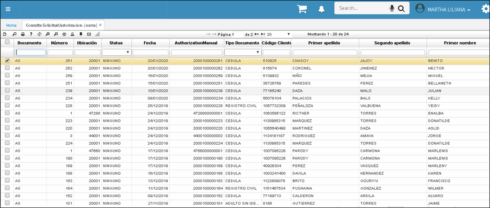

# EERSA - Aplicación Consulta de Solicitud de Autorizaciones

El prestador de servicios o externo (IPS - Hospital) puede consultar con el número de identificación del afiliado en la aplicación **EERSA – Consulta Solicitud Autorización,** si ya se le ha generado la autorización del servicio e imprimirla de ser necesario.

Para generar una Solicitud de Afiliaciones debe ir a la aplicación [**EESOA - Solicitud de Autorizaciones Hospitalarias**](http://docs.oasiscom.com/Operacion/crm/portal/proveedor/eesoa)

Si se requiere imprimir el documento, clic en vista preliminar. Esta opción permite guardar la autorización generada por la *EPS.* 

