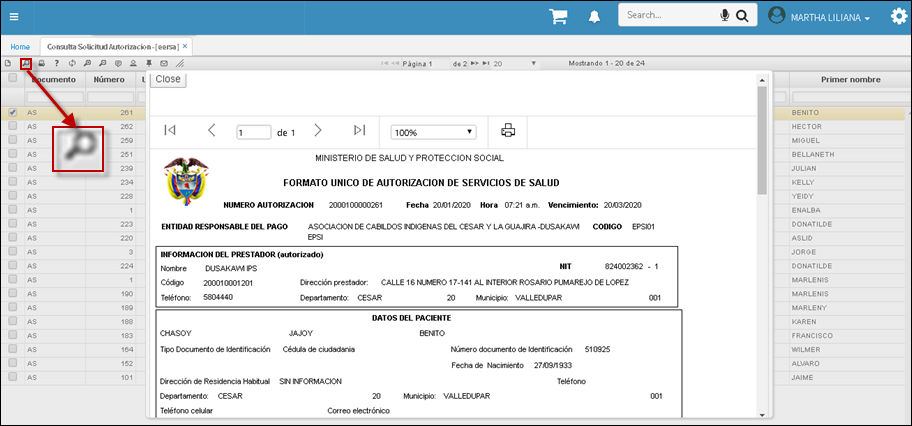

# EERSA - Aplicación Consulta de Solicitud de Autorizaciones

Por medio de la aplicación **EERSA** podemos visualizar, descarga e imprimir todas las autorizaciones generadas en la aplicación [**EESOA - Solicitud de Autorizaciones Hospitalarias**](http://docs.oasiscom.com/Operacion/crm/portal/proveedor/eesoa)

Si se requiere imprimir el documento, clic en vista preliminar. Esta opción permite guardar la autorización generada por la *EPS.* 

