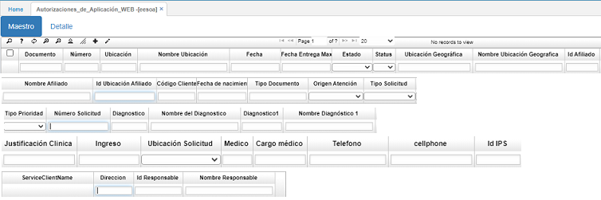
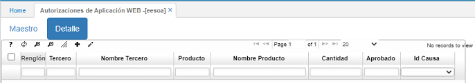
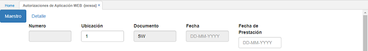
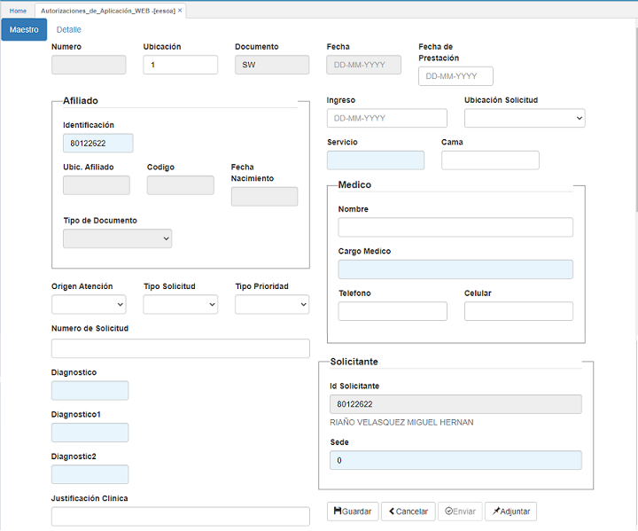
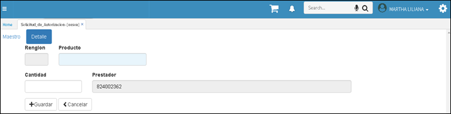

---

layout: default
title: Solicitud de Autorizaciones Hospitalarias
permalink: /Operacion/crm/portal/proveedor/eesoa
editable: si

---

# Solicitud de Autorizaciones Hospitalarias - EESOA

En esta aplicación, se registran todos los servicios que presta la *IPS* y que requieren de autorización por parte de la *EPS*. **Importante** diligenciar todos los campos que incluya la pestaña *Maestro y Detalle*, de lo contrario, quedaría incompleta la solicitud. 

  

Para diligenciar el formulario en el maestro, se adiciona un nuevo registro (+).  

El primer campo que aparece es el campo _Número_. Este campo está de color gris, por tal razón no se puede editar.  Al guardar, el sistema diligencia el campo automáticamente.  
El siguiente, es el campo _Ubicación_.  En este campo, se selecciona la IPS que está realizando la solicitud.  
El campo _Documento_, tampoco se puede editar.  Este campo también se diligencia automáticamente con el documento correspondiente a la autorización que para este caso es _**SW**_.  
En el campo _Fecha_, se diligencia la fecha en la que se realiza la solicitud.  
En el campo _Fecha de prestación_ se coloca una posible fecha en la que se prestaría el servicio.  

  

A continuación, se encuentra un formulario con los datos del afiliado.  El únicoa campo que se puede diligenciar es el de _Identificación_.  Este campo cuenta con un Zoom.  Se debe tener en cuenta que cada afiliado debe estar parametrizado en la aplicación [**Terceros - BTER**](http://docs.oasiscom.com/Operacion/common/btercer/bter).  Los demás campos, se diligencian automáticamente al guardar la solicitud.  
Los tres campos siguientes a la información del afiliado, funcionan con un menú desplegable.  En el primer campo _Origen atención_, se selecciona la opción correspondiente al orgien por el cual fue atendido el afiliado.  En el segundo campo _Tipo atención_, se selecciona la que corresponda del menú de opciones.  En el campo _Tipo prioridad_, se selecciona la prioridad de la autorización solicitada.  

El siguiente campo es _Número de solicitud_.  Este campo no necesita parametrización previa.  La IPS determina cuál es.  
El siguiente es el campo _Diagnóstico_.  En este campo también hay un Zoom del cual se debe seleccionar el diagnóstico dado por el médico.  Estos diagnósticos, se pueden parametrizar en la aplicación  [**Diagnóstico - EBDI**](http://docs.oasiscom.com/Operacion/is/salud/ebasica/ebdi).  

Finalmente se encuentra el campo _Justificación clínica_.  En este campo, se puede hacer una breve observación de ser necesario.  Este campo no es obligatorio.  

En la otra columna se encuentra el campo _Ingreso_. En este campo se coloca la fecha en la que se hace la solicitud.  
El siguiente campo es _Ubicación solicitud_.  Aquí hay un menú desplegable del cual se selecciona la ubicación de donde se emite la solicitud de autorización.  

Los campos restantes se diligencian libremente sin necesidad de una parametrización previa.  

En el campo _Servicio_ también hay un Zoom del cual se debe seleccionar el servicio del que se está pidiendo autorización, por ejemplo, QX cirugía general, QX cirugía ginecológica, QX cirugía neurológica, etc.).  
En el campo _Id Solicitante_, El sistema automáticamente muestra el **NIT** del prestador, se deben diligenciar todas las variables convenientes.  
El campo _Sede_, se diligencia en caso de que la *IPS* tenga más de una sede,  para saber con exactitud de dónde se está solicitando la autorización.  

Diligenciados todos estos datos, se da click en _Guardar_.  Aparece un aviso de _Transacción exitosa_.  
  
  

Posteriormente, se pasa al detalle.  Para diligenciar el formulario, se adiciona un nuevo registro (+).

En el campo _Producto_, se selecciona el producto o el servicio al cual se le realiza la solicitud de autorización y la cantidad de los productos a autorizar. Al terminar, daremos clic en *guardar* para que quede en el sistema.  

Regresamos al maestro.  Allí, podremos adjuntar los soportes de la solicitud. La solicitud estará satisfactoriamente creada en nuestro sistema de información.

Consultar la Solicitud de Autorizacion ingresando a la aplicación [**EERSA - Consulta de Solicitud de Autorizaciones.**](http://docs.oasiscom.com/Operacion/crm/portal/proveedor/eersa)
