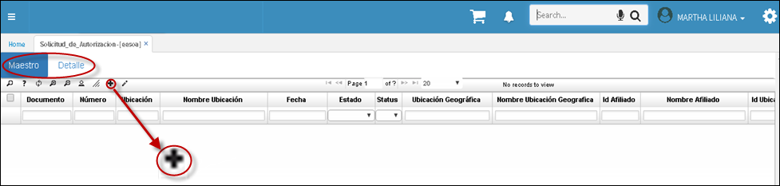
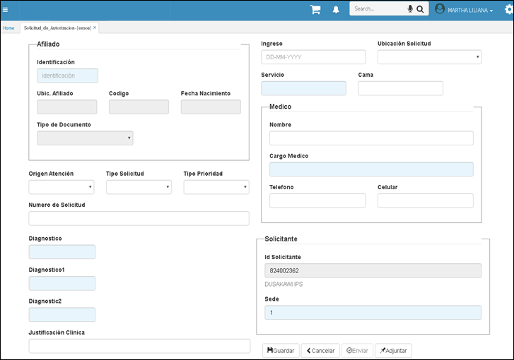

---

layout: default
title: Certificados de Retención
permalink: /Operacion/crm/portal/proveedor/eesoa
editable: si

---

# EESOA - Aplicación Solicitud de Autorizaciones Hospitalarias  

En esta aplicación, la *IPS* notifica a la *EPS* la solicitud de autorización. **Importante** diligenciar todos los campos que incluya la pestaña *Maestro y Detalle* de lo contrario quedaria incompleta la solicitud. 

El sistema automáticamente muestra el **NIT** del prestador, se debe diligenciar todas las variables convenientes, **Sede** en caso de que la *IPS* tenga más de una sede,  para saber con esactitud de donde se está solicitando la autorización.

Posteriormente nos vamos al detalle y adicionamos los productos autorizar. Al terminar daremos clic en *guardar* para que quede en el sistema.  

Regresamos al maestro, allí podremos adjuntar los soportes de la solicitud. La solicitud estará satisfactoriamente creada en nuestro sistema de información.

Consultar la Solicitud de Autorizacion ingresando a la aplicación [**EERSA - Consulta de Solicitud de Autorizaciones.**](http://docs.oasiscom.com/Operacion/crm/portal/proveedor/eersa)