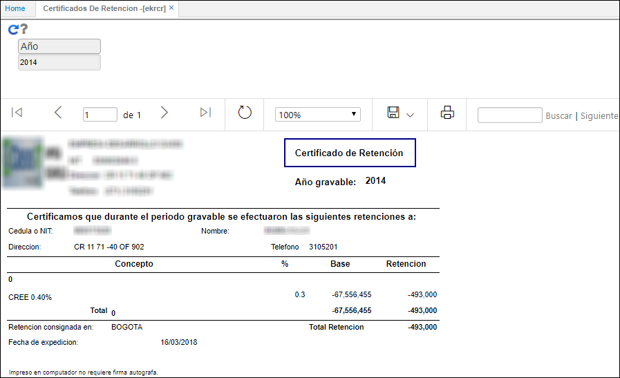
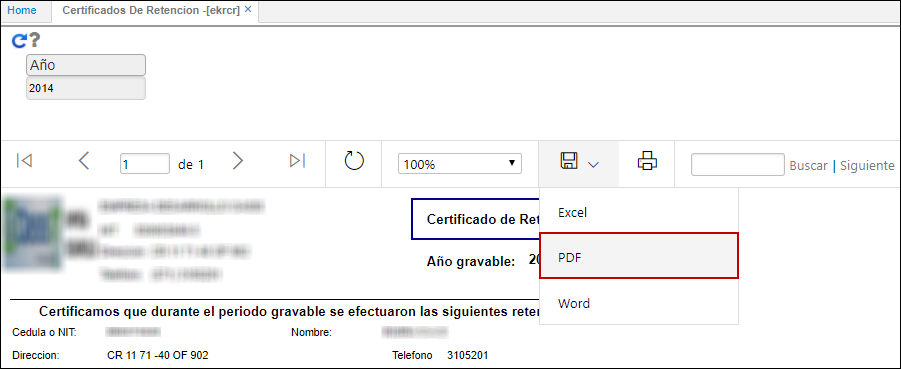
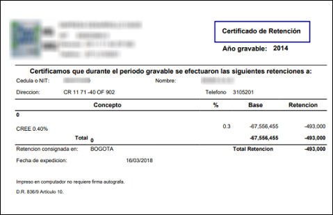

---

layout: default
title: Certificados de Retención
permalink: /Operacion/crm/portal/proveedor/ekrcr
editable: si

---

# Certificados de Retención - EKRCR

La aplicación **EKRCR** permite la visualización del certificado de retención para el usuario que se encuentre logueado.  

El usuario sólo deberá ingresar el año del cual desea obtener el certificado de retención y dar click en el botón _Generar_.  

El sistema arrojará el certificado con las retenciones realizadas al usuario logueado en el año de consulta.  

El certificado puede ser descargado en formato de Excel, PDF o Word.  

