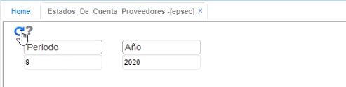
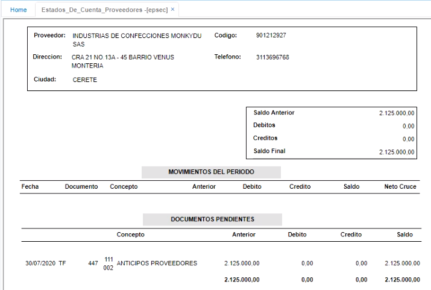

---

layout: default
title: Imprime Estados de Cuenta Proveedores - EPSEC
permalink: /Operacion/crm/portal/proveedor/epsec
editable: si

---

# Imprime Estados de Cuenta Proveedores - EPSEC

La aplicación **EPSEC** permite imprimir el estado de cuenta del proveedor; para ello se debe ingresar el periodo y el año.  Pulsar el botón consultar.  

Esta aplicación, muestra el estado de cuenta del proveedor con sus movimientos del periodo y los documentos pendientes de periodos anteriores.  

