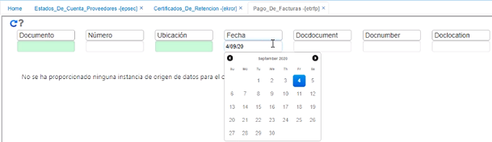
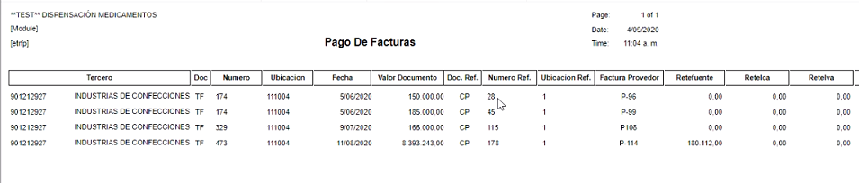

---

layout: default
title: Pago de facturas
permalink: /Operacion/crm/portal/proveedor/etrfp
editable: si

---

# Pago de Facturas - ETRFP  

En esta aplicación, el proveedor puede consultar qué pagos se le han realizado a las facturas que él ha generado.  

  

El registro muestra el comprobante de egreso, fecha, valor y la correspondiente cuenta por pagar que ha entrado a cruzar.  

