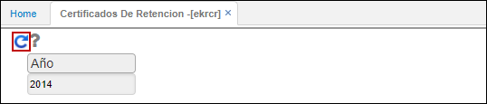

# Proveedores

El portal de proveedores consta de aplicaciones en donde el usuario que inició sesión puede ver únicamente su información correspondiente a certificado de retención y saldos por periodo, para poder consultas estas aplicaciones se debe crear un rol que se llame Portal de Proveedores y otorgarle a los proveedores permisos a estas aplicaciones, así mismo en el SUSU - Usuario se debe tener asociada la cédula o NIT a la persona o empresa que corresponde (campo tercero), esto con el fin que sólo se pueda ver la información del usuario que se logea.

**EKRCR - Certificados de Retención:** La aplicación permite la visualización del certificado de retención para el usuario que se encuentre logueado. El usuario sólo deberá ingresar el año del cual desea obtener el certificado de retención y dar click en el botón _Generar_.  

El sistema arrojará el certificado con las retenciones realizadas al usuario logueado en el año de consulta.  

El certificado puede ser descargado en formato de Excel, PDF o Word.  

**PSSP - Saldos de cuentas:** Aquí se pueden consultar las facturas pendientes por pagar a una fecha determinada.

