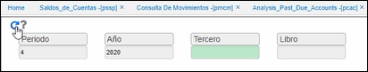
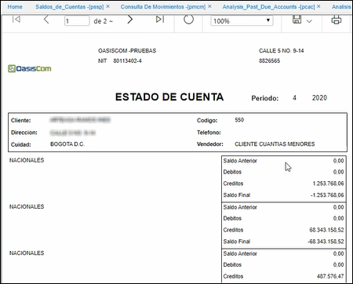

---

layout: default
title: Imprime Estados de Cuenta Proveedores
permalink: /Operacion/crm/portal/proveedor/psec
editable: si

---

# Imprime Estados de Cuenta Proveedores - PSEC

Permite consultar, tener estados de cuenta de cada proveedor y la distribución de cada uno de los movimientos realizados. 

Se ingresa año y periodo el cual se requiera consultar. 

Al realizar la consulta dando clic en el botón *generar* , el sistema arrojará un reporte como el siguiente:

