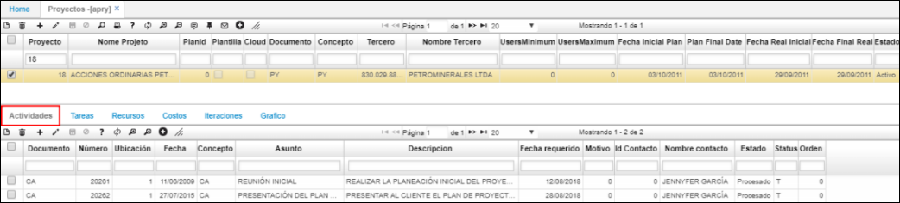
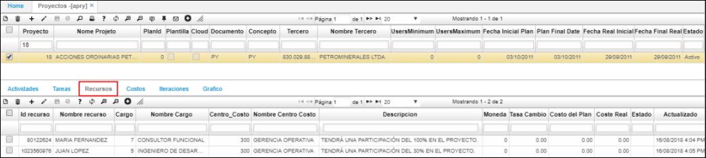

# APRY - Proyectos

La aplicación **APRY** permite crear la planeación de cada proyecto, asignar los recursos humanos que estarán involucrados en el mismo e incluir los costos del proyecto.  

En el maestro de la aplicación ingresaremos los datos del proyecto,el cual debe estar previamente creado en la aplicación [**BPRY - Proyectos**](http://docs.oasiscom.com/Operacion/common/bfinan/bpry).  

**Proyecto:** ingresar el número de proyecto asignado previamente en la aplicación [**BPRY - Proyectos**](http://docs.oasiscom.com/Operacion/common/bfinan/bpry).  
**Nombre Proyecto:** ingresar el nombre del proyecto.  
**Documento:** documento con el que fue creado el proyecto en [**BPRY - Proyectos**](http://docs.oasiscom.com/Operacion/common/bfinan/bpry).  
**Concepto:** concepto con el que fue creado el proyecto en [**BPRY - Proyectos**](http://docs.oasiscom.com/Operacion/common/bfinan/bpry).  
**Tercero:** ingresar el número de identificación (NIT)del cliente por el cual se crea el proyecto.  
**Nombre Tercero:** ingresar el nombre del cliente por el cual se crea el proyecto.  
**Fecha inicial planeada:** ingresar la fecha en la que inicia el proyecto según la planeación.  
**Fecha final planeada:** ingresar la fecha en la que debería finalizar el proyecto según la planeación.  
**Fecha inicial real:** cuando el proyecto se encuentre en ejecución, ingresar la fecha real en la que inició el proyecto.  
**Fecha final real:** cuando se cierre el proyecto, ingresar la fecha real en la que finalizó el proyecto.  
**Estado:** mientras el proyecto se encuentre en ejecución dejar el estado _activo_, cuando finalice el proyecto _procesarlo_ y en caso de que ya no se vaya hacer planeación al proyecto ingresado se deberá _anular_ el registro.  

Una vez registrado el proyecto en el maestro, en la pestaña _Actividades_ del detalle, se ingresarán las actividades a realizar en el desarrollo del proyecto.  

**Documento:** seleccionar del zoom el tipo de documento correspondiente al proceso que se realiza. Los documentos son parametrizables en la aplicación [**BDOC - Documentos**](http://docs.oasiscom.com/Operacion/common/bsistema/bdoc).  
**Número:** el número de la actividad la ingresará el sistema automáticamente.  
**Ubicación:** seleccionar la ubicación en donde se realizará la actividad.  
**Fecha:** ingresar la fecha en la cual se registra la actividad.  
**Concepto:** seleccionar el concepto correspondiente a la actividad.  
**Asunto:** escribir el asunto principal de la actividad.  
**Descripción:** hacer una descripción de lo que se debe realizar en la actividad planeada.  
**Fecha requerido:** ingresar la fecha para la cual se debe tener realizada la actividad.  

Guardamos la actividad y la procesamos.  

En la pestaña _Recursos_ podremos ingresar los colaboradores que participarán en el desarrollo del proyecto.  

Ingresaremos datos como el número de identificación del recurso, el cargo, el centro de costo al que pertenece, alguna descripción que se crea pertinente detallar, el costo planeado de lo que valdrá hacer uso de dicho recurso y el costo real de lo que valió.  