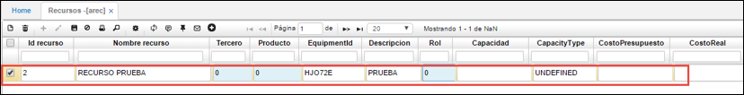
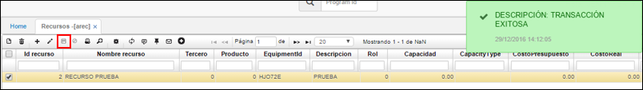
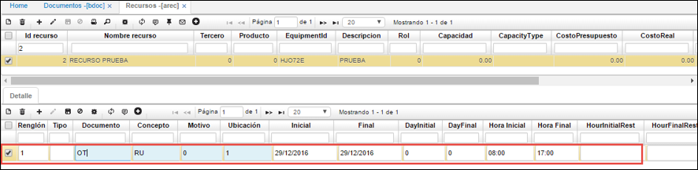
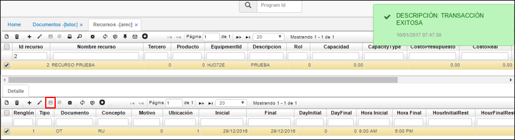

## Recursos - AREC

Esta aplicación permite la parametrización de los recursos que realizarán las revisiones de rutina dentro del módulo de mantenimiento.  

En el maestro creamos un nuevo registro y diligenciamos los campos.  

**Id Recurso:** se debe ingresar un número que identifique al recurso a crear, _se debe tener en cuenta que este número no es un consecutivo, pero si debe ser exclusivo para cada registro_.  
**Nombre Recurso:** se debe diligenciar el nombre del recurso, este campo admite tanto caracteres como letras y números.  
**Tercero:** se debe ingresar el tercero al que aplicará este recurso, teniendo en cuenta que, si el tercero es **0**, este aplicará para todos.  
**Producto:** se debe diligenciar el producto que manejará el recurso. Si selecciona **0**, aplicará para todos los productos.  
**EquipmentId:** se debe ingresar el código del equipo designado sobre el cuál se ejecutarán las revisiones. Si selecciona **0**, aplicará para todos los equipos.  
**Descripción:** se puede ingresar una descripción del recurso si así se desea.  
**Rol:** se debe ingresar el rol que desempeñará el recurso.  

Hecho esto, se guarda el registro.  

A nivel del detalle, se debe diligenciar el registro de la siguiente manera:  

**Renglón:** se llena de manera automática una vez se guarda el registro con los campos debidamente diligenciados.  
**Documento:** se debe seleccionar un documento de la lista, en este caso se trabaja con _OT_ que hace referencia a Orden de Trabajo.  
**Concepto:** se debe seleccionar un concepto de la lista, en este caso se trabajará con _RU_ que corresponde a Rutinas.  
**Ubicación:** se debe seleccionar la ubicación en donde el recurso se encuentra actualmente.  
**Inicial** y **Final:** se debe seleccionar las fechas de inicio y fin de labores del recurso.  
**Hora Inicial** y **Hora Final:** se debe ingresar la hora inicio y la hora fin de las labores que el recurso ejecuta en un día, por ejemplo, el recurso trabajará de 08:00am a 05:00pm  
**Intervalo:** se debe seleccionar el tiempo que tomará el recurso en ejecutar una revisión de rutina, este debe ser escrito en minutos.  

Hecho esto, se procede a guardar el registro.  

