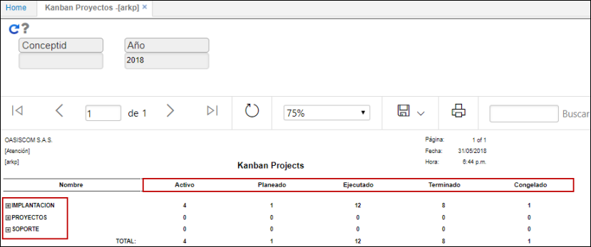
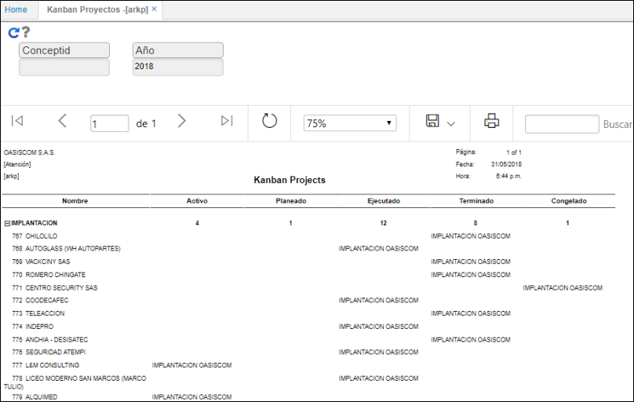

# Kanban Proyectos - ARKP

El reporte ARKP permite visualizar los proyectos por fase e identificar el estado en el que se encuentra cada uno: _Activo, Planeado, Ejecutado, Terminado o Congelado_.  

Es posible filtrar por concepto y año.  

Al ingresar a los proyectos en la fase de _Implantación_.  

