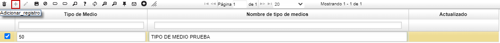
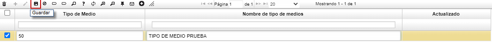

# Tipos de Medios - ABTM  

En esta aplicación se pueden parametrizar los diferentes tipos de difusión o de generación de demanda con los que cuenta el área de **Mercadeo**.  Esto, nos permitirá asignar un tipo de medio a todas las oportunidades comerciales que se tienen e identificar qué medio es el más efectivo.  

Para iniciar, se crea un nuevo registro (+).  Se le coloca un número de identificación en el campo _**Tipo de Medio**_ y en el campo _**Nombre tipo medios**_, se agrega el nombre que corresponda.  Se agregan todos los _Tipos de medios_ que se consideren son los que se utiliza en la empresa y finalmente se guarda el registro.  

  

