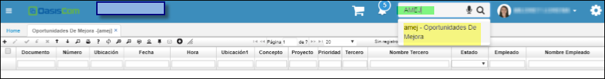
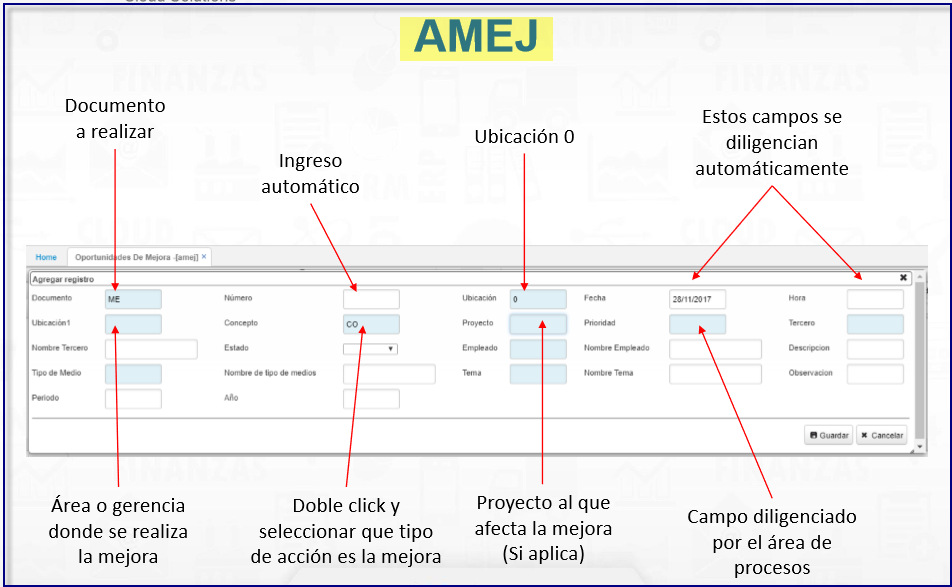
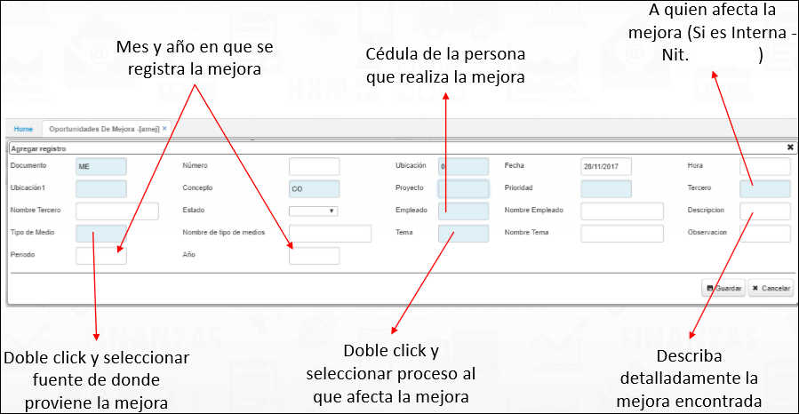

---  
layout: default  
title: Mejora  
permalink: /Operacion/crm/servicio/abasica/amej  
editable: si  
---  

# MEJORA - AMEJ   

  

Aplicación que nos permite editar y registrar las oportunidades de mejora de la organizacion, en ella se guardan datos relevantes segun la oportunidad de mejora.   
Esta opcion **AMEJ** al adicionar abre un formulario con estos campos a editar:  

  

**Documento:**  Parametrización del **BDOC** [ME * MEJORA].  
**Número:**  Consecutivo parametrizado en **BCNS**.  
**Ubicación:**  Parametrización realizada en **BUBI**.  
**Ubicación1:**  area o gerencia, parametrización realizada en **BUBI**.  
**Fecha:** Data de emisión del documento al guardar.  
**Hora:** Dato de zona horaria del documento al guardar.  
**Concepto:**  Parametrizacion realizada en **BDOC**.  
**Proyecto:**  Parametrización del **BPRY**.   
**Prioridad:** campo que posee zoom de busqueda.  

  

**Tercero:** A quien afecta la mejora **BTER** (Si es Interna Nit. de la empresa).  
**Descripcion:** **Breve analisis donde se detalla la mejora hallada**.  
**Empleado:** Documento y/o cedula de la persona que realiza la mejora.  
**Tema:** Doble click y seleccionar proceso al que afecta la mejora.  
**Periodo y Año:** Mes y año en que se registra la mejora.  
**Segmento:** Parametrización del **BCSE** Segmentos comerciales.  
**Tipo de Medio:** campo posee zoom de busqueda, ej newspaper, catalogo de software, pagina web1, pagina web3.  
  
Se finaliza el documento guardando el maestro con la mejora.  

********

