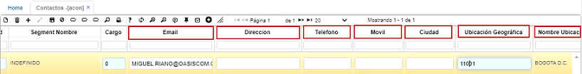
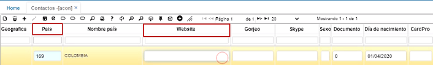
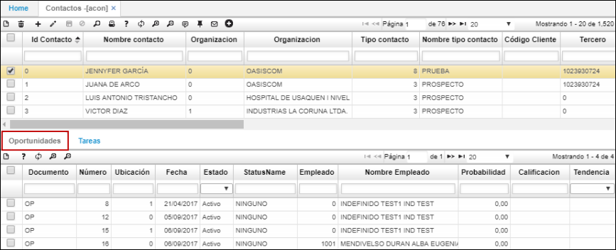
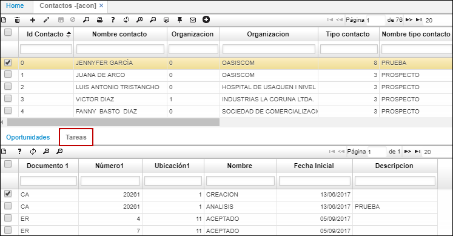

# Contactos - ACON

En la aplicación **ACON** se registran los contactos con los cuales se tiene relación en las empresas clientes.  También se pueden registrar los prospectos, que son los posibles clientes.

* [Registro de Contactos](http://docs.oasiscom.com/Operacion/crm/servicio/acontacto/acon#registro-de-contactos)
* [Registro de Prospectos](http://docs.oasiscom.com/Operacion/crm/servicio/acontacto/acon#registro-de-prospectos)

## [Registro de Contactos](http://docs.oasiscom.com/Operacion/crm/servicio/acontacto/acon#registro-de-contactos)

Se adiciona un nuevo registro (+), se agrega el nombre del contacto, en el campo _Id Organización_, se asocia a esta persona con un cliente ya creado en nuestra base de datos.  

El campo _Tipo de contacto_ es definido por cada compañía, para este caso, cliente o prospecto.  

  

En el campo _Tercero_, se digita el NIT o cédula del contacto; el campo _Producto_, se define de acuerdo a los productos de cada compañía; el campo _Segmento_ se refiere al segmento al que pertenece la compañía  

  

En el campo _Cargo_, el cargo que tiene el contacto en la compañía, también se diligencian los otros datos de contacto como _Correo electrónico, Dirección, Teléfono, Móvil, Ciudad, Ubicación geográfica (que es de acuerdo con el código del DANE), si tiene página web (también se puede asociar en este campo)_  

  

  

El campo _Tipo de medio_, también lo define la compañía e igual es parametrizable.  

  

Después de diligenciar los campos, procedemos a guardar el registro.  

  

Este sirve para almacenar y tener una base de datos.   
Cuando es un posible cliente y se quiere convertir en una oportunidad, se da click en el botón _Convertir_A_Oportunidad_ y el sistema automáticamente genera el registro.  

Luego, se pasa a la aplicación [**AOPO - Oportunidades**](http://docs.oasiscom.com/Operacion/crm/venta/aoportunidad/aopo)

En el detalle se encuentran dos pestañas, oportunidades y tareas. La pestaña _Oportunidades_, muestra los documentos OP correspondientes a las oportunidades que se encuentran asociadas a dicho Id de contacto.  

En la pestaña _Tareas_ se verán las actividades que se han ejecutado relacionadas con la gestión a dicho contacto del maestro.  

## [Registro de Prospectos](http://docs.oasiscom.com/Operacion/crm/servicio/acontacto/acon#registro-de-prospectos)

La Aplicación **ACON** realiza el repositorio de datos al "Prospecto"; su funcionalidad está basada en el mismo **APRO**  de los clientes potenciales de una empresa. Se trata de una persona que ya mostró interés por tu marca, producto o servicio. Puede que se haya subscrito a un boletín o directamente se haya puesto en contacto contigo para recibir más información. En esta aplicacion **ACON** se realiza y documenta la mayor cantidad de datos del futuro cliente, el cual podrá ser convertido automáticamente en oportunidad **AOPO**.
La prospección es el primer paso del proceso de ventas, puede que se convierta o no en un cliente, sin embargo tendrá que seguir una serie de pasos hasta llegar a ese punto. El primer punto de partida es la calificación de prospectos, donde el vendedor determina si el prospecto cuenta con todas las características para convertirse en cliente.
Para esta aplicacion **ACON** la llave primaria es el campo: Email como resultante no permite ingresar correos repetidos.

*Funcionalidad:  
Existen dos botones cuya finalidad es convertir a oportunidad o partner.
al ejecutarlos el sistema automáticamente crea un documento OP [Oportunidad] o PN [Partner] según sea el caso.

**Idcontacto:** Código de contacto inicial; no precisamente cédula o nit.  
**Nombre Contacto:** Con el cual se identifica el futuro prospecto.  
**Organización:** Nombre del ente u organización.  
**Tipo Contacto:** Dato que se parametriza desde el **ABTC**.  
**Codigo Cliente:** Nit o RUT al cual pertenece.  
**Tercero:**  Códigos Tercero del **BTER.**  
**Cargo:** Dato que se parametriza desde el **BCAR**.  
**Email:** Llave primaria.  
**Dirección:** Nomenclatura de area.  
**Teléfono:** Numeros telefonicos.  
**Movil:** Número celular.  
**Ciudad:** Parametrización del **BUBG.**  
**Ubicación Geográfica:** Parametrización del **BUBG.**  
**Especialidad:** Parametrización del **BBES.**  
**Prioridad:** Código.  
**Tipo Medio:** Parametrización del **ABTM.**.  
**IdCampaña:** Parametrización de la campaña **ACAM.**.  
**Ingreso:** Fecha de apertura.  

**Empleado:**  Código Tercero del **BTER.**
**Nombre Empleado:** Nombres y apellidos del **BTER**.  
**Descripción:**.  Campo a editar con detalles importantes.  
**Ingresos:**.  Cantidad a editar.  
**Activos:**.  Cantidad a editar.  
**Empleados:**  Códigos Tercero del **BTER.**  
**CorreoDirecto:** Flag de si - no.  
**Vendedor:**.  Código Tercero del **BTER.**  
**Nombre Vendedor:**  Nombres y apellidos parametrizados en **BTER**.  
**Observacion:**.Campo a editar con detalles relevantes.  
**Estado:** Activo o inactivo según corresponda.  
**Status:** si aplica.  
**Actualizado:** fecha de cambio al editar.  

En el detalle se encuentran dos pestañas: _oportunidades_ y _tareas_. La pestaña _Oportunidades_: muestra los documentos OP correspondientes a las oportunidades que se encuentran asociadas a dicho Id de contacto.  

En la pestaña  _Tareas_ se verán las actividades que se han ejecutado relacionadas con la gestión a dicho contacto del maestro.  