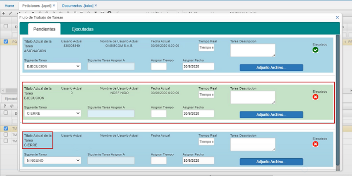

# Peticiones - APET  

Esta es la aplicación de OasisCom para peticiones, quejas y reclamos.  Antes de comenzar, se debe ir a la aplicación [**BDOC - Documentos**](http://docs.oasiscom.com/Operacion/common/bsistema/bdoc) para parametrizar y definir los documentos que se van a utilizar.  Una vez se tenga esta parametrización, se ingresa a esta aplicación **APET**.  Se adiciona un nuevo registro (+).  Para peticiones, se elige el documento _**PQ**_, para el ejemplo, se elige el concepto _FC_, que correspondería a una petición de **Factura**, la fecha en que se presenta la petición, también para el ejemplo, se escoge a **OasisCom** como _Tercero_ para generar el registro, quien sería la persona que presenta la petición.  Luego, se elige el _Tipo de medio_, o sea la forma a través de la cual llegó la petición (estos son definidos por cada empresa); para el ejemplo, se elige _**Correo electrónico**_, se llenan los campos _**Asunto**_ y _**Descripción**_ y se guarda el registro.

  

  

  

Una vez se encuentra guardado el registro, el sistema automáticamente genera una serie de tareas.  En esta ventana, se empiezan a ejecutar todas las tareas o acciones encaminadas a resolver la _**petición**_  

  

  

Por ejemplo, se le asigna la tarea a una persona de facturación.  El campo _Tiempo Real_ es para escribir en minutos lo que se demora la persona en asignar el caso a quien va a gestionar la petición.  En el campo _Tarea Descripción_, se pone en este caso asignación ya que se está asignando a alguien de Facturación la tarea de resolver la petición.  El campo _Siguiente Tarea_ está como ejecución ya que es el mensaje que va a llegar a la persona a quien se le asignó la tarea para que la ejecute.  En el campo _Siguiente tarea asignar a_, se escribe el número de documento de la persona a quien se asigna la tarea y en el campo _Asignar Tiempo_, el tiempo en minutos que se considera tomaría la persona en realizar dicha tarea.  En el campo _Asignar Fecha_, se escribe la fecha en la que esa persona debe realizar la tarea.  Diligenciados todos los campos, se da click en _**Ejecutado**_ en la parte superior derecha.  

  

Al dar click en el botón _Refrescar datos_, se puede evidenciar que se le creo el registro de la tarea a la persona asignada en la parte inferior en _**Ejecución**_.  

  

Dicha persona debe ingresar a esta aplicación **APET** y buscar el _Documento_, _Número_ e ingresar de nuevo a _Tareas Workflow_ y llenar el segundo espacio de la _Ejecución_ con sus propios datos de acuerdo a la labor que realizó.  Cuando ya se termina la tarea, entonces se llena el renglón de _Cierre_.  

  

Para ingresar a _Tareas Workflow_, se puede hacer por el icono de la parte superior o por _Tareas en la parte inferior izquierda.  

