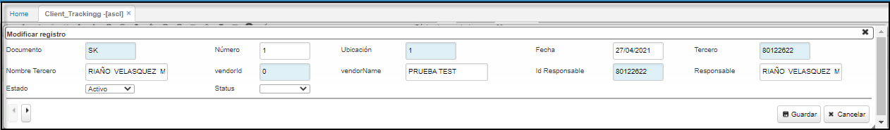

# Seguimiento de Clientes  - ASCL  

Esta es la aplicación de OasisCom para seguimiento de clientes.  Antes de comenzar, se debe ir a la aplicación [**BDOC - Documentos**](http://docs.oasiscom.com/Operacion/common/bsistema/bdoc) para parametrizar y definir los documentos que se van a utilizar.  

Para agregar un nuevo registro damos click en el botón  ubicado en la barra superior de herramientas y diligenciamos el formulario.  

  

**Documento:** ingresar el documento _SK_ seguimiento Clientes.  Los documentos son parametrizables en la aplicación [**BDOC - Documentos**](http://docs.oasiscom.com/Operacion/common/bsistema/bdoc).  
**Ubicación:** Seleccionar la ubicación desde donde se está realizando el registro.  
**Status:** Seleccionar el status en el que se encuentra el tercero registrado como seguimiento al cliente.  
**Tercero:** Ingresar el número de identificación del cliente.  

