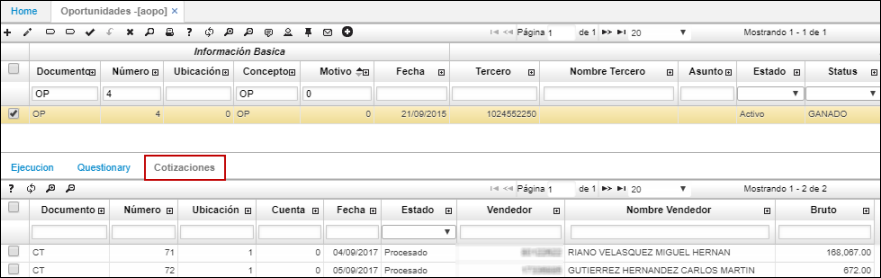

# AOPO - Oportunidades

La aplicación AOPO permite registrar las oportunidades de negocio que puedan surgir de las diferentes campañas comerciales.  

Para agregar un nuevo registro damos click en el botón  ubicado en la barra superior de herramientas y diligenciamos el formulario.  

**Documento:** ingresar el documento _OP_ correspondiente a Oportunidades.  Los documentos son parametrizables en la aplicación [**BDOC - Documentos**](http://docs.oasiscom.com/Operacion/common/bsistema/bdoc).  
**Ubicación:** seleccionar la ubicación desde donde se está realizando el registro.  
**Concepto:** ingresar el concepto OP (oportunidades). Los conceptos son parametrizables en la aplicación [**BCON - Conceptos**](http://docs.oasiscom.com/Operacion/common/bsistema/bcon).  
**Motivo:** seleccionar el motivo del registro. Los motivos son parametrizables en la aplicación [**BMOT - Motivos**](http://docs.oasiscom.com/Operacion/common/bsistema/bmot).  
**Asunto:** describir brevemente el asunto del registro.  
**Status:** seleccionar el status en el que se encuentra el tercero registrado como una oportunidadd de negocio.  
**Id Contacto:** seleccionar del zoom el número de consecutivo asignado a la oportunidad de negocio previamente en la aplicación [**APRO - Prospectos**](http://docs.oasiscom.com/Operacion/crm/venta/aprospecto/apro).  
**Tipo de Medio:** seleccionar el tipo de medio por el cual ingresó la oportunidad.  
**Id Campaña:** seleccionar la campaña por la cual ingresó la oportunidad.  
**Empleado:** ingresar el número de identificación del empleado a cargo de la oportunidad que se registra.  
**Tema:** seleccionar la solución que más se acomoda a las necesidades que tiene el cliente.  
**Probabilidad:**  
**Calificación:**  
**Tendencia:**  
**Proyecto:** seleccionar el proyecto al cual se asocia el registro de la oportunidad.  

En la pestaña _Ejecución_ se pueden observar las tareas ejecutadas por los trabajadores relacionadas a la oportunidad de negocio seleccionada en el maestro. Estas actividades se ejecutan por medio de la funcionalidad de workflow ubicada en la barra superior de herramientras, representada por el botón  .  

La opción **AOPO** también cuenta con una pestaña en el detalle llamada _Cuestionario_, la cual permitirá la calificación de oportunidades de negocio de acuerdo a las preguntas definidas previamente en la aplicación [**BMOT - Motivos**](http://docs.oasiscom.com/Operacion/common/bsistema/bmot) en la pestaña del detalle también llamada _Cuestionario_.  

Seguidamente se encuentra la pestaña _Cotizaciones_, en la cual se podrán observar las cotizaciones que están procesadas y asignadas a la oportunidad de negocio en los campos _Document1_, _NumberId1_, y _LocationId1_ de la cotización.  

