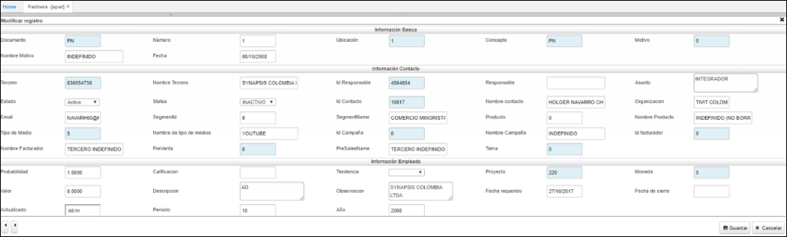
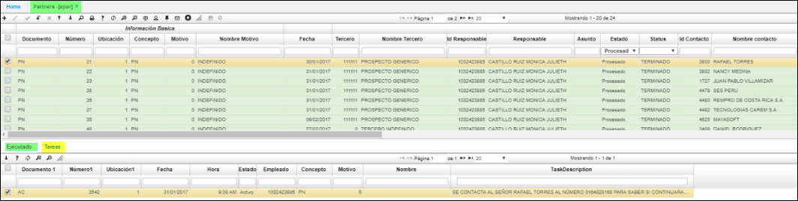

# PARTNERS - APAR

Aplicación que nos permite editar datos del socio de negocios o alianza; puede ser crucial como estrategia comercial. Las empresas no pueden elegir socios de negocios en la forma que quieran. En muchos casos, el socio potencial no podría estar interesado en formar una relación de negocios. Es importante que ambas partes del acuerdo se complementen entre sí, pero también que haya algunos puntos en común. Por ejemplo, en el estilo de gestión, forma de pensar y también en la tecnología.  
* Se debe de diligenciar el siguiente formulario:

**Documento:**  Parametrización del BDOC [PN].  
**Número:**  Consecutivo parametrizado en BCNS.  
**Ubicación:**  Parametrización realizada en BUBI.  
**Concepto:**  Parametrizacion realizada en BDOC.  
**Motivo:**  Parametrización del BMOT.   
**Fecha:**  Data de emisión del documento al guardar.  
**Tercero:** Parametrización del BTER tercero.  
**Id Responsable:** Código del encargado.  
**Asunto:** Referencia breve del asunto.
**Estado:** Activo, procesado, anulado.  
**Status:** Si aplica.  
**Id Contacto:** Código de relación con el contacto.  
**Nombre contacto:** Nombre apellido del contacto.  
**Organización:** Se edita el nombre del ente u organización.  
**Tipo de Medio:** Parametrización del **ABTM**.  
**Nombre de tipo de medios:**  Parametrización del **ABTM.**.  
**Id Campaña:** Parametrización del ACAM.  
**Nombre Campaña:** Parametrización del ACAM.  
**Id facturador:** Código parametrizado en BTER.  
**Probabilidad:** Data según criterio el tercero que realiza la alianza.  
**Calificación:** Según el nivel de probabilidad.  
**Tendencia:** Se definen tres opciones: ninguna, aumentar o disminuir.  
**Proyecto:** Zoom del BPRY.  
**Moneda:** Parametrización según BMON.  
**Valor:** Posible cifra.  
**Descripcion:** Texto descriptivo.  
**Observación:**   Texto que detalla relevancias.   
**Fecha requerido:**  dia/mes/año.  
**Fecha de cierre:**  dia/mes/añño.  
**Actualizado:**  dia/mes/año.  

* En el detalle, pestaña **Ejecutado**; se insertan las tareas manuales que se han realizado desde la Actividad **[AACT]**.  
* En el detalle, pestaña **Tareas**; se documentan las **acciones** este campo posee zoom de búsqueda.  

* Posteriormente se guarda y se procesa el documento según sea el caso.  

