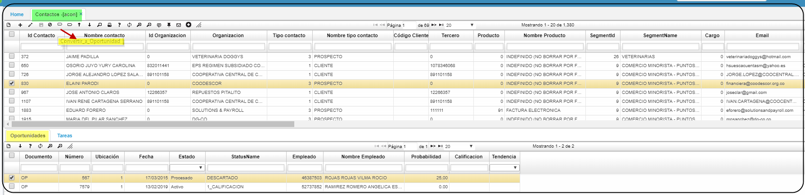

# ACON - Contactos

la Aplicacion **ACON** realiza el repositorio de datos al "Prospecto"; su funcionabilidad esta basada en el mismo **APRO**  a los clientes potenciales de una empresa. Se trata de una persona que ya mostró interés por tu marca, producto o servicio. Puede que se haya subscrito a un boletín o directamente se haya puesto en contacto contigo para recibir más información. En esta aplicacion **ACON** se realiza y documenta la mayor cantidad de datos del futuro cliente; que podra ser convertdo automaticamente en oportunidad **AOPO**.  
La prospección es el primer paso del proceso de ventas, puede que se convierta o no en un cliente, sin embargo tendrá que seguir una serie de pasos hasta llegar a ese punto. El primer punto de partida es la calificación de prospectos, donde el vendedor determina si el prospecto cuenta con todas las características para convertirse en cliente.
Para esta aplicacion **ACON** la llave primaria es el campo: Email como resultante no permite ingresar correos repetidos.

*Funcionabilidad:  
Existen dos botones cuya finalidad es convertir a oportunidad o partner.
al ejecutarlos el sistema auotomaticamente crea un documento OP [Oportunidad] o PN [Partner].

**Idcontacto:** Codigo de contacto inicial; no presisamente cedula o nit.  
**Nombre Contacto:** Con el cual se identifica el futuro prospecto.  
**Organizacion:** Nombre del ente u organizacion.  
**Tipo Contacto:** Dato que se parametriza desde el **ABTC**.  
**Codigo Cliente:** Nit o RUT al cual pertenece.  
**Tercero:**  Codigos Tercero del **BTER.**  
**Cargo:** Dato que se parametriza desde el **BCAR**.  
**Email:** Llave primaria.  
**Dirección:** Nomenclatura de area.  
**Telefono:** Numeros telefonicos.  
**Movil:** Numero celular.  
**Cuidad:** Parametrizacion del **BUBG.**  
**Ubicacion Geografica:** Parametrizacion del **BUBG.**  
**Especialidad:** Parametrizacion del **BBES.**  
**Prioridad:** Codigo.  
**Tipo Medio:** Parametrizacion del **ABTM.**.  
**IdCampaña:** Parametrizacion de la campaña **ACAM.**.  
**Ingreso:** Fecha de apertura.  

**Empleado:**  Codigo Tercero del **BTER.**
**Nombre Empleado:** Nombres y apellidos del **BTER**.  
**Descripción:**.  Campo a editar con detalles importantes.  
**Ingresos:**.  Cantidad a editar.  
**Activos:**.  Cantidad a editar.  
**Empleados:**  Codigos Tercero del **BTER.**  
**CorreoDirecto:** Flac de si - no.  
**Vendedor:**.  Codigo Tercero del **BTER.**  
**Nombre Vendedor:**  Nombres y apellidos parametrizados en **BTER**.  
**Observacion:**.Campo a editar con detalles relevantes.  
**Estado:** Activo o inactivo segun corresponda.  
**Status:** si aplica.  
**Actualizado:** fecha de cambio al editar.  

En el detalle se encuentran dos pestañas, oportunidades y tareas. La pestaña Oportunidades, muestra los documentos OP correspondientes a las oportunidades que se encuentran asociadas a dicho Id de contacto

En la pestaña Tareas se verán las actividades que se han ejecutado relacionadas con la gestión a dicho contacto del maestro.

**********

