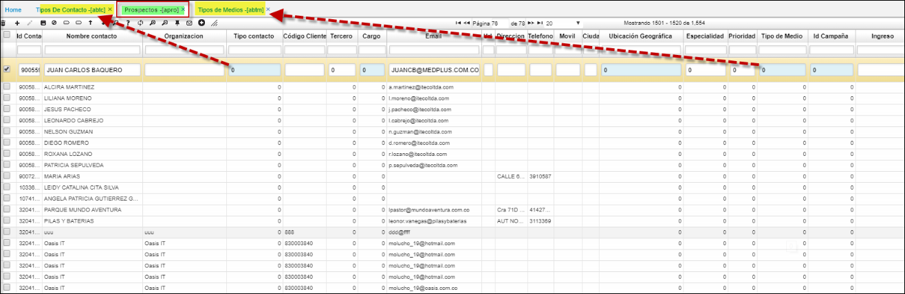

# APRO - Prospectos

Prospecto es el término con el cual se le denomina a los clientes potenciales de una empresa. Se trata de una persona que ya mostró interés por tu marca, producto o servicio. Puede que se haya subscrito a un boletín o directamente se haya puesto en contacto contigo para recibir más información. en esta aplicacion se realiza el repositorio de datos.  
La prospección es el primer paso del proceso de ventas, puede que se convierta o no en un cliente, sin embargo tendrá que seguir una serie de pasos hasta llegar a ese punto. El primer punto de partida es la calificación de prospectos, donde el vendedor determina si el prospecto cuenta con todas las características para convertirse en cliente.
Para esta aplicacion **APRO** la llave primaria es el campo: Email como resultante no permite ingresar correos repetidos.

**Idcontacto:** Codigo de contacto inicial; no presisamente cedula o nit.  
**Nombre Contacto:** Con el cual se identifica el futuro prospecto.  
**Organizacion:** Nombre del ente u organizacion.  
**Tipo Contacto:** Dato que se parametriza desde el **ABTC**.  
**Codigo Cliente:** Nit o RUT al cual pertenece.  
**Tercero:**  Codigos Tercero del **BTER.**  
**Cargo:** Dato que se parametriza desde el **BCAR**.  
**Email:** Llave primaria.  
**Dirección:** Nomenclatura de area.  
**Telefono:** Numeros telefonicos.  
**Movil:** Numero celular.  
**Cuidad:** Parametrizacion del **BUBG.**  
**Ubicacion Geografica:** Parametrizacion del **BUBG.**  
**Especialidad:**Parametrizacion del **BBES.**  
**Prioridad:** Codigo.  
**Tipo Medio:** Parametrizacion del **ABTM.**.  
**IdCampaña:** Parametrizacion de la campaña **ACAM.**.  
**Ingreso:** Fecha de apertura.  

**Empleado:**  Codigo Tercero del **BTER.**
**Nombre Empleado:**.Nombres y apellidos del **BTER**.  
**Descripción:**.  Campo a editar con detalles importantes.  
**Ingresos:**.  
**Activos:**.  
**Empleados:**  Codigos Tercero del **BTER.**  
**CorreoDirecto:** flac de si - no.  
**Vendedor:**.  Codigo Tercero del **BTER.**
**Nombre Vendedor:**  Nombres y apellidos parametrizados en **BTER**.  

