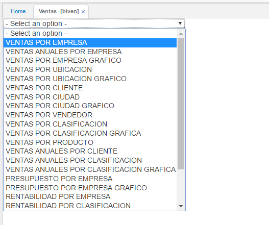
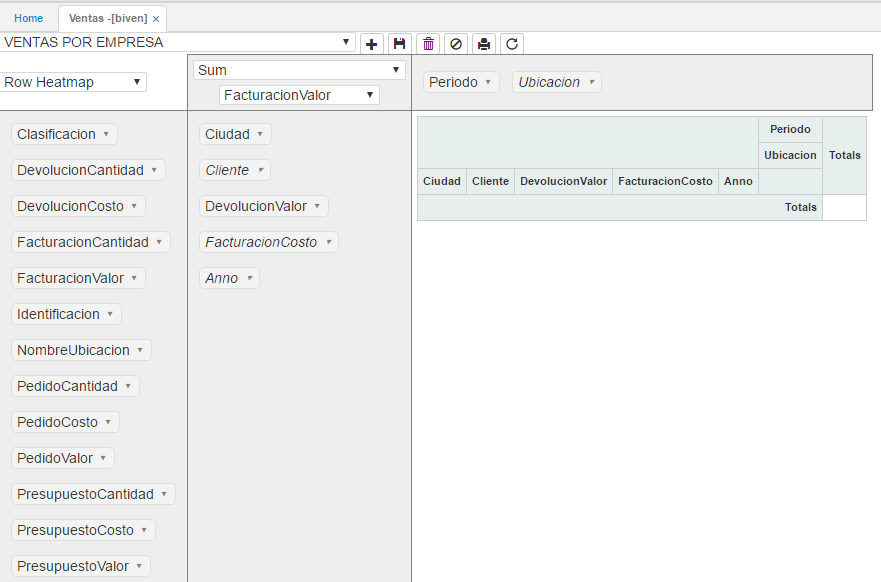
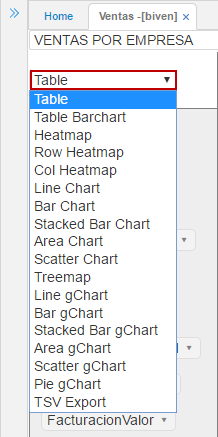
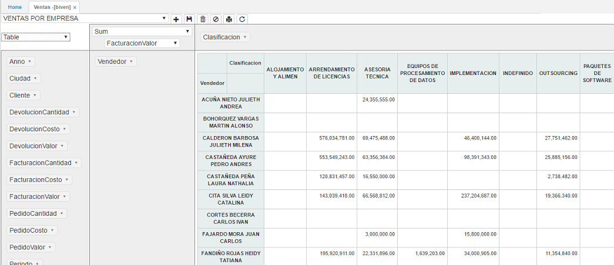
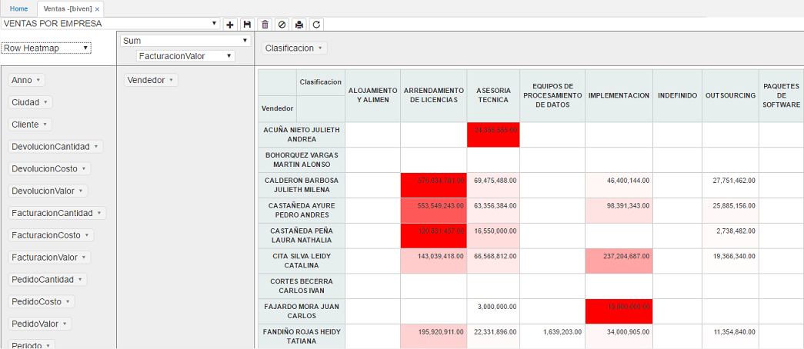
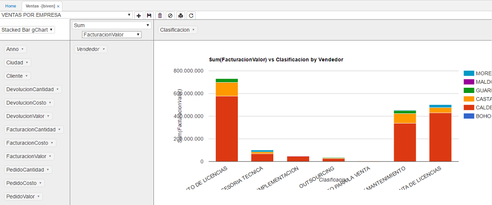
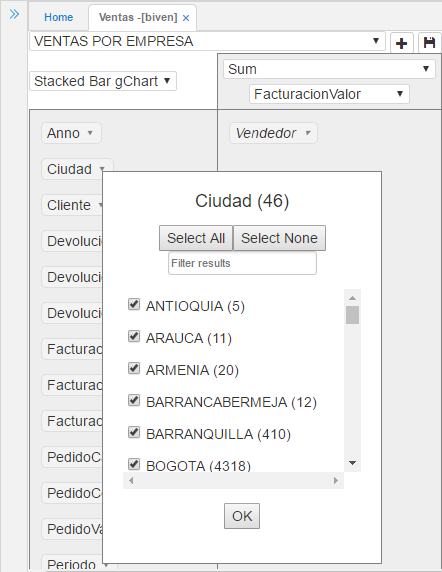
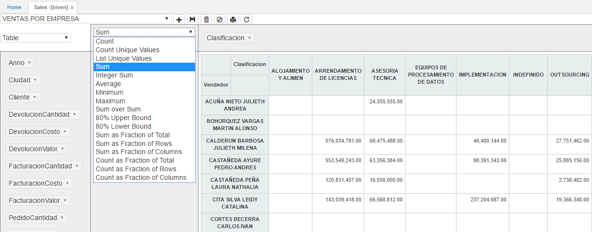
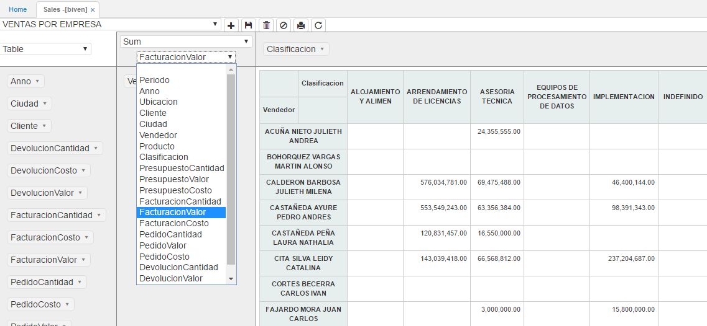
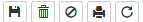

---
layout: default
title: BI Comercial
permalink: /Operacion/dss/bicom/biven
editable: si
---

# BIVEN - Ventas

La aplicación **BIVEN** permite realizar restricción de consultas para las opciones de tipo tablero y pivote, ya sea por usuario, compañía y/o ubicación, dependendiendo de la parametrización realizada en la pestaña de _Publicaciones_ de la aplicación [**SROL - Roles**](http://docs.oasiscom.com/Operacion/system/sacceso/srol).  

Esta aplicación nos permite visualizar toda la información relacionada a las ventas.  

Al ingresar a la aplicación, seleccionamos de la lista desplegable el reporte que se desea visualizar.  



Al seleccionar el reporte, el sistema arrojará una ventana como la siguiente, en donde se pueden observar en la primera columna las variables disponibles de consulta, en la segunda columna las variables seleccionadas para la búsqueda y que corresponden al eje **Y** y en la fila superior, las variables de consulta correspondientes al eje **X**.  

Estas variables se puede arrastrar al eje **X** o **Y** según como se quiera visualizar la información.  



En la lista desplegable del recuadro blanco seleccionamos el tipo de gráfica como se quiere visualizar la información.



Algunos ejemplos de como se puede visualizar la información es en:

_Tabla_



_Tabla de Calor de acuerdo a la fila_



_Barra Apilada_



Cada variable permite realizar filtros de acuerdo a como se requiera hacer la consulta, junto al nombre de la varible se puede ver la cantidad de datos que contiene.  



Igualmente, permite seleccionar todas las opciones de las variables dando click en el botón  o desmarcar todas con el botón , si se desea buscar entre las opciones de la variable alguna en específico, se podrá cosnulta en el campo .  

La primera lista desplegable de la segunda columna determina que operación se va a realizar para mostrar la información, por ejemplo (_Sumar, contar, promedios, máximos, mínimos, entre otros_).



La siguiente lista desplegable de la segunda columna, hace referencia al valor del campo consultado, por ejemplo, el valor que se muestra en la tabla corresponde al _Valor de Facturación_.  



#### Botones Superiores



##### Guardar Reporte  

Permite guardar la última consulta realizada. Cuando el usuario vuelva a ingresar a la aplicación, esta arrojará la misma consulta.  

##### Eliminar Reporte  

Este botón elimina la publicación, es decir, el reporte consultado. Al eliminarlo, no se podrá volver a consultar la información por ese tipo de reporte. Es necesario tener cuidado al momento de hacer uso de dicho botón.  

##### Deshacer cambios en el reporte 

Permite volver a la consulta inicial predeterminada por el reporte seleccionado.  

##### Imprimir Reporte   

Este botón convierte el reporte a formato PDF para realizar su impresión.  

##### Recargar datos del reporte   

Al dar click en este botón, se refrescará la información contenida en el reporte.  
