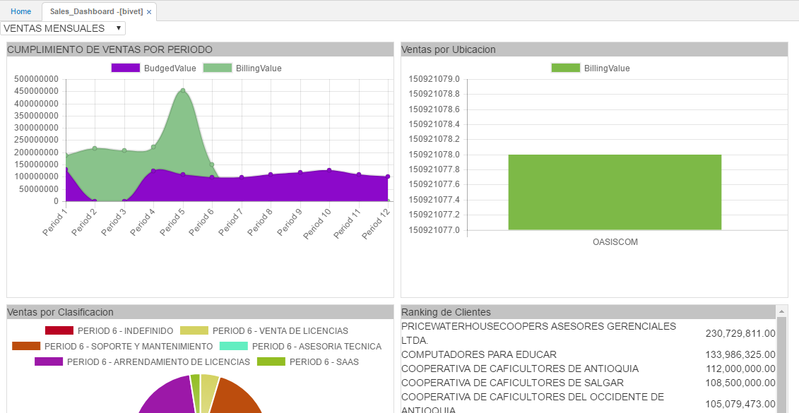
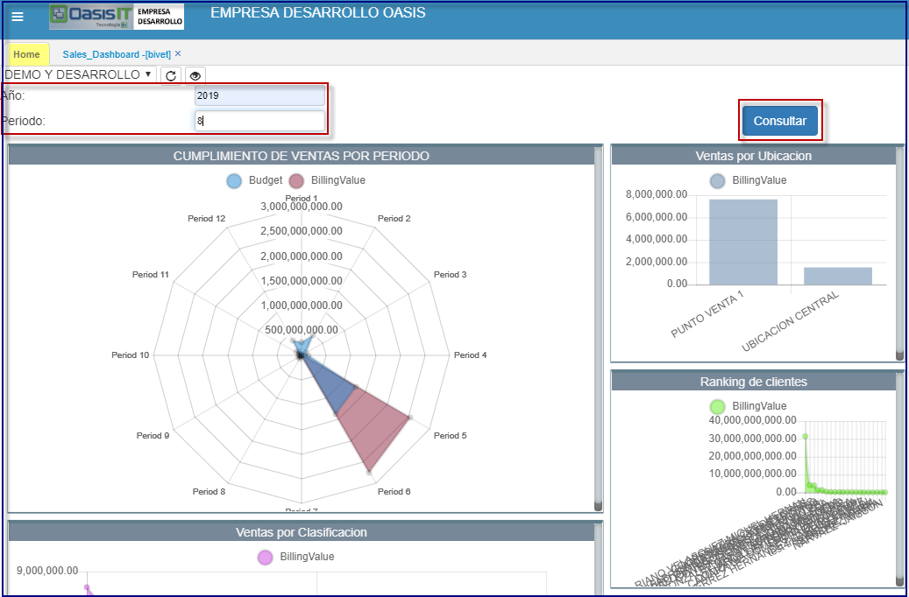
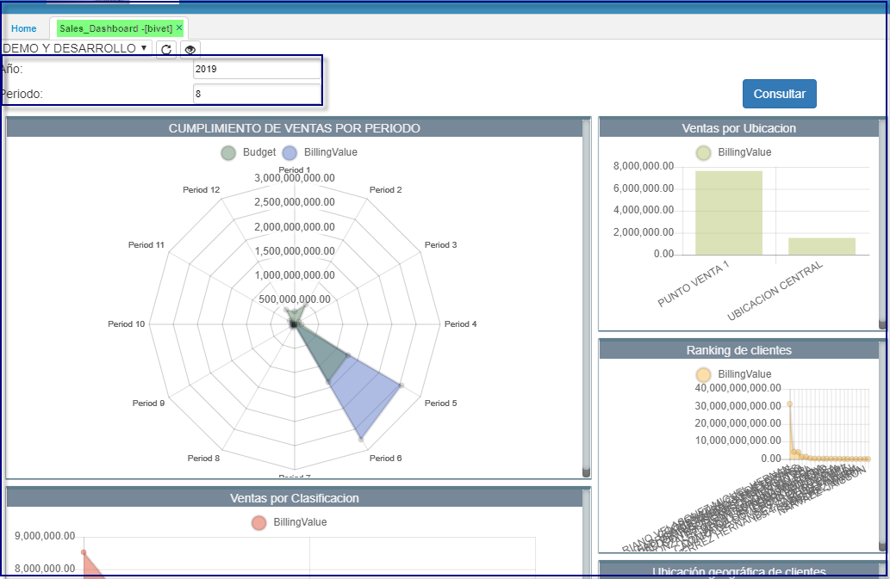

# BIVET - Tablero de Ventas

La aplicación **BIVET** permite visualizar gráficamente los indicadores que se tengan parametrizados por usuario. Dicha parametrización se define en la aplicación [**SROL - Roles**](http://docs.oasiscom.com/Operacion/system/sacceso/srol).  

Seleccionamos de la lista desplegable los indicadores que se desean visualizar.  

***

Los cuadros del tablero de control, parametrización de la consulta que desea establecer. Similar parametrizacion a las tablas pivote del B.I. (Business Intelligence). La parametrización será única para cada dashboard.  

* Desde el Home podemos parametizar cada uno de los tableros, tal como se refleja en el **BIVET**  
Se ingresan los datos de la consulta, para este escenario: año, periodo.  

**Home**  

  

**Bivet**  

  

