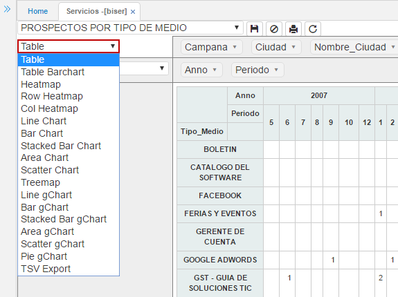
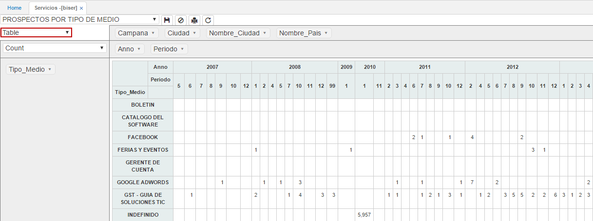
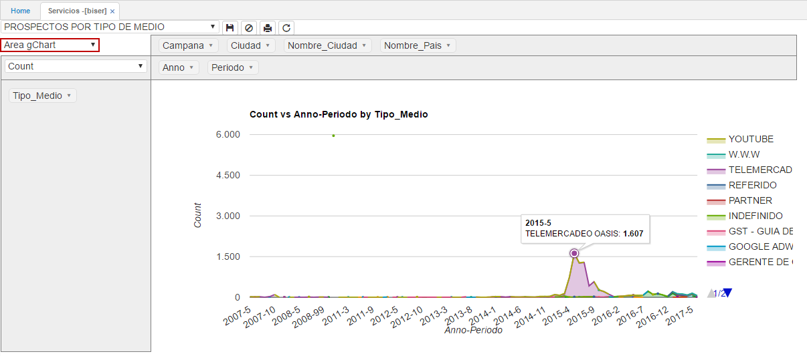
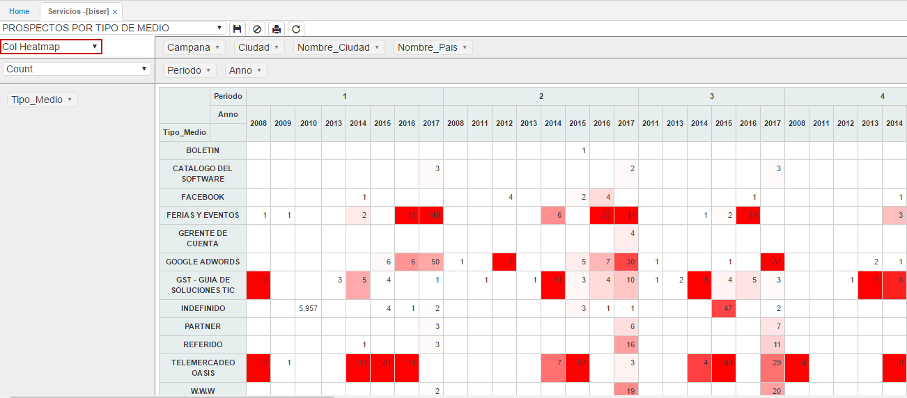
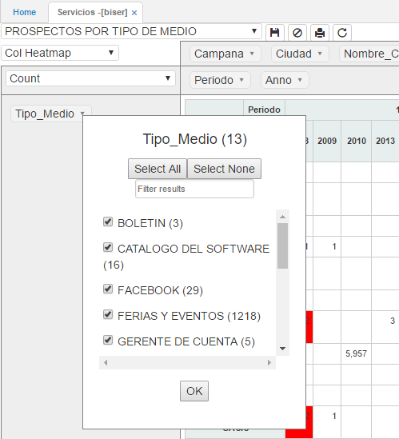
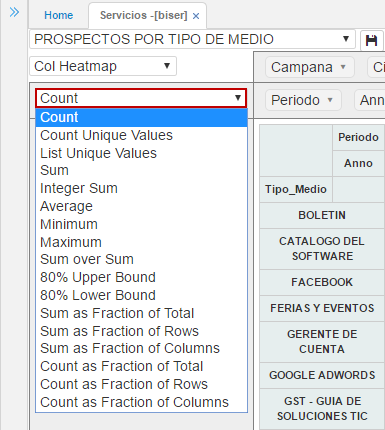
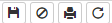

---
layout: default
title: BI Clientes
permalink: /Operacion/dss/bicrm/biser
editable: si
---

# BISER - Servicios

La aplicación **BISER** permite visualizar la información respecto a servicios, es decir, información de prospectos u oportunidades comerciales.  

Seleccionamos de la lista desplegable el reporte a consultar.  



Al seleccionar el reporte, el sistema arrojará una ventana como la siguiente, en donde se pueden observar en la columna las variables disponibles de consulta, estas variables podrán cambiar de acuerdo al reporte que se haya seleccionado de la lista desplegable inicial. Las variables de la columna se reflejarán en el eje **Y**.

En la parte superior de la ventana se encuentran dos filas, en la primera fila también se pueden ver algunas variables disponibles de consulta las cuales pueden ser arrastadas a la segunda fila, viéndose estas reflejadas en el eje **X** de la ventana o incluso se pueden agregar a la columna y verlas reflejadas en el eje **Y**, esto ya corresponde a como se requiera hacer la consulta.  Las variables se deben agregar en algún eje para que la aplicación **BISER** efectue la consulta.  




En la lista desplegable del recuadro blanco seleccionamos el tipo de gráfica como se quiere visualizar la información.  



Algunos ejemplos de como se puede visualizar la información es en:

_Tabla_




_Gráfica de línea con marcadores_



_Tabla de calor de acuerdo a la columna_



Cada variable permite realizar filtros de acuerdo a como se requiera hacer la consulta, junto al nombre de la varible se puede ver la cantidad de datos que contiene.  



Igualmente, permite seleccionar todas las opciones de las variables dando click en el botón  o desmarcar todas con el botón , si se desea buscar entre las opciones de la variable alguna en específico, se podrá consultar en el campo .  

La siguiente lista desplegable de la columna determina que operación se va a realizar para mostrar la información, por ejemplo (_Sumar, contar, promedios, máximos, mínimos, entre otros_).  



#### Botones Superiores



##### Guardar Reporte  

Permite guardar la última consulta realizada. Cuando el usuario vuelva a ingresar a la aplicación, esta arrojará la misma consulta.  

##### Deshacer cambios en el reporte 

Permite volver a la consulta inicial predeterminada por el reporte seleccionado.  

##### Imprimir Reporte   

Este botón convierte el reporte a formato PDF para realizar su impresión.  

##### Recargar datos del reporte   

Al dar click en este botón, se refrescará la información contenida en el reporte.  



