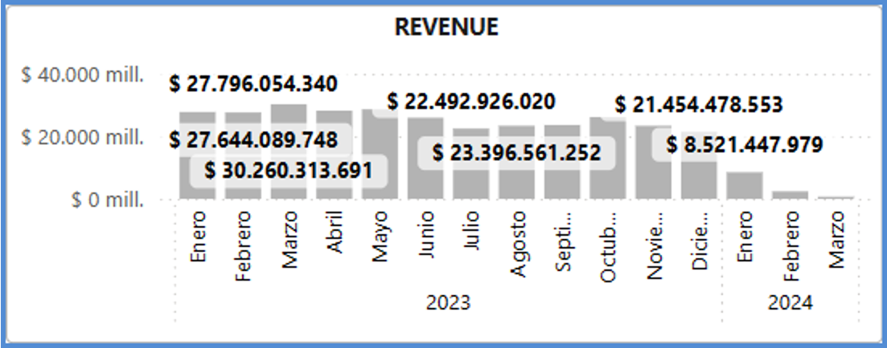
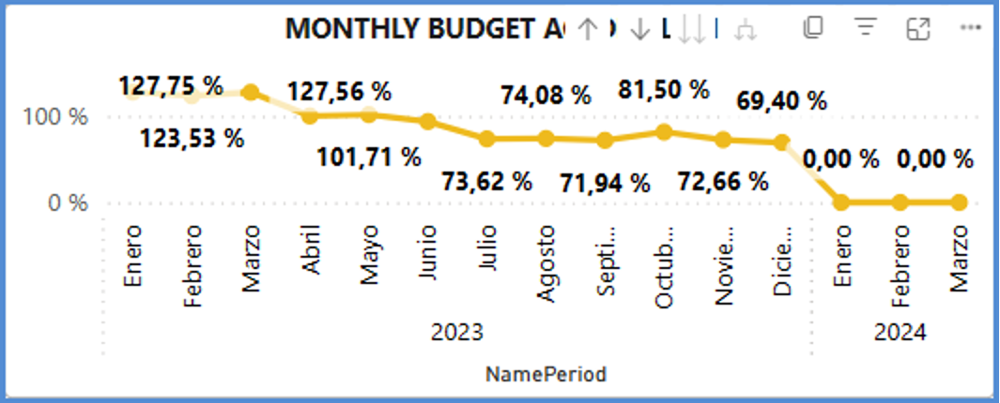
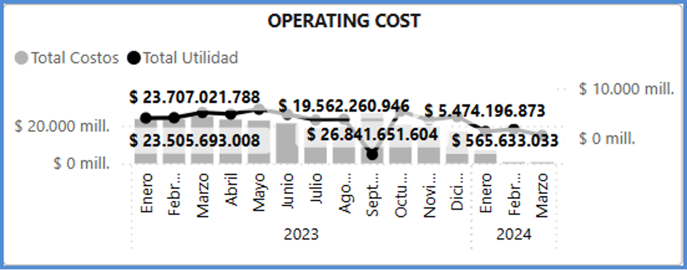
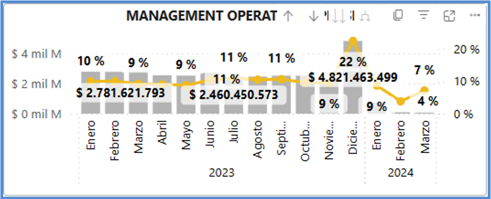
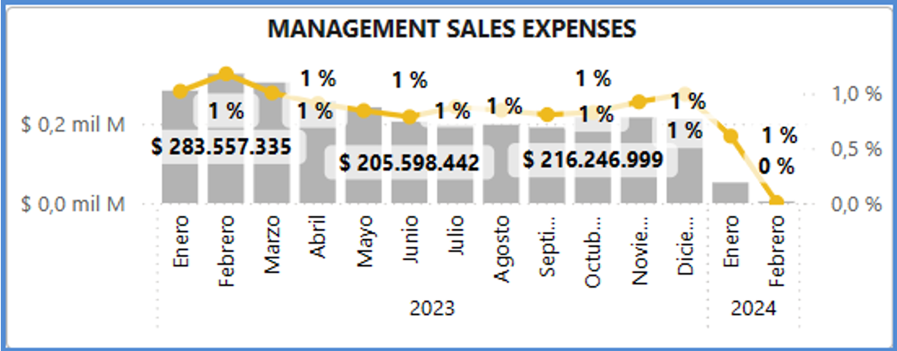
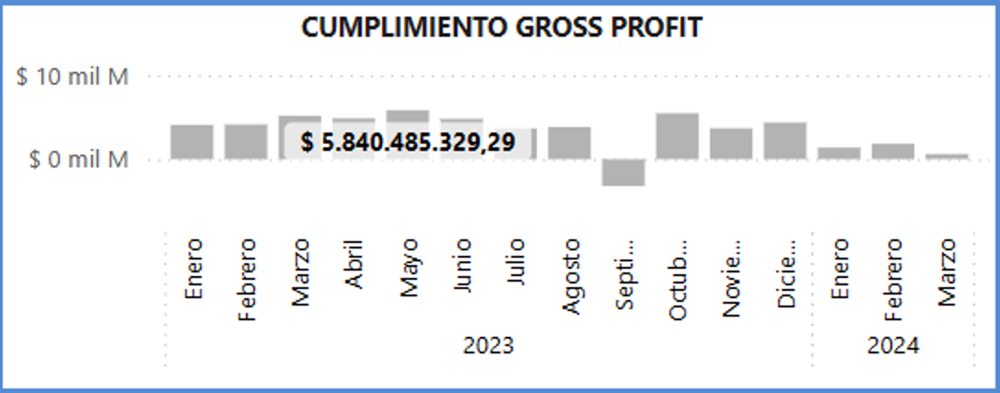
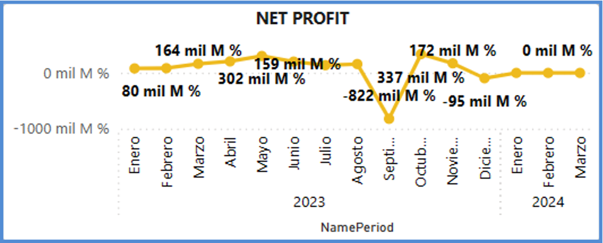

# BI FINANCIERO

Es una herramienta que ayuda a recopilar, analizar y visualizar grandes cantidades de datos financieros. Esto permite medir el desempeño, identificar tendencias, seguimiento presupuesto, costos, ganancias, ventas y demás.

Power BI es una herramienta que permite a directivos, profesionales de contabilidad y finanzas disponer de la información relevante en el momento preciso para la toma de decisiones estratégicas.

Tal como se visualiza en los siguientes gráficos: 

1. Ganancias de la Empresa. 

2. Cumplimiento de Presupuesto Mensual.

3. Operaciones de Costos.

4. Operación de Gestión.

5. Gastos de Gestión de Ventas.

6. Cumplimiento Beneficio Bruto. 

7. Beneficio Neto. 

