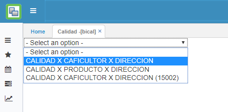
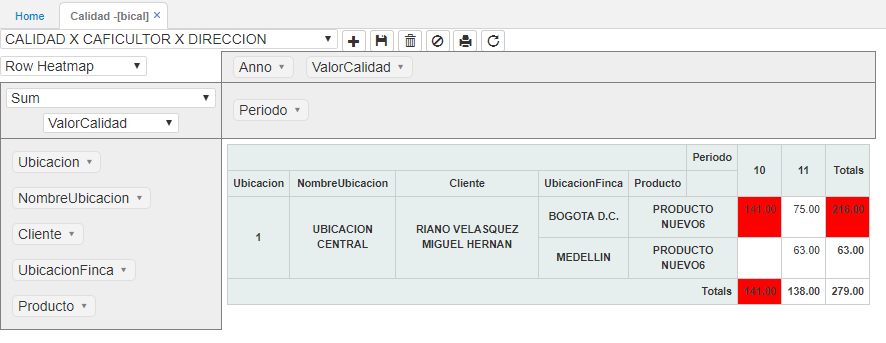
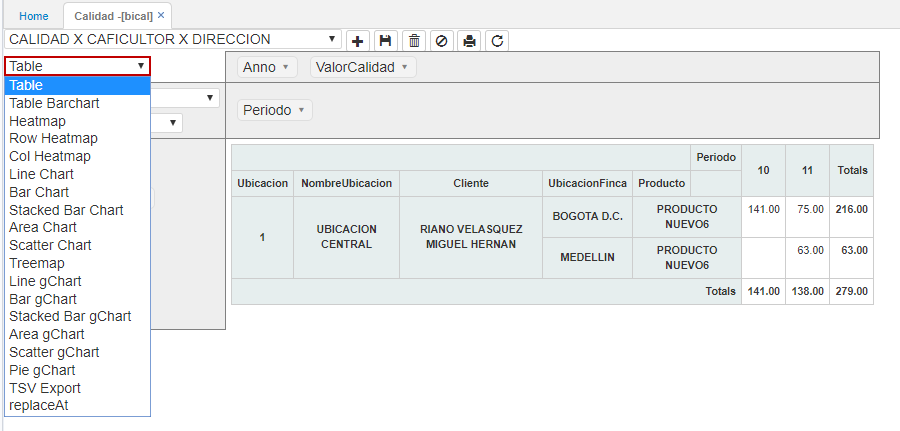
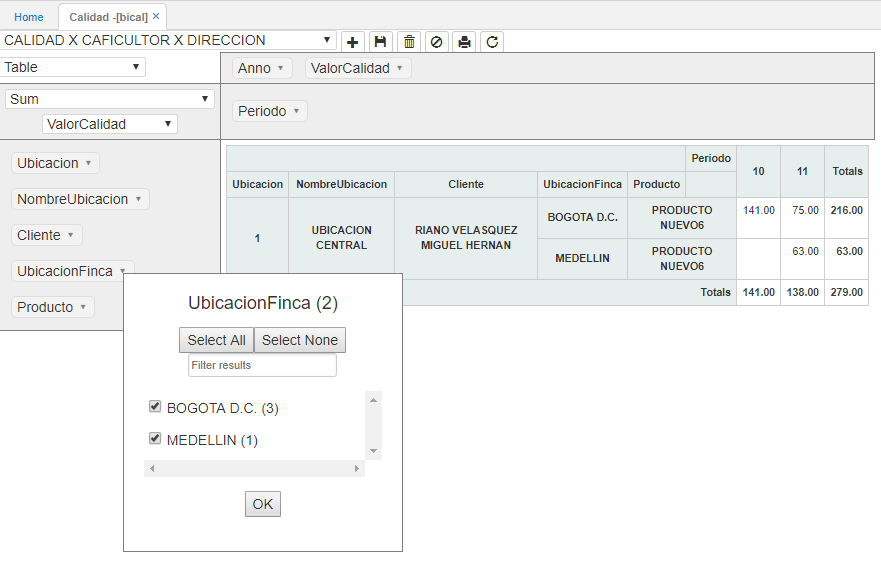
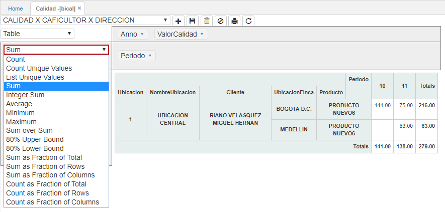
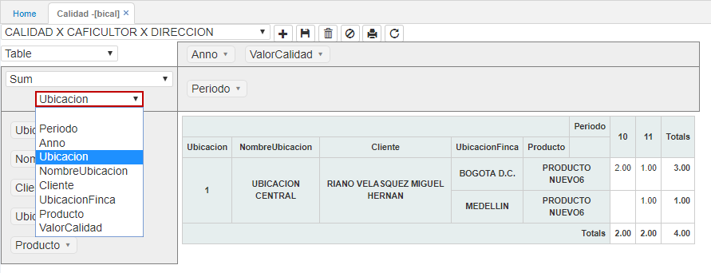
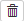
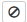

# BICAL - Calidad

La aplicación BICAL de calidad, permite visualizar información correspondiente al análisis de calidades por caficultor, por producto o por dirección. Esta aplicación se alimenta de la información  ingresada en [**AANA - Análisis de Calidad**]().  

Al ingresar a la aplicación, seleccionamos de la lista desplegable el reporte que se desea visualizar.  

Al seleccionar el reporte, el sistema arrojará una ventana como la siguiente, en donde se pueden observar en la primera columna las variables disponibles de consulta y que corresponden al eje **Y** y en la fila superior, las variables de consulta correspondientes al eje **X**.  

Estas variables se puede arrastrar al eje **X** o **Y** según como se quiera visualizar la información.  

En la lista desplegable del recuadro blanco seleccionamos el tipo de gráfica como se quiere visualizar la información.  

Cada variable permite realizar filtros de acuerdo a como se requiera hacer la consulta, junto al nombre de la varible se puede ver la cantidad de datos que contiene.  

Igualmente, permite seleccionar todas las opciones de las variables dando click en el botón o desmarcar todas con el botón , si se desea buscar entre las opciones de la variable alguna en específico, se podrá consultar en el campo .  

La segunda lista desplegable de la columna determina que operación se va a realizar para mostrar la información, por ejemplo (Sumar, contar, promedios, máximos, mínimos, entre otros).  

La siguiente lista desplegable de la columna, hace referencia al dato del campo consultado, por ejemplo, el dato que se muestra en la tabla corresponde a la cantidad de productos por ubicación.  

#### Botones Superiores

##### Guardar Reporte  

Permite guardar la última consulta realizada. Cuando el usuario vuelva a ingresar a la aplicación, esta arrojará la misma consulta.  

##### Eliminar Reporte  

Este botón elimina la publicación, es decir, el reporte consultado. Al eliminarlo, no se podrá volver a consultar la información por ese tipo de reporte. Es necesario tener cuidado al momento de hacer uso de dicho botón.  

##### Deshacer cambios en el reporte 

Permite volver a la consulta inicial predeterminada por el reporte seleccionado.  

##### Imprimir Reporte   

Este botón convierte el reporte a formato PDF para realizar su impresión.  

##### Recargar datos del reporte   

Al dar click en este botón, se refrescará la información contenida en el reporte.  

