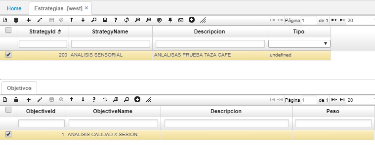

# WEST - Estrategias

En esta opción se crea la estrategia asociada a el proceso de análisis sensorial ([**AANA - Análisis de Calidad**](http://docs.oasiscom.com/Operacion/utility/calidad/bregis/aana)):  

En el maestro, se debe ingresar el Id de la estrategia, su nombre y descripción en los campos correspondientes. En el detalle, ingresaremos el objetivo de la estrategia.  

