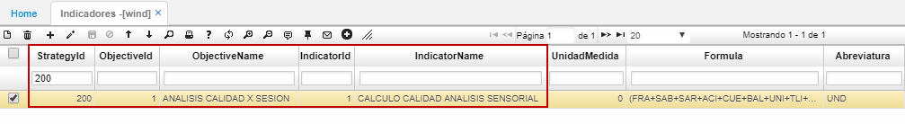
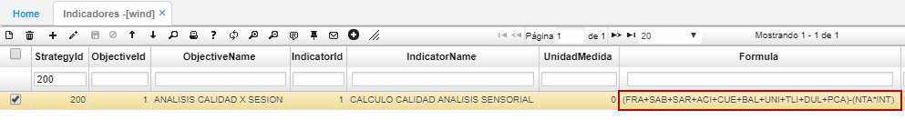

# WIND - Indicadores

## [Parametrización proceso Análisis de Calidad](http://docs.oasiscom.com/Operacion/dss/bsc/wbasica/wind#parametrización-proceso-análisis-de-calidad)

En esta opción se parametriza la fórmula de cálculo de calidad asociada a la estrategia previamente parametrizada en la opción [**WEST - Estrategia**](http://docs.oasiscom.com/Operacion/dss/bsc/wbasica/west).  

En el maestro:  

**StrategyId:** debe asociar el Id de la estrategia previamente parametrizada en el maestro de la opción [**WEST - Estrategia**](http://docs.oasiscom.com/Operacion/dss/bsc/wbasica/west).  
**Objetive Id:** se debe asociar el id del objetivo de la estrategia previamente parametrizado en el detalle de la opción [**WEST - Estrategia**](http://docs.oasiscom.com/Operacion/dss/bsc/wbasica/west).  
**IndicatorId** y **IndicatorName:** se deben ingresar el Id y el nombre del indicador.  

**Fórmula:** se debe parametrizar la fórmula de cálculo de calidad, así:  

**(FRA + SAB + SAR + ACI + CUE + BAL + UNI + TLI + DUL + PCA) - (NTA * INT)**

Los campos son los parametrizados en el formulario dinámico de la opción [**BMOT - Motivos**](http://docs.oasiscom.com/Operacion/common/bsistema/bmot#parametrización-formularios-dinámicos-opción-aana---análisis-de-calidad).  

(FRAGANCIA + SABOR + S. RESIDUAL + ACIDEZ + CUERPO + BALANCE + UNIFORMIDAD + TAZA LIMPIA + DULZOR + PUNTAJE CATADOR) - (# TAZAS * INTENSIDAD)  

Cuyos nemotécnicos pertenecen a los parametrizados en el detalle de la opción [**BMOT - Motivos**](http://docs.oasiscom.com/Operacion/common/bsistema/bmot#parametrización-formularios-dinámicos-opción-aana---análisis-de-calidad).  

