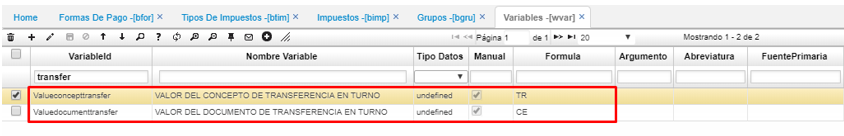

# WVAR - Variables

### [Parametrización para las transferencias de dinero](http://docs.oasiscom.com/Operacion/dss/bsc/wbasica/wvar#parametrización-para-las-transferencias-de-dinero)

Para realizar el proceso de transferencia de dinero, se deben asociar 2 variables, estas correspondientes a _Valor del concepto de transferencia en turno_ y _Valor del documento de transferencia en turno_. Las variables son definidas por cada empresa.  

El proceso de transferencias de dinero se realiza por la aplicación [**TPTR - Transferencias**](http://docs.oasiscom.com/Operacion/erp/tesoreria/tproceso/tptr). _(Ver aplicación)_

