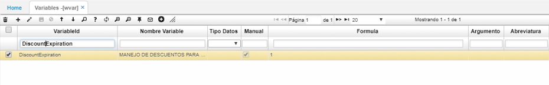

# WVAR - Variables

## [Parametrización para las transferencias de dinero](http://docs.oasiscom.com/Operacion/dss/bsc/wbasica/wvar#parametrización-para-las-transferencias-de-dinero)

Para realizar el proceso de transferencia de dinero, se deben asociar 2 variables, estas correspondientes a _Valor del concepto de transferencia en turno_ y _Valor del documento de transferencia en turno_. Las variables son definidas por cada empresa.  

El proceso de transferencias de dinero se realiza por la aplicación [**TPTR - Transferencias**](http://docs.oasiscom.com/Operacion/erp/tesoreria/tproceso/tptr). _(Ver aplicación)_

## [Parametrización liquidación por Vencimiento](http://docs.oasiscom.com/Operacion/dss/bsc/wbasica/wvar#parametrización-liquidación-por-vencimiento)

Para hacer uso de la funcionalidad de descuentos para productos con fecha de vencimiento, se debe tener presente la siguiente configuracion en WVAR.  

Se debe crear una variable para indicar que la empresa maneja este tipo de descuentos (1 aplica, 0 no aplica), esto aplica unicamente para los productos que manejan fecha de vencimiento.  

Seguidamente, continuación la parametrización en la aplicación [**FDES - Descuentos**](http://docs.oasiscom.com/Operacion/scm/facturacion/fprecio/fdes#parametrización-liquidación-por-vencimiento).  

