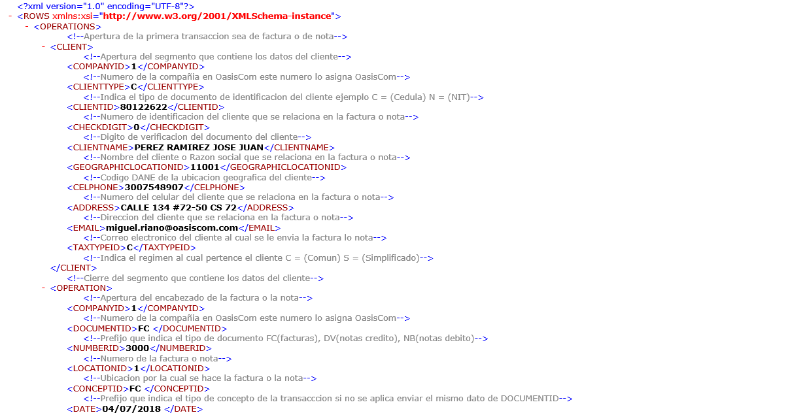
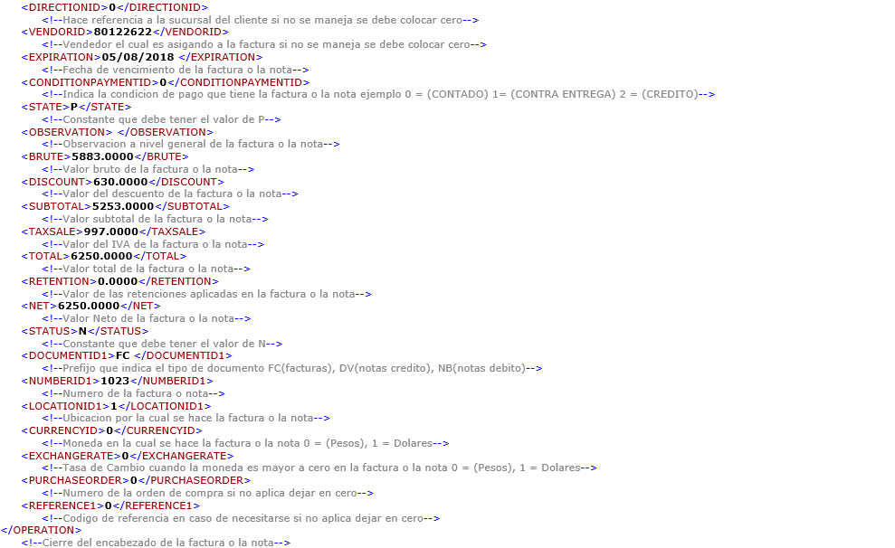
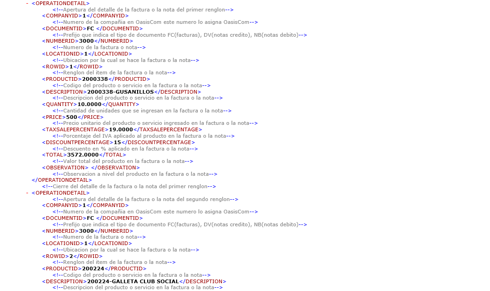
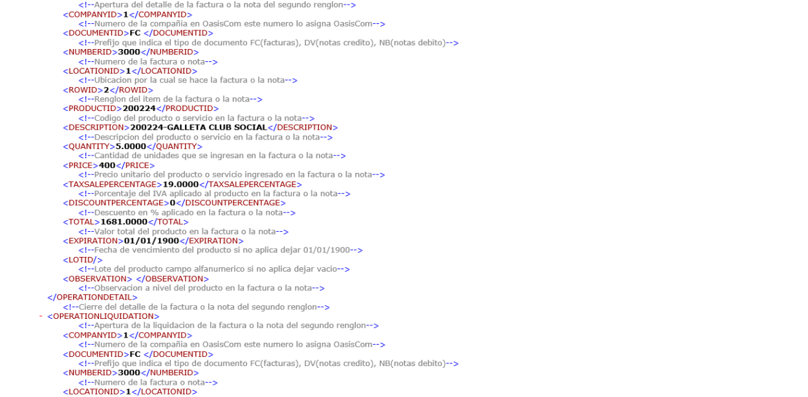

# FACTURA ELECTRONICA

**Menú**  

1. [Correo Factura Electrónica](http://docs.oasiscom.com/Operacion/ebportal/#correo-factura-electrónica)  
2. [Código QR](http://docs.oasiscom.com/Operacion/ebportal/#código-qr)  
3. [Envío de mensajes de texto](http://docs.oasiscom.com/Operacion/ebportal/#envío-de-mensajes-de-texto)  
4. [Adjuntos en la factura electrónica](http://docs.oasiscom.com/Operacion/ebportal/#adjuntos-en-la-factura-electrónica)  
5. [Integración de documentos electrónicos con OasisCom](http://docs.oasiscom.com/Operacion/ebportal/#integración-de-documentos-electrónicos-con-oasiscom)  
5.1 [Archivo XML](http://docs.oasiscom.com/Operacion/ebportal/#archivo-xml)  
5.2 [Archivo plano](http://docs.oasiscom.com/Operacion/ebportal/#archivo-plano)  
5.3 [Instructivo Integración OasisCom](http://docs.oasiscom.com/Operacion/ebportal/#instructivo-integración-oasiscom)  
6. [Actualización RUT Hoja 2 - Facturador Electrónico](http://docs.oasiscom.com/Operacion/ebportal/#actualización-rut-hoja-2---facturador-electrónico)

## [Correo Factura Electrónica](http://docs.oasiscom.com/Operacion/ebportal/#correo-factura-electrónica)

La plantilla de envío de facturas electrónicas contiene tres links que permiten confirmar el recibido de la factura, _Aceptarla_ o _Rechazarla_. Igualmente, para cada acción se envía una plantilla de correo como respuesta.  

Plantilla al confirmar el recibido de la factura.  

Plantilla al _Aceptar_ una factura.  

Plantilla al _Rechazar_ una factura.  

**Nota:** las plantillas de envío de correos se visualizarán con el logo de la empresa de donde el usuario se encuentre en sesión.  

## [Código QR](http://docs.oasiscom.com/Operacion/ebportal/#código-qr)

El formato de factura electrónica que se envía al adquiriente contiene un Código QR, que le permitirá ver desde un dispositivo móvil los datos de la factura.  

## [Envío de mensajes de texto](http://docs.oasiscom.com/Operacion/ebportal/#envío-de-mensajes-de-texto)

Generada la factura electrónica, el sistema enviará automáticamente un mensaje de texto al número del dispositivo móvil del cliente registrado en el sistema informando de la creación de la factura.  

## [Adjuntos en la factura electrónica](http://docs.oasiscom.com/Operacion/ebportal/#adjuntos-en-la-factura-electrónica)

En el envío de la factura electrónica es posible agregar archivos adjuntos, para ello, se debe parametrizar inicialmente los campos _Ebill_ y _EbillAdjunct_ en la aplicación **SEMP - Empresas**, lo cual indicará que la empresa emite facturación electrónica y podrá adjuntar archivos en la misma.  

Los archivos adjuntos que se visualizarán en el correo eletrónico son:  

1. Documento **.pdf** con el formato fisico de la factura.  
2. Archivo **.zip** con la factura electrónica en formato **.xml**.  
3. Los demás archivos adjuntos que hayan sido agregados en la factura electrónica al momento de generarla.  

## [Integración de documentos electrónicos con OasisCom](http://docs.oasiscom.com/Operacion/ebportal/#integración-de-documentos-electrónicos-con-oasiscom)

### [Archivo XML](http://docs.oasiscom.com/Operacion/ebportal/#archivo-xml)

Mediante archivo XML el cliente puede subir documentos electrónicos a la plataforma de OasisCom o consumiendo un servicio web que provee OasisCom para que este cargue sea de forma automática.  

**Estructura**

### [Archivo plano](http://docs.oasiscom.com/Operacion/ebportal/#archivo-plano)

Cuando no se cuenta con una estructura en formato XML, OasisCom provee una estructura en formato de _archivo plano_ el cual debe ser cargado de forma manual a la plataforma de OasisCom por medio de la aplicación BINT - Interfaces.  

**Nota:** al cargar el archivo plano, el sistema creará los terceros y productos en caso de que no existan previamente.  

Los datos relacionados al color amarillo son los que irán diligenciados en el maestro de la aplicación FFAC - Facturas y los asociados al color verde en el detalle.  

La estructura enviada por OasisCom cuenta con comentarios en cada campo para facilitar su diligenciamiento.  

Ingresada toda la información en el archivo de Excel, debemos eliminar los renglónes señalados en la siguiente imagen para así proceder a convertirlo en formato _.CVS_.  

Al eliminar los anteriores renglones deberá quedar así:  

Para convertir el archivo en formato **.CVS** vamos a _Archivo  Guardar como  Elegimos una ubicación  Asignamos un nombre  Tipo: CSV (delimitado por comas)  Guardar_.  

**_IMPORTANTE:_** Convertido el archivo en formato _.CVS_, este se debe abrir en el editor de texto y eliminar el último espacio en blanco.  

Quedando el cursor en el último caracter del último renglón.  

### [Instructivo Integración OasisCom](http://docs.oasiscom.com/Operacion/ebportal/#instructivo-integración-oasiscom)

A continuación, se dará a conocer la data requerida para realizar la carga de documentos electrónicos en los formatos XLS o TXT para el proceso de facturación electrónica en OasisCom.  

#### _Definiciones_

Descripción de cada una de las columnas de la malla de validación:  

**Atributo:** Corresponde al nombre del campo a definir.  
**Tipo:** Identifica si los datos del campo son a nivel de maestro **(M)** o del detalle **(D)** de la transacción, factura o nota.  
**Descripción:** Breve explicación de la característica del campo en cuestión.  
**T:** Corresponde al tipo de dato del campo:  

 * **D**: Campo tipo fecha.  
 * **N:** Campo de tipo número (Entero, Decimal).  
 * **C:** Carácter o cadena de caracteres.  

**Longitud máxima:** En esta columna se describe el tamaño máximo requerido para el campo (en números).  
**Req. Valor:** Identifica si el campo es o no es obligatorio. **S** para si, **N** para no.  
**Formato:** Ejemplo de cómo debe ser llenado cada campo.  

#### _Malla de validación_

A continuación, se describe la malla de validación con la información precisa para realizar la carga de documentos electrónicos.  

## [Actualización RUT Hoja 2 - Facturador Electrónico](http://docs.oasiscom.com/Operacion/ebportal/#actualización-rut-hoja-2---facturador-electrónico)

El siguiente instructivo contiene el paso a paso para actualizar RUT (hoja #2) y seleccionar al Proveedor Tecnológico (OasisCom S.A.S) en la página de la DIAN.  

* Ingresar a la página web de la DIAN (https://muisca.dian.gov.co) y loguearse.  

* En el menú izquierdo seleccionar la opción _Registro Único Tributario_.  

* De la lista desplegable, seleccionar la opción _Actualizar RUT_.  

* Seguidamente dar click en el botón _Continuar_.  

* Dar click en el botón _Continuar_.  

* De la lista desplegable seleccionar la **Hoja 2**.  

* Para cargar el documento damos click en el botón _Continuar_.  

* En el formulario de la **Hoja 2**, en el renglón 89 seleccionar la opción _74 - Información Proveedor de Servicios Tecnológicos PST_.  

* Allí mismo, en el renglón 90 seleccionar la fecha exacta en la que se asoció al proveedor tecnológico.  

* Seguidamente, en el renglón 91 ingresar el número de NIT de OASISCOM S.A.S **830003840-5**.  

* Finalmente, guardar y firmar para formalizar el documento.  
