# Factura Electronica

---
### Factura Electrónica

>###### [Factura Electrónica (descargar)](http://docs.oasiscom.com/Operacion/ebportal/factura-electronica.pdf)  
>###### [Factura Electrónica Fase Dos (descargar)](http://docs.oasiscom.com/Operacion/ebportal/factura-electronica-dos.pdf)  
>###### [Manual Documentos Equivalentes (descargar)](http://docs.oasiscom.com/Operacion/ebportal/manual-documentos-equivalentess.pdf)
---

**Menú**  

1. [Correo Factura Electrónica](http://docs.oasiscom.com/Operacion/ebportal/#correo-factura-electrónica)  
2. [Código QR](http://docs.oasiscom.com/Operacion/ebportal/#código-qr)  
3. [Envío de mensajes de texto](http://docs.oasiscom.com/Operacion/ebportal/#envío-de-mensajes-de-texto)  
4. [Adjuntos en la factura electrónica](http://docs.oasiscom.com/Operacion/ebportal/#adjuntos-en-la-factura-electrónica)  
5. [Integración de documentos electrónicos con OasisCom](http://docs.oasiscom.com/Operacion/ebportal/#integración-de-documentos-electrónicos-con-oasiscom)  
5.1 [Archivo XML](http://docs.oasiscom.com/Operacion/ebportal/#archivo-xml)  
5.2 [Archivo plano](http://docs.oasiscom.com/Operacion/ebportal/#archivo-plano)  
5.3 [Instructivo Integración OasisCom](http://docs.oasiscom.com/Operacion/ebportal/#instructivo-integración-oasiscom)    
5.4 [Proceso de Factura Electrónica en Oasiscom R3](http://docs.oasiscom.com/Operacion/ebportal/#proceso-de-factura-electrónica-en-oasis-r3)   
5.5 [Proceso de Factura Electrónica en los On Premise](http://docs.oasiscom.com/Operacion/ebportal/#proceso-de-factura-electrónica-en-los-on-premise)  
5.6 [Proceso de Factura Electrónica en la plataforma de Oasiscom en Azure](http://docs.oasiscom.com/Operacion/ebportal/#proceso-de-factura-electrónica-en-la-plataforma-de-oasis-en-azure)  
6. [Actualización RUT Hoja 2 - Facturador Electrónico](http://docs.oasiscom.com/Operacion/ebportal/#actualización-rut-hoja-2---facturador-electrónico)  
7. [Manual Facturación Electrónica - Archivo XML](http://docs.oasiscom.com/Operacion/ebportal/#manual-facturación-electrónica---archivo-xml)  
7.1 [Cargue de Factura Electrónica - Archivo XML](http://docs.oasiscom.com/Operacion/ebportal/#cargue-de-factura-electrónica---archivo-xml)  
7.2 [Verificación de Facturas Electrónicas](http://docs.oasiscom.com/Operacion/ebportal/#verificación-de-facturas-electrónicas)  
7.3 [Modificación de Datos Adquiriente](http://docs.oasiscom.com/Operacion/ebportal/#modificación-de-datos-adquiriente)  
8. [Facturación Electrónica Fase Dos](http://docs.oasiscom.com/Operacion/ebportal/#facturación-electrónica-fase-dos)  
9. [Manual de Documentos Equivalentes](http://docs.oasiscom.com/Operacion/ebportal/#manual-de-documentos-equivalentes)  
9.1 [Aplicación BDOC–Básico de documentos](http://docs.oasiscom.com/Operacion/ebportal/#aplicación-bdoc-básico-de-documentos)  
9.2 [Aplicación BMOT–Motivos](http://docs.oasiscom.com/Operacion/ebportal/#aplicación-bmot-motivos)  
9.3 [Aplicación BPLA-Plantillas](http://docs.oasiscom.com/Operacion/ebportal/#aplicación-bpla-plantillas)  
9.4 [Aplicación FRES-Resoluciones](http://docs.oasiscom.com/Operacion/ebportal/#aplicación-fres-resoluciones)  
9.5 [Aplicación BCNS-Consecutivos](http://docs.oasiscom.com/Operacion/ebportal/#aplicación-bcns-consecutivos)  
10. [Manual Documento Soporte](http://docs.oasiscom.com/Operacion/ebportal/#manual-documento-soporte)  
10.1 [Habilitación de la aplicación ODEQ](http://docs.oasiscom.com/Operacion/ebportal/#habilitación-de-la-aplicación-odeq)  
10.1.1 [Aplicación SROL-Roles](http://docs.oasiscom.com/Operacion/ebportal/#aplicación-srol-roles)  
10.1.2 [Aplicación WVAR-Variables](http://docs.oasiscom.com/Operacion/ebportal/#aplicación-wvar-variables)   
10.1.3 [Aplicación BDOC-Documentos](http://docs.oasiscom.com/Operacion/ebportal/#aplicación-bdoc-documentos)  
10.1.4 [Aplicación BPRO-Productos](http://docs.oasiscom.com/Operacion/ebportal/#aplicación-bpro-productos)
10.2 [Validaciones en la aplicación ODEQ](http://docs.oasiscom.com/Operacion/ebportal/#validaciones-en-la-aplicación-odeq)  
10.2.1 [A nivel de documentos](http://docs.oasiscom.com/Operacion/ebportal/#a-nivel-de-documentos)  
10.2.2 [A nivel de tercero](http://docs.oasiscom.com/Operacion/ebportal/#a-nivel-de-tercero)  
10.2.2.1 [Aplicación BTER-Tercero](http://docs.oasiscom.com/Operacion/ebportal/#aplicación-bter-tercero)  
10.2.2.2 [Aplicación BTIM–Tipos de Impuestos](http://docs.oasiscom.com/Operacion/ebportal/#aplicación-btim-tipos-de-impuestos)  
10.2.3 [Resolución de documentos soporte](http://docs.oasiscom.com/Operacion/ebportal/#resolución-de-documentos-soporte)  
10.2.3.1 [Aplicación FRES–Resoluciones](http://docs.oasiscom.com/Operacion/ebportal/#aplicación-fres-resoluciones)  
10.2.3.2 [Aplicación BCNS–Consecutivos](http://docs.oasiscom.com/Operacion/ebportal/#aplicación-bcns-consecutivos)  
10.3 [Aplicación ODEQ–Documento Equivalente](http://docs.oasiscom.com/Operacion/ebportal/#aplicación-odeq-documento-equivalente)  

     

## [Correo Factura Electrónica](http://docs.oasiscom.com/Operacion/ebportal/#correo-factura-electrónica)

La plantilla de envío de facturas electrónicas contiene tres links que permiten confirmar el recibido de la factura, _Aceptarla_ o _Rechazarla_. Igualmente, para cada acción se envía una plantilla de correo como respuesta.  

Plantilla al confirmar el recibido de la factura.  

Plantilla al _Aceptar_ una factura.  

Plantilla al _Rechazar_ una factura.  

**Nota:** las plantillas de envío de correos se visualizarán con el logo de la empresa de donde el usuario se encuentre en sesión.  

## [Código QR](http://docs.oasiscom.com/Operacion/ebportal/#código-qr)

El formato de factura electrónica que se envía al adquiriente contiene un Código QR, que le permitirá ver desde un dispositivo móvil los datos de la factura.  

## [Envío de mensajes de texto](http://docs.oasiscom.com/Operacion/ebportal/#envío-de-mensajes-de-texto)

Generada la factura electrónica, el sistema enviará automáticamente un mensaje de texto al número del dispositivo móvil del cliente registrado en el sistema informando de la creación de la factura.  

## [Adjuntos en la factura electrónica](http://docs.oasiscom.com/Operacion/ebportal/#adjuntos-en-la-factura-electrónica)

En el envío de la factura electrónica es posible agregar archivos adjuntos, para ello, se debe parametrizar inicialmente los campos _Ebill_ y _EbillAdjunct_ en la aplicación **SEMP - Empresas**, lo cual indicará que la empresa emite facturación electrónica y podrá adjuntar archivos en la misma.  

Los archivos adjuntos que se visualizarán en el correo eletrónico son:  

1. Documento **.pdf** con el formato fisico de la factura.  
2. Archivo **.zip** con la factura electrónica en formato **.xml**.  
3. Los demás archivos adjuntos que hayan sido agregados en la factura electrónica al momento de generarla.  

## [Integración de documentos electrónicos con OasisCom](http://docs.oasiscom.com/Operacion/ebportal/#integración-de-documentos-electrónicos-con-oasiscom)

### [Archivo XML](http://docs.oasiscom.com/Operacion/ebportal/#archivo-xml)

Mediante archivo XML el cliente puede subir documentos electrónicos a la plataforma de OasisCom o consumiendo un servicio web que provee OasisCom para que este cargue sea de forma automática.  

**Estructura**

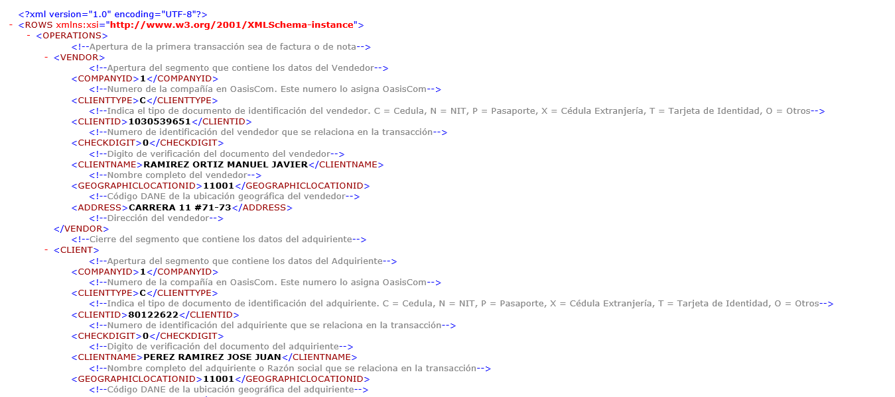
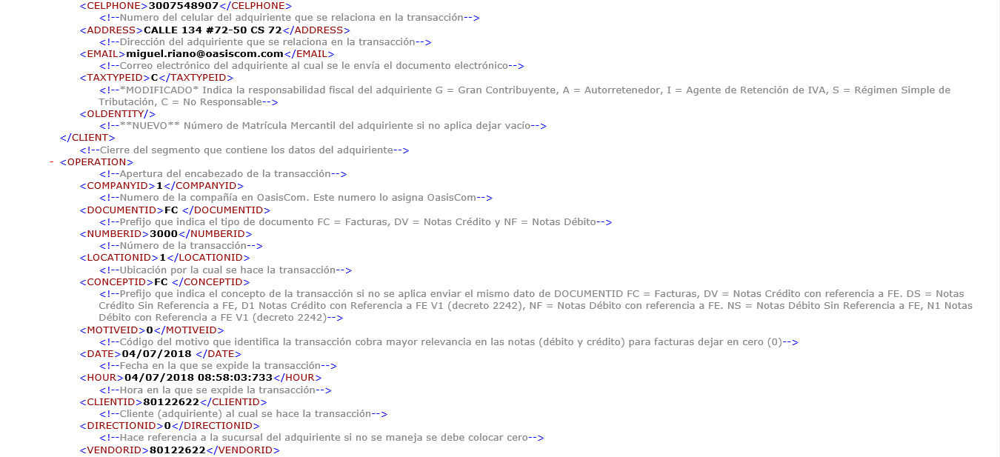
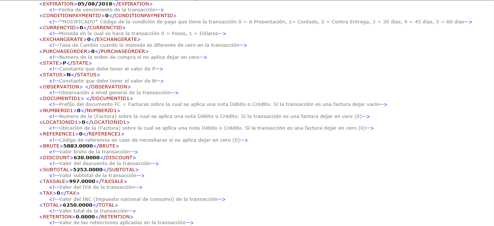
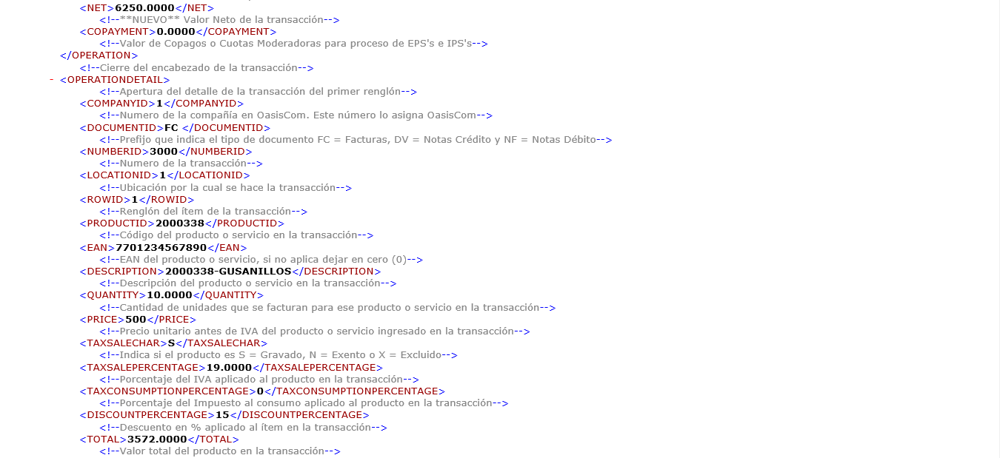
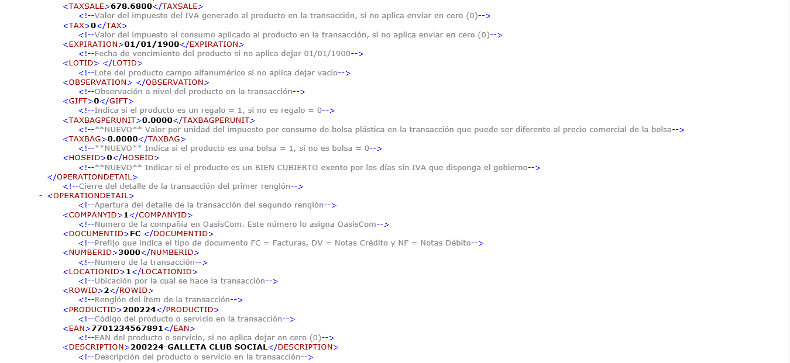
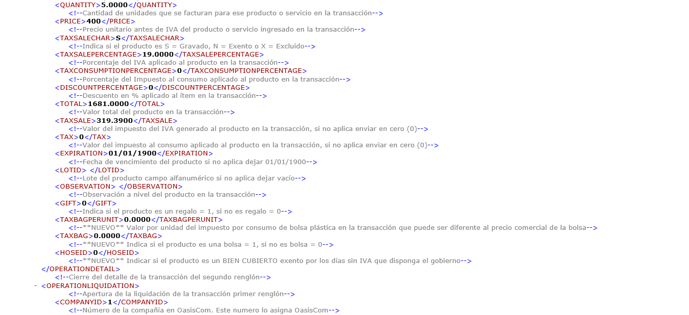
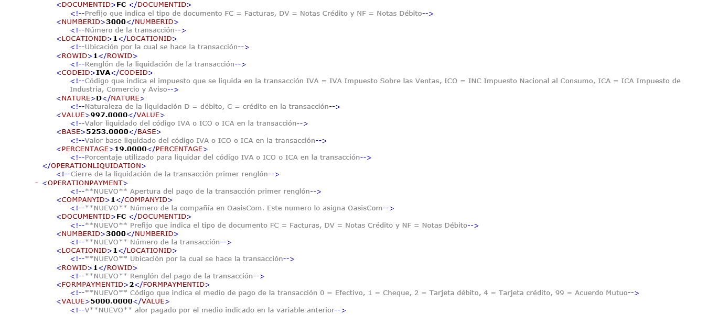
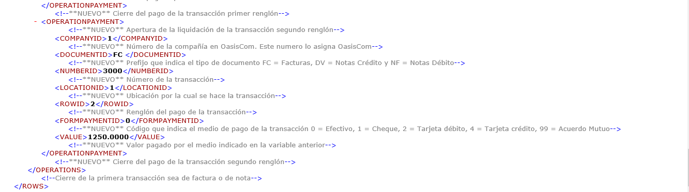

### [Archivo plano](http://docs.oasiscom.com/Operacion/ebportal/#archivo-plano)  

Cuando no se cuenta con una estructura en formato XML, OasisCom provee una estructura en formato de _archivo plano_ el cual debe ser cargado de forma manual a la plataforma de OasisCom por medio de la aplicación BINT - Interfaces.  

#### [Descargue Aquí el Archivo Plano](http://docs.oasiscom.com/Operacion/ebportal/Archivo_Plano.xlsx) 

**Nota:** al cargar el archivo plano, el sistema creará los terceros y productos en caso de que no existan previamente.  

Los datos relacionados al color:  
* **Azul** corresponde al Adquiriente.   
* **Color** gris del vendedor.   
* **Amarillo** son los que irán diligenciados en el maestro de la aplicación FFAC - Facturas.  
* Los asociados al color **verde** en el detalle.    

  

La estructura enviada por OasisCom cuenta con comentarios en cada campo para facilitar su diligenciamiento.  

  

Ingresada toda la información en el archivo de Excel, debemos eliminar los renglónes señalados en la siguiente imagen para así proceder a convertirlo en formato _.CVS_.   

  

Al eliminar los anteriores renglones deberá quedar así:  

 

Para convertir el archivo en formato **.CVS** vamos a _Archivo  Guardar como  Elegimos una ubicación  Asignamos un nombre  Tipo: CSV (delimitado por comas)  Guardar_.   

Una vez guardado, se ingresa a la aplicación **Interfaces - BINT**, se selecciona la publicación 961 (SUBIDA FACTURA ELECTRÓNICA FASE II (PLANO)), se selecciona el archivo que se guardó en .csv y se da clic en *Aceptar y Ejecutar* y el sisema genera un mensaje de control.

Posteriormente, se ingresa a la aplicación **Facturas de venta - ebffac.** En esta aplicación se valida que estén todas las facturas de acuerdo al consecutivo, estén en Envío existoso y estén cargadas en **OASIS.**

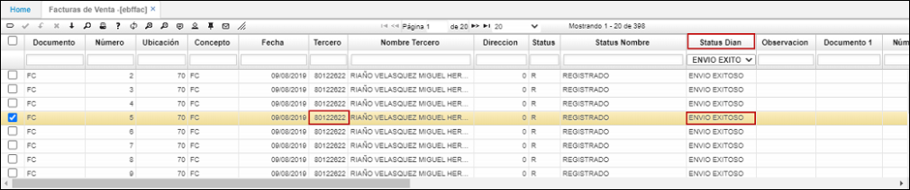

En la pestaña *Ejecutado,* se entra a validar si el envío efectivamente se realizó con éxito a la DIAN y la hora en la que se realizó el envío.

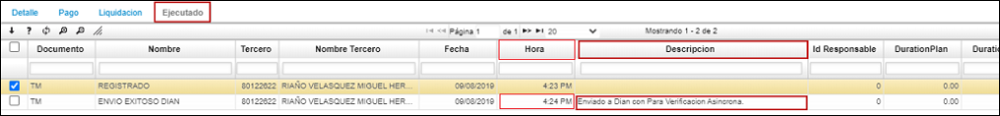

**_IMPORTANTE:_** Convertido el archivo en formato _.CVS_, este se debe abrir en el editor de texto y eliminar el último espacio en blanco.  

Quedando el cursor en el último caracter del último renglón.  

### [Instructivo Integración OasisCom](http://docs.oasiscom.com/Operacion/ebportal/Instructivo_Integracion_OasisCom_v1.0.pdf)

A continuación, se dará a conocer la data requerida para realizar la carga de documentos electrónicos en los formatos XLS o TXT para el proceso de facturación electrónica en OasisCom.  

#### _Definiciones_

Descripción de cada una de las columnas de la malla de validación:  

**Atributo:** Corresponde al nombre del campo a definir.  
**Tipo:** Identifica si los datos del campo son a nivel de maestro **(M)** o del detalle **(D)** de la transacción, factura o nota.  
**Descripción:** Breve explicación de la característica del campo en cuestión.  
**T:** Corresponde al tipo de dato del campo:  

 * **D**: Campo tipo fecha.  
 * **N:** Campo de tipo número (Entero, Decimal).  
 * **C:** Carácter o cadena de caracteres.  

**Longitud máxima:** En esta columna se describe el tamaño máximo requerido para el campo (en números).  
**Req. Valor:** Identifica si el campo es o no es obligatorio. **S** para si, **N** para no.  
**Formato:** Ejemplo de cómo debe ser llenado cada campo.  

#### _Malla de validación_

A continuación, se describe la malla de validación con la información precisa para realizar la carga de documentos electrónicos.  

  

## [Proceso de Factura Electrónica en Oasiscom R3](http://docs.oasiscom.com/Operacion/ebportal/#proceso-de-factura-electrónica-en-oasiscom-r3)

Para iniciar el proceso de Facturación electrónica en la versión R3 de Oasiscom, se crea una factura normal con el *Documento* correspondiente y el *Número* de documento. Cabe resaltar que la factura debe estar en *Estado Procesado* para poderla transmitir a Oasiscom en Azure.

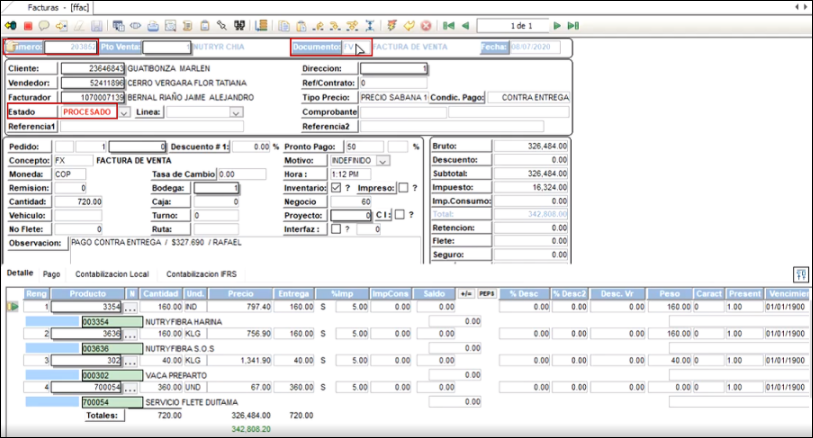

Cuando la factura ya esté hecha, ingreso a la aplicación **Log-BINT - FPFE.** Una vez en esta aplicación, se filtra por el número de la factura.

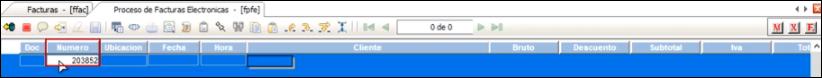

Se utiliza el comando **Ctrl F** y aquí se evidencia la factura para poderla transmitir a Oasiscom. Se selecciona y se oprime el primer botón de la derecha: *Marcar todo*

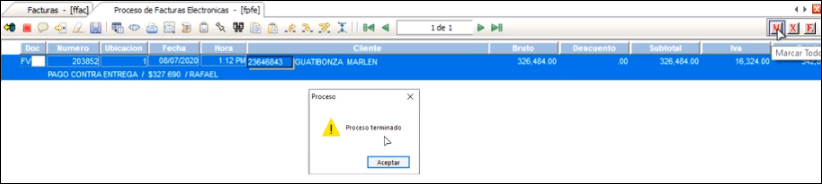

Finalmente, se oprime el botón _**Envía transacciones automáticamente**_ y aparece un aviso de control diciendo que el proceso ha terminado.

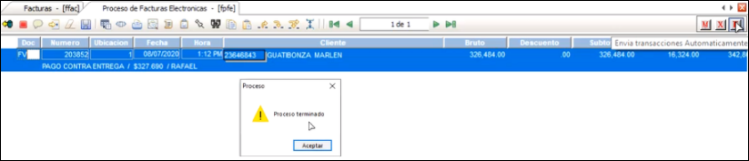

Una vez terminado el proceso, nos dirigimos a Oasiscom e ingresamos a la aplicación **Facturas de venta - EBFFAC**

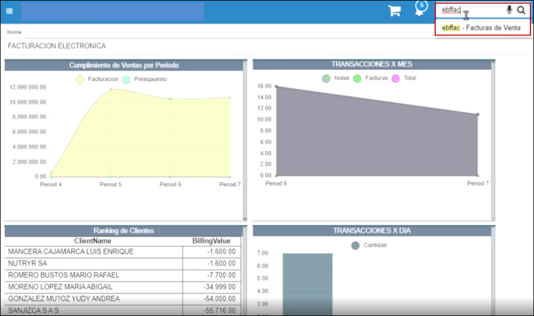

Aquí también se filtra por el número de la factura y se evidencia que la factura se transmitió de manera correcta y se verifica que el campo Status _**DIAN**_ sea _**Envío exitoso**_

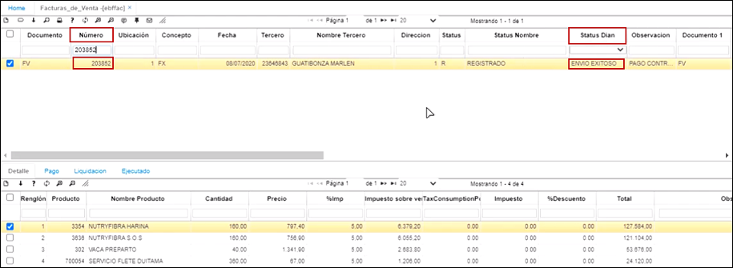

Ahora, en esta parte, se valida cómo se pasa una factura de OasisR3 a Oasiscom descargando el archivo XML. Una vez se tiene la factura ya lista y procesada, se pasa de nuevo a la aplicación **Log-BINT - FPFE** y se filtra por el número de factura y se hace aplica el comando **Ctrl F.** Estando en este punto, se selecciona el registro y se da clic en la opción *Marcar todo*. Aparece el aviso de control *Proceso terminado* y se da clic en aceptar.

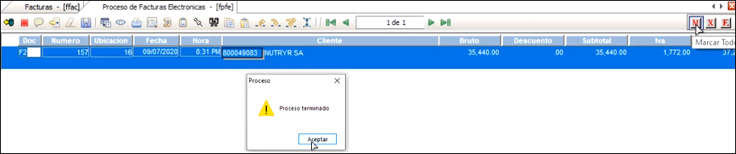

Luego, se oprime el botón *Generar archivo XML.* El sistema solicita que se guarde el archivo y se puede asignar el nombre que se desee. Aparece el aviso de control *Proceso terminado* y se da clic en aceptar.

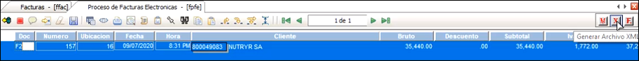

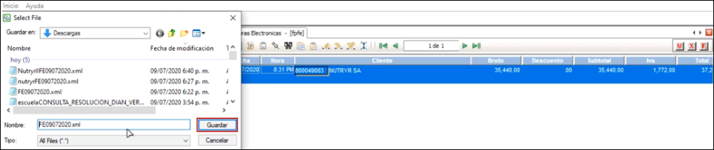

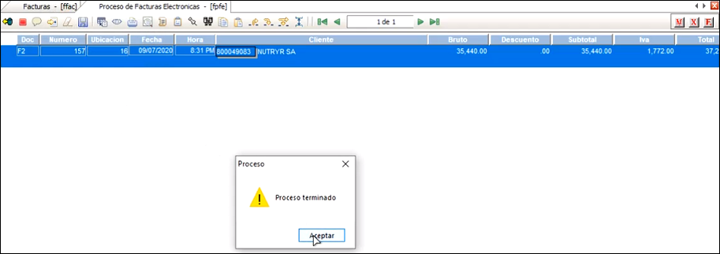

Una vez terminado el proceso, se accede a Oasiscom y se ingresa a la aplicación **Interfaces - BINT**. En el campo *Publicación,* se selecciona la opción **951 - Subida factura Oasiscom XML Ver 2 Ebill**, se habilita la opción para buscar el archivo y poderlo cargar. Una vez cargado el archivo, se da clic en *Aceptar y Ejecutar*. Sale un aviso de control informando que la Factura fue enviada correctamente.

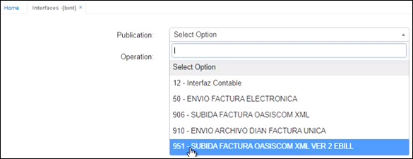

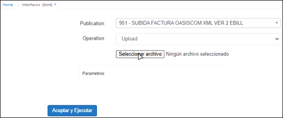

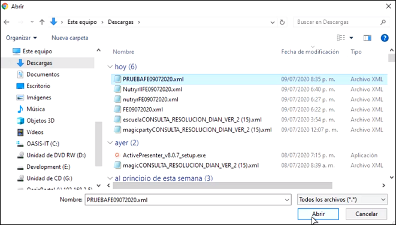

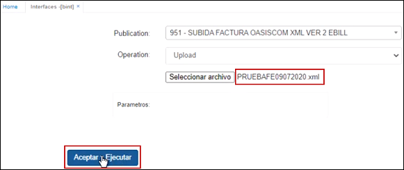

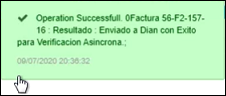

Para validar esta factura, se ingresa a la aplicación **Facturas de venta - EBFFAC** y se filtra por el número del documento. Como se puede apreciar en la ilustración, ya está cargada la factura y el campo Status dian aparece como _**Envío Exitoso.**_

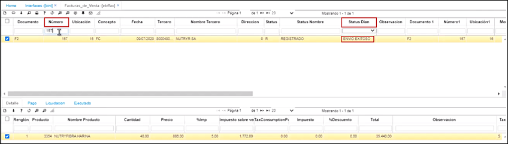

## [Proceso de Factura Electrónica en los On Premise](http://docs.oasiscom.com/Operacion/ebportal/#proceso-de-factura-electrónica-en-los-on-premise)

Los **On Premise** son clientes de Oasis que tienen el ERP, pero lo tienen en su instalación propia. En este caso, se indicará cómo desde la instalación propia, se debe generar el proceso de facturación y cómo se hace el respectivo seguimiento.

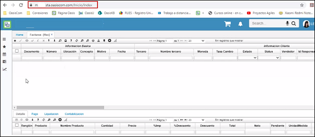

Para esta ilustración, se está en una base **On Premise.** Se crea una factura (+), la cual para el proceso de habilitación, como se explica en la parametrización, el *Documento* es **FC2**, pero si fuera un proceso de producción, se usan los documentos que se tienen definidos para ello. La *Ubicación*, por la que normalmente se generan las facturas. Se llenan todos los datos pertinentes de la factura y finalmente se guarda.

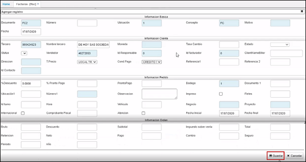

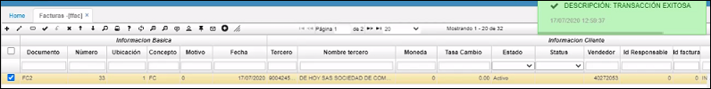

En el detalle, se adicionan los registros que se requieren y al final, se guarda. 

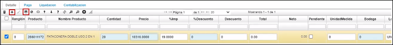

En este momento, si todo se encuentra correcto, cuando se confirma el documento, esta factura se debe visualizar en la plataforma de **Azure.**

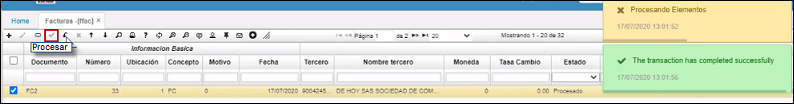

Al confirmarla, se verifica que efectivamente llegó a la plataforma de **Azure** y también a la DIAN. Se entra a la plataforma de **Azure**, la cual se encuentra en app.oasiscom.com, sobre la misma empresa y se revisa en la aplicación **Facturas - EBFFAC** que la factura se encuentre cargada y enviada a la DIAN con éxito. Se consulta con el mismo número y ahí se ve la factura con la misma información que se registró en el **On Premise** y en el campo *Stauts Dian,* aparece _**Envío exitoso.**_

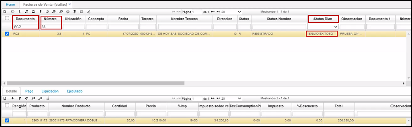

En la aplicación **Mailing-Lists(Listas de Correo) - SMEN**, se puede verificar el envío a los adquirientes, en el campo *Argumento* se puede filtrar la factura.

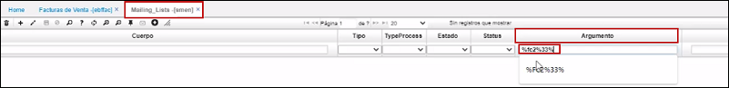

En la pantalla, me muestra quién envió el correo, el destino al que se envía, asunto, y sus respectivos adjuntos. En el campo *Status*, me muestra el estado de envío.

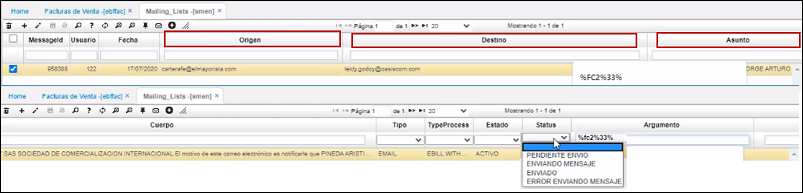

Si en algún momento se queda en *Enviando mensaje*, lo que se puede hacer si de pronto es porque no hay un e-mail relacionado a ese tercero, se corrige la información en el básico de terceros (**Terceros - BTER**), colocarle el e-mail correspondiente y oprimir el botón *Reenviar* correo en la aplicación **Facturas - EBFFAC.**

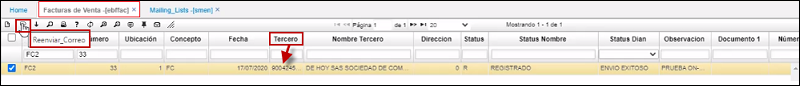

El sistema crea otro seguimiento en la aplicación **Mailing-Lists(Listas de Correo) - SMEN** con ese mismo número de factura y con los datos corregidos.

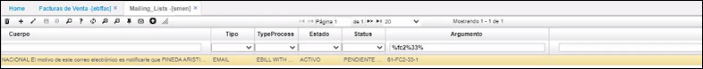

## [Proceso de Factura Electrónica en la plataforma de Oasiscom en Azure](http://docs.oasiscom.com/Operacion/ebportal/#proceso-de-factura-el)

Se hace una factura en cualquiera de las aplicaciones **Facturas - JFAC** o **Facturas - FFAC** (+). Para la ilustración, tomamos la factura número 15 que ya está creada y se encuentra en _**Estado Activo**_. Al momento de confirmar o *Procesar* la factura, el documento se emite a la DIAN y posteriormente al adquiriente. Una vez el proceso termina, sale el aviso de *Transacción exitosa.*

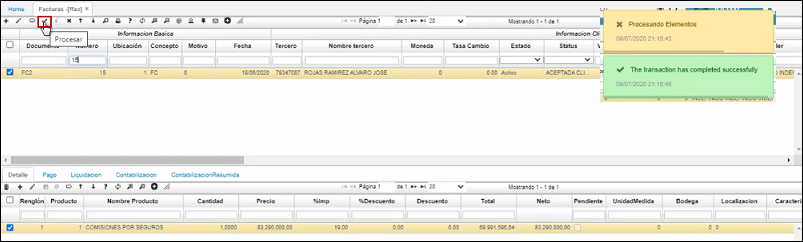

Posteriormente, se ingresa a la aplicación **Facturas de venta - EBFFAC** para validar que la factura se haya enviado con éxito a la DIAN. Se filtra por el número del documento y se verifica que el campo *Status Dian* sea _**Envío exitoso.**_

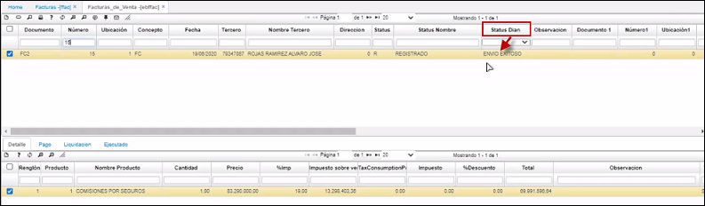

## [Actualización RUT Hoja 2 - Facturador Electrónico](http://docs.oasiscom.com/Operacion/ebportal/#actualización-rut-hoja-2---facturador-electrónico)

El siguiente instructivo contiene el paso a paso para actualizar RUT (hoja #2) y asociar al Proveedor Tecnológico (OasisCom S.A.S) en la página de la DIAN.  

* Ingresar a la página web de la DIAN (https://muisca.dian.gov.co) y loguearse.  

* En el menú izquierdo seleccionar la opción _Registro Único Tributario_.  

* De la lista desplegable, seleccionar la opción _Actualizar RUT_.  

* Seguidamente dar click en el botón _Continuar_.  

* Dar click en el botón _Continuar_.  

* De la lista desplegable seleccionar la **Hoja 2**.  

* Para cargar el documento damos click en el botón _Continuar_.  

* En el formulario de la **Hoja 2**, en el renglón 89 seleccionar la opción _74 - Información Proveedor de Servicios Tecnológicos PST_.  

* Allí mismo, en el renglón 90 seleccionar la fecha exacta en la que se asoció al proveedor tecnológico.  

* Seguidamente, en el renglón 91 ingresar el número de NIT de OASISCOM S.A.S **830003840-5**.  

* Finalmente, guardar y firmar para formalizar el documento.  

## [Manual Facturación Electrónica - Archivo XML](http://docs.oasiscom.com/Operacion/ebportal/#manual-facturación-electrónica---archivo-xml)

A continuación, se informará el paso a paso del proceso de cargue, validación y modificación de facturación electrónica en la plataforma OASISCOM. 

Para empezar, se debe realizar el registro del usuario ingresando los datos pertinentes que solicita la plataforma OASISCOM en la página principal [**https://app.oasiscom.com**](https://app.oasiscom.com).  

### [Cargue de Factura Electrónica - Archivo XML](http://docs.oasiscom.com/Operacion/ebportal/#cargue-de-factura-electrónica-archivo---xml)

Ingresamos con nuestro usuario y contraseña a la plataforma OASISCOM en el siguiente link https://app.oasiscom.com.  

Al momento de ingresar aparecerá una interfaz como la siguiente, donde tendrá varias opciones.  

Nos ubicamos en la barra de búsqueda e ingresamos el nemotécnico **“BINT” – Interfaces**, nos aparecerá una ventana.  

Nos ubicamos en la opción **Publication** y damos click, se despliega una lista y seleccionaremos la opción **906-SUBIDA FACTURA OASISCOM XML**.  

Después de seleccionar la opción, en el campo **Operation** cargará automáticamente la opción Upload (No modificar esta opción). Luego damos click en el botón “seleccionar archivo” y buscamos el archivo XML en nuestros documentos.  

Al momento de cargar el archivo, se verá reflejado el nombre de este. A continuación, damos click en “Accept”.  

Al momento de hacer click en Aceptar, aparecerá un mensaje indicando que la operación fue satisfactoria, así:  

Así sabremos que la factura quedó bien cargada en el sistema.  

### [Verificación de Facturas Electrónicas](http://docs.oasiscom.com/Operacion/ebportal/#verificación-de-facturas-electrónicas)

Para realizar la verificación de las facturas, ingresaremos al nemotécnico **“EBFFAC – Facturas de Venta**. Ingresaremos esta opción en la barra de búsqueda.  

Y aparecerá la siguiente ventana:  

En la parte superior de la ventana se mostrará el encabezado de la factura con los valores en general y en la parte inferior se verá el detalle de la factura: Productos de la factura.  

Para realizar el filtro de todas las facturas, simplemente nos ubicamos en un campo en blanco y oprimimos la tecla **“Enter”**.  

De igual manera se puede realizar el filtro por cualquiera de los campos.  

Existen los campos de verificación llamados **“status”** de los cuales se desglosan varias opciones.  

#### **Status Name**  

**Ninguno:** no se envió correo.  
**Registrado:** El correo se envió al adquiriente.  
**Apertura de correo:** Adquiriente vio el correo.  
**Acuse de recibo:** El adquiriente oprime la opción acuse de recibo a la factura.  
**Factura aceptada:** El adquiriente acepta la factura.  
**Factura rechazada:** El cliente rechaza la factura.  

#### **Status Dian**  

**Pendiente envío:** Aun no se ha enviado la factura.  
**Envío Exitoso:** La factura llegó correctamente a la Dian.  
**Error de envío:** La factura tuvo errores de envío. (Para este caso OASISCOM se encargará de revisar estas facturas y realizar el reenvío).  

En la parte superior se puede observar el encabezado de la factura y los valores totales que corresponden, y en la parte inferior se observará el detalle de la factura, en este caso los productos que se están facturando.  

Se puede imprimir la factura seleccionada oprimiendo el botón **“vista preliminar”** o directamente desde el botón **"imprimir"**.  

### [Modificación de Datos Adquiriente](http://docs.oasiscom.com/Operacion/ebportal/#modificación-de-datos-adquiriente)

Al momento de realizar nuestros registros de facturas, la plataforma OASISCOM toma los datos del adquiriente y lo crea en la base de datos solamente, si el adquiriente no está creado o es la primera vez que se le factura por OASISCOM. Esto lo podemos verificar por la aplicación **BTER - Terceros**.  

Se puede filtrar por cualquier campo o si se requiere consultar todos los terceros podemos seleccionar cualquier campo en blanco y oprimir la tecla **“Enter”**.  

Esta base de datos es muy importante, ya que los datos que se encuentren allí son los datos que se imprimirán en la factura.  

**IMPORTANTE:** Al momento de cargar las facturas, la plataforma OASISCOM, tomará los datos que se encuentran en la factura para crear el tercero solo si no está creado en la base. Si el tercero ya se encuentra en la base de datos, la plataforma OASISCOM tomará los datos que estén allí para insertarlos en la factura. La plataforma NO realiza actualización de los datos automáticamente al subir nuevas facturas.  

En el caso de que algún cliente cambie algún dato en específico como: dirección, teléfono, ciudad, o en el caso más importante de correo electrónico, debemos ir a la base de datos de los clientes **BTER - Terceros** y de allí realizar el cambio de los datos que se requieran.  

#### **Cambio de Datos en BTER - Terceros**  

Para realizar el cambio de datos de los clientes, primero debemos ir al aplicativo **BTER**, podemos filtrar específicamente por el usuario que necesitamos o podemos filtrar todos los clientes.  

Hacemos click en el campo que se requiere hacer el cambio y se ingresa el nuevo dato.  

Luego podemos presionar la tecla “Enter” o con el puntero del mouse dar click en el botón **Guardar**.  

Y la información que esté guardada será la que se muestre en la factura.  

**NOTA:**  

Para referirse a los detalles técnicos sobre la generación de los archivos xml requeridos por la Dian, y el proceso de ejecución de los mismos, favor referirse a la documentación expedida por la Dian en la siguiente dirección:  
https://factura-electronica.dian.gov.co/documentacion-normatividad-16.html en la caja de herramientas.   

## [Facturación Electrónica Fase Dos](http://docs.oasiscom.com/Operacion/ebportal/#facturación-electrónica-fase-dos)

1.	INTRODUCCIÓN  
El presente documento tiene como objetivo dar a conocer el proceso de la parametrización en fase II de facturación electrónica en OasisCom.  
Le recomendamos leerlo atentamente para asegurar el correcto aprendizaje y/o resolución de dudas.  

2.	PARAMETRIZACIÓN   

**Ubicación**   
Se debe ingresar a las ubicaciones geográficas **[BUBG]**, en donde se debe configurar la ubicación geográfica según los códigos del *DANE* y verificar que a nivel padre e hijo se encuentre correcto (El campo padre debe corresponder de Municipio ? Ciudad).  

  

**Documentos**  
Se ingresa al básico de documentos **[BDOC]**, se procede a crear los documentos para aprobar el Set de Pruebas FC2 (Documento para facturas), DV2 (Documento para notas crédito), NF2 (Documento para notas débito).  
Puede descargar aquí los documentos de *Maestro, Detalle y Status.*  

  

En la parametrización de los documentos mencionados anteriormente en el maestro el campo *EBILL* debe estar diligenciado con una de las opciones que se visualiza.   

  

A continuación, se describen la funcionalidad del campo Ebill:  
•	**No Ebill:** Hace referencia a los documentos que no corresponden a documentos electrónicos.  
•	**Ebill ver. 1 Producción:**  Corresponde a los documentos electrónicos que se encuentren reportando a la DIAN en Fase I.  
•	**Ebill ver. 2 Síncrono Producción:** Corresponde a los documentos electrónicos que se encuentren reportando a la DIAN en Fase II.  
•	**Ebill ver. 2 Síncrono Habilitación:** Corresponde a los documentos electrónicos reportados a la DIAN en fase de habilitación (set de pruebas). De este modo nos permite visualizar los rechazos de la transacción en caso de existir, pero no alimenta el tablero (diagrama de barras) en la página de habilitación de la DIAN.  
•	**Ebill ver. 2 Asíncrono Testid Habilitación:** Corresponde a los documentos electrónicos reportados a la DIAN en fase de habilitación (set de pruebas). Esta opción envía a la DIAN así existan rechazos sobre la transacción y alimenta el Tablero (diagrama de barras). En caso de enviar documentos y aparecer en la pagina de la DIAN rechazados aconsejamos cambiar al modo anterior (Ebill ver. 2 Síncrono Habilitación), para validar el motivo del rechazo.  
•	**Ebill ver. 2 Asíncrono Producción:**  Corresponde a los documentos electrónicos que se encuentren reportando en Fase II autorizados por la DIAN para enviar en lote (generación masiva de facturas diarias).  
•	**Ebill ver. 2 Azure:**  Corresponde a los documentos electrónicos de un cliente de OASIS ONPREMISE que se encuentre reportando sus facturas a la nube de Azure para hacer el proceso de envió al adquiriente y DIAN, tanto en habilitación como en producción.  

En el detalle se debe parametrizar el campo código externo   

  

Adicional a esto también se debe parametrizar el campo código externo1.  

  

Se recuerda que las tres primeras opciones (Aiu, Estándar, Mandatos) son para     facturas de venta y/o facturas de exportaciones.  
**Terceros:**  
En el básico de terceros **[BTER]**, debe estar creado el tercero de la empresa que es facturador electrónico y el tercero de **OASISCOM.**  
Puede descargar **aquí** el tercero de OasisCom   

  

Adicional a esto en el tercero del facturador electrónico en el campo Código Antiguo deben relacionar la matrícula mercantil de la empresa.  

  

El tercero FE debe tener relacionado el código de la ubicación geográfica donde se encuentra:  

  

**Acciones:**  
En el básico de acciones **[BACC]** debe estar creada la acción cero 0.  

  

**Tipos de Medios:**  
En el básico de tipos de medios **[ABTM]** debe estar creado el Tipo de medio cero 0.  

  

**Contactos:**  
En la aplicación de contactos **[ACON]** debe estar creado el contacto cero 0.  

  

**Tipos de Contactos:**  
En la aplicación de tipos de contactos **[ABTC]** debe estar creado Tipo contacto cero 0.   

  
**Tipos de Impuestos:**  
En el básico de Tipos de Impuestos **[BTIM]** debe estar creado el tipo de impuesto 99, el cual se debe parametrizar de acuerdo con la(s) responsabilidad(es) fiscal(es) del Facturador Electrónico y asociarlo a las responsabilidades y régimen correspondiente de la empresa creada.  

  

**Motivos:**  
En el básico de motivos **[BMOT]** deben de estar parametrizados los motivos de cada documento en el campo Código externo. Los 5 primeros corresponden a los motivos que se deben asociar a los documentos de las notas crédito y los siguientes 4 corresponden a los motivos que se deben asociar a las notas débito.  

  

**Condiciones de Pago:**  
En el básico de condiciones de pago **[BCND]**debe de estar parametrizado el campo Código externo.  

  

**Formas de Pago:**  
En el básico de Formas de Pago **[BFOR]** debe estar parametrizado el campo código externo.  

  
**Unidades de Medida:**  
En el básico de Unidades de Medida **[BMED]** debe de estar parametrizado el campo código externo.  

  

**Resoluciones:**  
En la aplicación de Resoluciones **[FRES]** Deben de estar creadas cada una de las resoluciones según datos de la DIAN para los documentos de facturación electrónica teniendo en cuenta los campos.  

•	Documento: Documento de Factura al que pertenece la resolución (FC2, FC, etc.)  
•	Ubicación: Código de la Ubicación en Oasis  
•	Caja: Siempre dejar uno (1).  
•	ResolutionId: Número de la Resolución expedida en la DIAN  
•	Prefijo: Prefijo asociado a la resolución, en caso de no tener se deja vacío  
•	Inicial: Número inicial de resolución  
•	Final: Número final de resolución  
•	Pronunciamiento: Clave técnica otorgada por la DIAN en cada resolución  
•	F. Inicial Resolución: Fecha Inicial de la resolución  
•	F. Final Resolución: Fecha Final de la resolución  
•	Fecha Final: Fecha Final de la resolución  
•	Estado: Dejar Activo  

  

**Empresas:**  
En la aplicación de Empresa **[SEMP]** parametrizar el TestSetId dado por la Dian para las pruebas de habilitación en el campo TestId.  

  

Se debe relacionar el correo electrónico que se usará como máscara para el envío de correos electrónicos a los adquirientes en el campo EMailOutput.  

  

Se debe relacionar la información de la empresa como dirección, teléfonos, ciudad, etc. para la información que se visualiza en el formato (Representación Gráfica de las transacciones).  

  

## [Manual de Documentos Equivalentes](http://docs.oasiscom.com/Operacion/ebportal/#manual-de-documentos-equivalentes)

En el siguiente manual se realiza la explicación de la parametrización que se debe realizar para la creación de los documentos equivalentes, indicando en cuáles aplicaciones se debe realizar este proceso. 

A continuación, se explica cómo realizar la parametrización para los documentos soporte sobre las adquisiciones efectuadas a sujetos no obligados a expedir factura de venta o documento equivalente.
Los documentos definidos para realizar esta parametrización se relacionan a continuación:

+ PE = PMOV – Movimientos
+ EF = OFAC – Facturas de compra
+ CS = OCAF - Compras de café

### [Aplicación BDOC-Básico de documentos](http://docs.oasiscom.com/Operacion/ebportal/#aplicación-bdoc-básico-de-documentos)

Estos documentos, con sus respectivos conceptos deben ser parametrizados en la aplicación **BDOC – Básico de documentos.** 

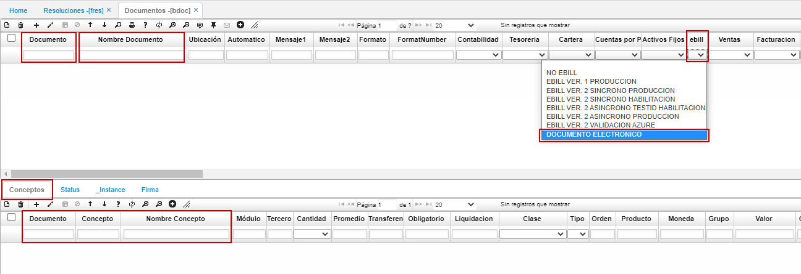

Se deben diligenciar los campos señalados de la siguiente manera:

+ **Documento:** En este campo se deben parametrizar los documentos mencionados **(PE, EF o CS).**
+ **Nombre documento:** Los documentos deben denominarse expresamente con el nombre *"Documento soporte en adquisiciones efectuadas a no obligados a facturar".*
+ **Ebill:** En este campo los documentos deben marcarse como *“Documento Electrónico”.* Lo anterior con el fin de que, además del funcionamiento normal del documento, este empiece a exigir y controlar las resoluciones.

En el detalle de la aplicación **BDOC,** en la pestaña *“Conceptos”* se deben crear los respectivos conceptos.

### [Aplicación BMOT-Motivos](http://docs.oasiscom.com/Operacion/ebportal/#aplicación-bmot-motivos)

En la aplicación **BMOT – Motivos** se debe crear el motivo correspondiente para cada documento y concepto creado. 

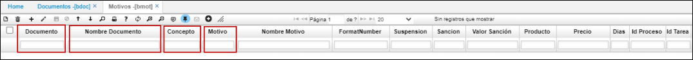

### [Aplicación BPLA-Plantillas](http://docs.oasiscom.com/Operacion/ebportal/#aplicación-bpla-plantillas)

Una vez se realice la parametrización en las aplicaciones **BDOC – Básico de documentos** y **BMOT - Motivos,** en la aplicación **BPLA – Plantillas** se debe realizar la parametrización de las plantillas que apliquen para los documentos creados que van a funcionar para los sujetos no obligados a expedir *Factura de Venta.*

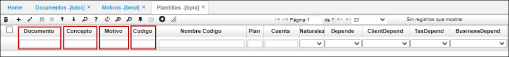

### [Aplicación FRES-Resoluciones](http://docs.oasiscom.com/Operacion/ebportal/#aplicación-fres-resoluciones)  

En la aplicación **FRES – Resoluciones** se debe diligenciar la información que se encuentra en la resolución que envía la **DIAN.** 

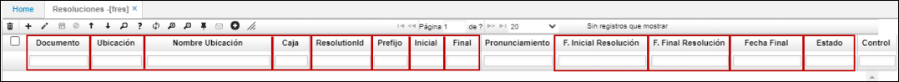

Los campos se deben diligenciar de la siguiente manera:

+ **Documento:** Debe ir el documento que se utilice para el proceso de compras a sujetos no obligados a expedir Factura de Venta
+ **Ubicación:** Se debe diligenciar la ubicación correspondiente. 
+ **Caja:** Se debe diligenciar el número 1.
+ **Resolution ID:** En este campo se diligencia el número de resolución que se encuentra en el documento que envía la DIAN.
+ **Prefijo:** En este campo se debe diligenciar el prefijo en caso de que éste se encuentre asociado, si no se maneja predijo se deja vacío este campo. Es importante tener en cuenta que, si se diligencia un prefijo, este debe ser exclusivo para el proceso de documentos soporte.
+ **Inicial y Final:** Se debe diligenciar el rango respectivo.
+ **Fecha inicial de resolución:** En este campo se digita la fecha inicial desde donde comprende la resolución.
+ **Fecha final de resolución y fecha final:** En estos campos se debe digitar la fecha final hasta donde comprende la resolución.
+ **Estado:** El estado debe ser *“Activo”.*

### [Aplicación BCNS-Consecutivos](http://docs.oasiscom.com/Operacion/ebportal/#aplicación-bcns-consecutivos)  

Una vez se realice la parametrización en la aplicación **FRES – Resoluciones,** se deben parametrizar los consecutivos en la aplicación **BCNS – Consecutivos** en el campo *“Número”* para que inicien de acuerdo con el rango inicial solicitado en la **DIAN,** digitando de igual forma el documento y la ubicación a la que pertenece. 

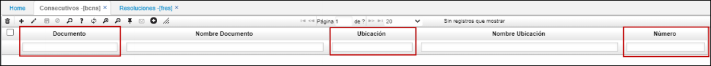

**Importante:** Adicional a la información presentada anteriormente sobre la parametrización que se debe realizar para los documentos equivalentes, es importante que se tenga en cuenta lo indicado por la **DIAN** en el comunicado de prensa N° 55 del 21 de julio del 2020, el cual se relaciona a continuacion:
[https://www.dian.gov.co/Prensa/Paginas/NG-Comunicado-de-Prensa-55.aspx](https://www.dian.gov.co/Prensa/Paginas/NG-Comunicado-de-Prensa-55.aspx)

## [Manual Documento Soporte](http://docs.oasiscom.com/Operacion/ebportal/#manual-documento-soporte)

El siguiente manual se crea de acuerdo con la resolución # 0042 expedida por la DIAN, donde se realiza la explicación sobre la parametrización realizada para llevar un control sobre las compras que se realicen a terceros no obligados a expedir factura de venta. 

## [Habilitación de la aplicación ODEQ](http://docs.oasiscom.com/Operacion/ebportal/#habilitación-de-la-aplicación-odeq)

A continuación, se explica el paso a paso de cómo realizar la parametrización para terceros no obligados a expedir factura de venta

### [Aplicación SROL-Roles](http://docs.oasiscom.com/Operacion/ebportal/#aplicación-srol-roles)  

Luego se debe ingresar a la aplicación SROL - Roles, en el rol que corresponda. En el detalle en la pestaña programas se debe añadir un nuevo registro y agregar el programa ODEQ – Documento equivalente. 

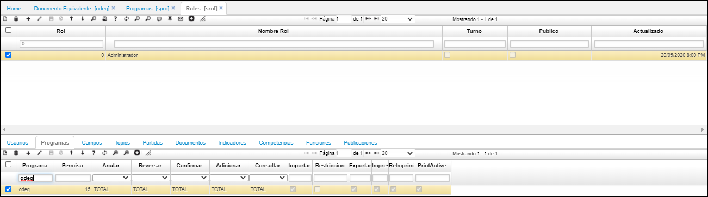

### [Aplicación WVAR-Variables](http://docs.oasiscom.com/Operacion/ebportal/#aplicación-wvar-variables)  

En la aplicación WVAR - Variables, esta variable debe ser creada para que el sistema identifique que se debe crear un documento EQ. 

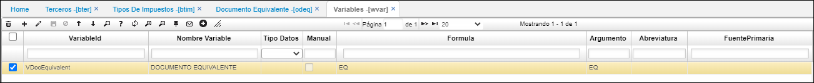

### [Aplicación BDOC-Documentos](http://docs.oasiscom.com/Operacion/ebportal/#aplicación-bdoc-documentos)  

A nivel de la aplicación BDOC – Básico de documento, también debe ser creado el documento EQ, por concepto EQ. 

**Importante:** En el campo programa debe ir diligenciado la aplicación que vamos a requerir, en este caso la aplicación ODEQ. En el campo ebill se debe seleccionar la opción NO EBILL, únicamente para el documento EQ lleva esta opción. 

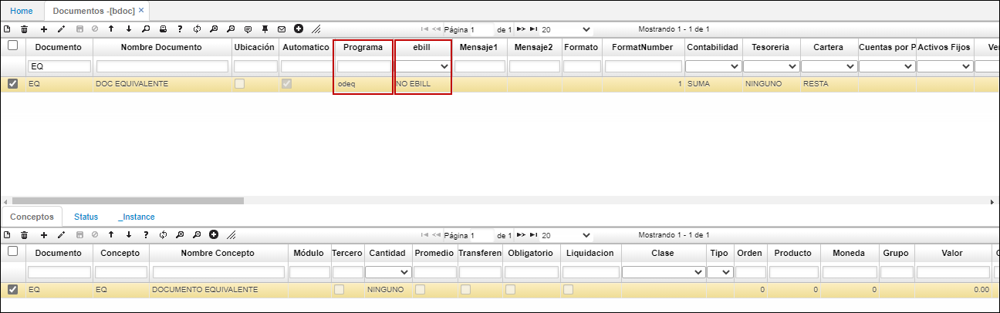

En el detalle la pestaña status debe ir diligenciado el concepto N. 

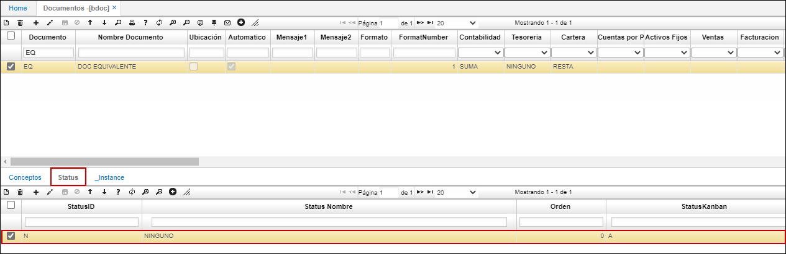

En la aplicación BMOT – Básico de motivos se debe crear el motivo cero.

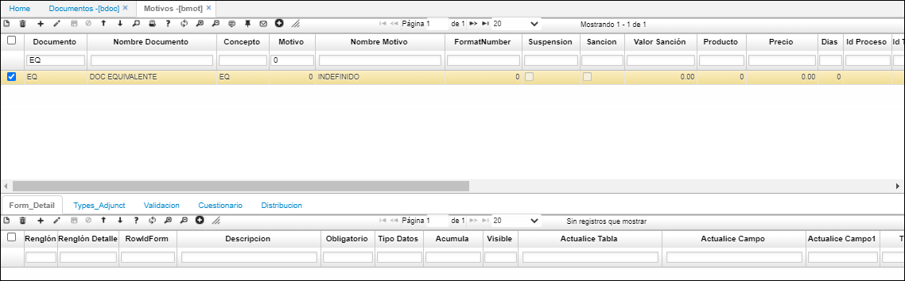

### [Aplicación BPRO-Productos](http://docs.oasiscom.com/Operacion/ebportal/#aplicación-bpro-productos)

En la aplicación BPRO -Productos, se debe añadir un nuevo registro y crear el producto numero 1, para utilizar este modelo en aplicación PMOV y TMEN. No es necesario ponerle nombre al producto, en el campo inventario Terminado y en el estado activo.

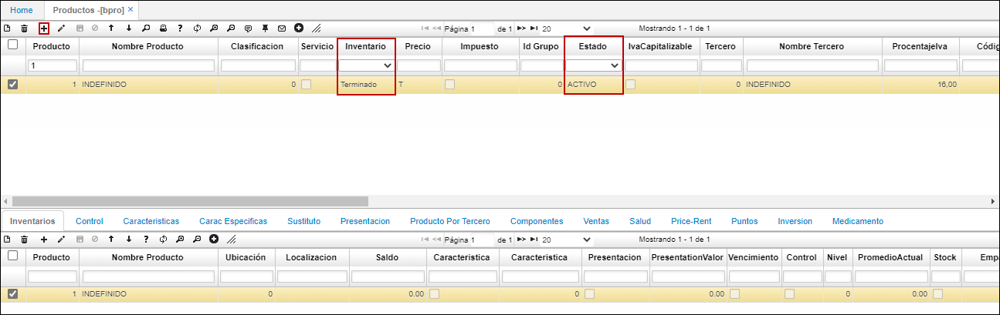

## [Validaciones en la aplicación ODEQ](http://docs.oasiscom.com/Operacion/ebportal/#validaciones-en-la-aplicación-odeq)   
### [A nivel de documentos](http://docs.oasiscom.com/Operacion/ebportal/#a-nivel-de-documentos)  

En la aplicación BDOC – Básico de documentos, se parametrizan los documentos existentes por los que se registran las compras (FP, CP y CF) ya sea a nivel de producto o a nivel de servicios, estos documentos deben estar marcados en el campo EBILL con la opción “Genera Documento Equivalente”. 

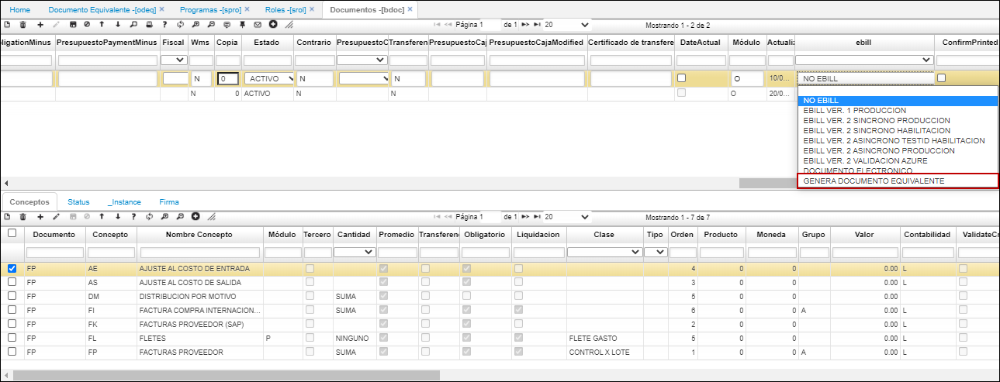

Al momento de confirmar las compras por las diferentes aplicaciones de OasisCom, el sistema identifica que debe crear automáticamente el documento EQ en la aplicación ODEQ – Documento equivalente.

### [A nivel de tercero](http://docs.oasiscom.com/Operacion/ebportal/#a-nivel-de-tercero)  
#### [Aplicación BTER-Tercero](http://docs.oasiscom.com/Operacion/ebportal/#aplicación-bter-tercero)  

Para realizar la validación de los proveedores no obligados a expedir factura de venta, primero se debe validar en la aplicación BTER - Terceros y verificar el tipo de impuesto. 

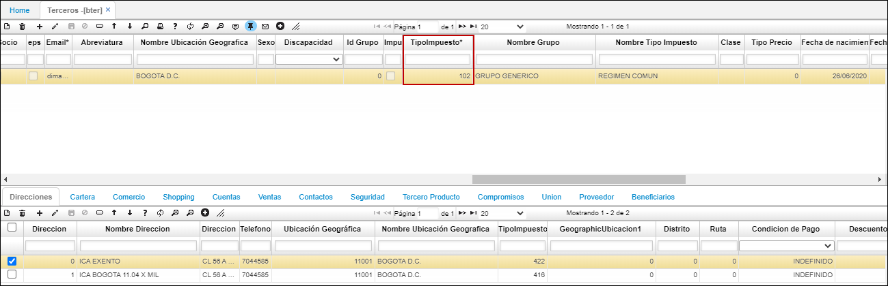

#### [Aplicación BTIM–Tipos de Impuestos](http://docs.oasiscom.com/Operacion/ebportal/#aplicación-btim-tipos-de-impuestos)  

El tipo de impuesto es el que nos indica si el proveedor está obligado o no a expedir factura de venta, el campo que nos indica lo mencionado anteriormente, es el campo declarante. Para verificar este proceso ingresamos a la aplicación BTIM - Tipos de Impuestos y filtramos por el número de impuesto del tercero. 

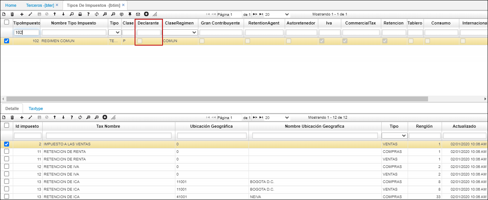

**Nota:** Si el campo declarante se encuentra con el check, quiere decir que el tercero que tenga ese tipo de impuesto está obligado a expedir factura de venta y todo lo que se adquiera con este tercero no se va a ver reflejado en la aplicación ODEQ – Documento Equivalente. Si se realiza la compra a un tercero y el tipo de impuesto que tiene relacionado no cuenta con el check, los movimientos se verán reflejados en la aplicación ODEQ - Documento Equivalente. 

## [Resolución de documentos soporte](http://docs.oasiscom.com/Operacion/ebportal/#resolución-de-documentos-soporte)    
### [Aplicación FRES–Resoluciones](http://docs.oasiscom.com/Operacion/ebportal/#aplicación-fres-resoluciones)   

En la aplicación FRES – Resoluciones se debe diligenciar la información que se encuentra en la resolución que envía la DIAN sobre documento soporte. 

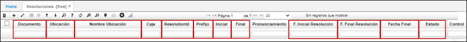

Los campos se deben diligenciar de la siguiente manera:

+ **Documento:** Debe ir el documento que se utilice para el proceso de compras a sujetos no obligados a expedir Factura de Venta, para este caso el documento que debe ser diligenciado es EQ. 
+ **Ubicación:** Se debe diligenciar la ubicación correspondiente. 
+ **Caja:** Se debe diligenciar el número 1.
+ **Resolution ID:** En este campo se diligencia el número de resolución que se encuentra en el documento que envía la DIAN.
+ **Prefijo:** En este campo se debe diligenciar el prefijo en caso de que éste se encuentre asociado, si no se maneja prefijo se deja vacío este campo. Es importante tener en cuenta que, si se diligencia un prefijo, este debe ser exclusivo para el proceso de documentos soporte.
+ **Inicial y Final:** Se debe diligenciar el rango respectivo.
+ **Fecha inicial de resolución:** En este campo se digita la fecha inicial desde donde comprende la resolución.
+ **Fecha final de resolución y fecha final:** En estos campos se debe digitar la fecha final hasta donde comprende la resolución.
+ **Estado:** El estado debe ser “Activo”.

### [Aplicación BCNS–Consecutivos](http://docs.oasiscom.com/Operacion/ebportal/#aplicación-bcns-consecutivos)  

Una vez se realice la parametrización en la aplicación FRES – Resoluciones, se deben parametrizar los consecutivos en la aplicación BCNS – Consecutivos en el campo “Número” para que inicien de acuerdo con el rango inicial solicitado en la DIAN, digitando de igual forma el documento EQ y la ubicación a la que pertenece.

## [Aplicación ODEQ–Documento Equivalente](http://docs.oasiscom.com/Operacion/ebportal/#aplicación-odeq-documento-equivalente)  

Una vez se realicen las parametrizaciones mencionadas anteriormente, el sistema en la aplicación ODEQ – Documentos Equivalentes crea el documento EQ, proveniente de aquellas compras realizadas a los sujetos no obligados a expedir factura de venta, respetando la numeración parametrizada de acuerdo con la resolución.

**Nota:** El sistema controla que el consecutivo que se asigne al documento EQ se encuentre acorde con la resolución parametrizada. 

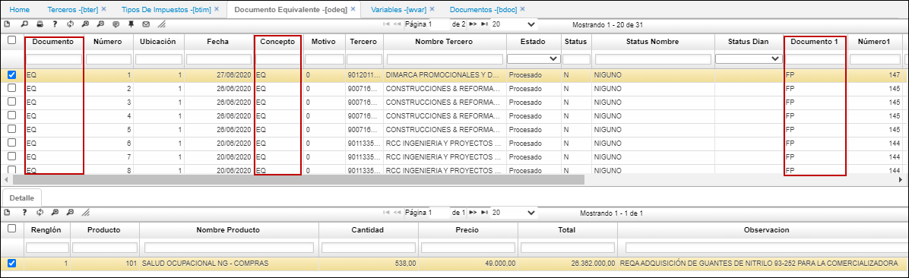

Para identificar si la factura llegó o no, en los campos documento 1, número 1 y ubicación 1, se ve relacionado el documento original. 

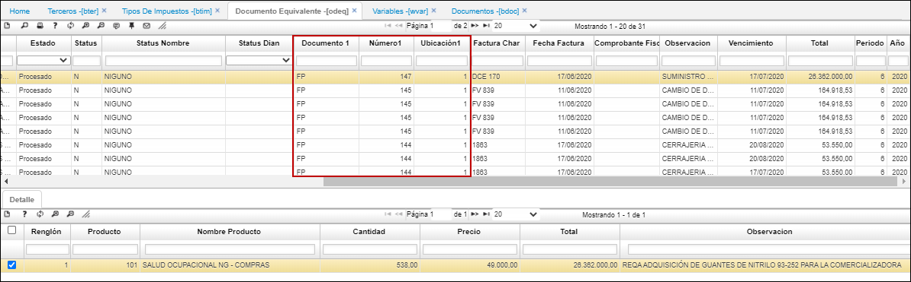

En el detalle encontramos el producto, la cantidad, el precio, el total y la observación que se hayan registrado previamente. 

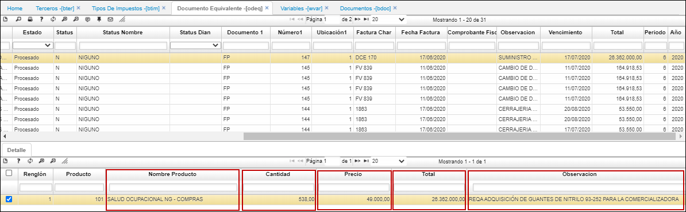
