# FACTURA ELECTRONICA

---
### Factura Electrónica

>###### [Factura Electrónica (descargar)](http://docs.oasiscom.com/Operacion/ebportal/factura-electronica.pdf) 

---

**Menú**  

1. [Correo Factura Electrónica](http://docs.oasiscom.com/Operacion/ebportal/#correo-factura-electrónica)  
2. [Código QR](http://docs.oasiscom.com/Operacion/ebportal/#código-qr)  
3. [Envío de mensajes de texto](http://docs.oasiscom.com/Operacion/ebportal/#envío-de-mensajes-de-texto)  
4. [Adjuntos en la factura electrónica](http://docs.oasiscom.com/Operacion/ebportal/#adjuntos-en-la-factura-electrónica)  
5. [Integración de documentos electrónicos con OasisCom](http://docs.oasiscom.com/Operacion/ebportal/#integración-de-documentos-electrónicos-con-oasiscom)  
5.1 [Archivo XML](http://docs.oasiscom.com/Operacion/ebportal/#archivo-xml)  
5.2 [Archivo plano](http://docs.oasiscom.com/Operacion/ebportal/#archivo-plano)  
5.3 [Instructivo Integración OasisCom](http://docs.oasiscom.com/Operacion/ebportal/#instructivo-integración-oasiscom)  
6. [Actualización RUT Hoja 2 - Facturador Electrónico](http://docs.oasiscom.com/Operacion/ebportal/#actualización-rut-hoja-2---facturador-electrónico)  
7. [Manual Facturación Electrónica - Archivo XML](http://docs.oasiscom.com/Operacion/ebportal/#manual-facturación-electrónica---archivo-xml)  
7.1 [Cargue de Factura Electrónica - Archivo XML](http://docs.oasiscom.com/Operacion/ebportal/#cargue-de-factura-electrónica---archivo-xml)  
7.2 [Verificación de Facturas Electrónicas](http://docs.oasiscom.com/Operacion/ebportal/#verificación-de-facturas-electrónicas)  
7.3 [Modificación de Datos Adquiriente](http://docs.oasiscom.com/Operacion/ebportal/#modificación-de-datos-adquiriente)  

8. [FACTURACIÓN ELECTRONICA FASE II](http://docs.oasiscom.com/Operacion/ebportal/#FACTURACIÓN-ELECTRONICA-FASE-II)  

## [Correo Factura Electrónica](http://docs.oasiscom.com/Operacion/ebportal/#correo-factura-electrónica)

La plantilla de envío de facturas electrónicas contiene tres links que permiten confirmar el recibido de la factura, _Aceptarla_ o _Rechazarla_. Igualmente, para cada acción se envía una plantilla de correo como respuesta.  

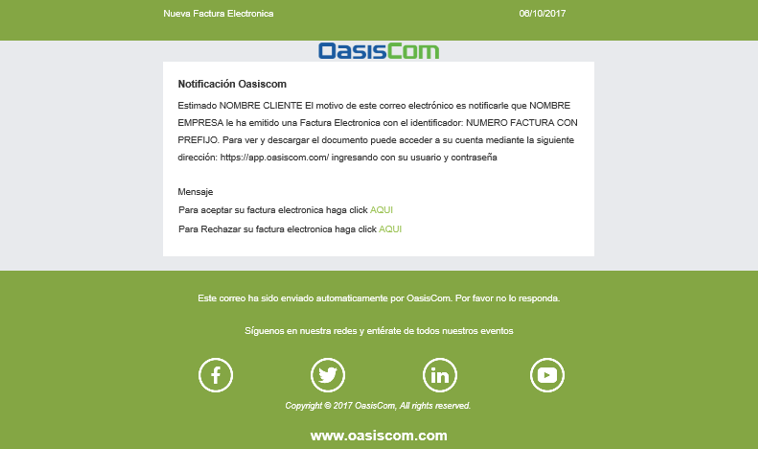

Plantilla al confirmar el recibido de la factura.  

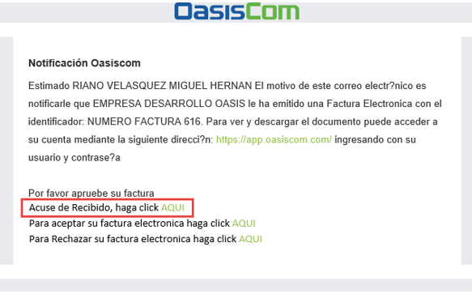

Plantilla al _Aceptar_ una factura.  

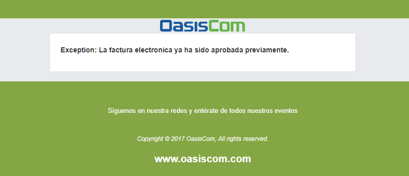

Plantilla al _Rechazar_ una factura.  

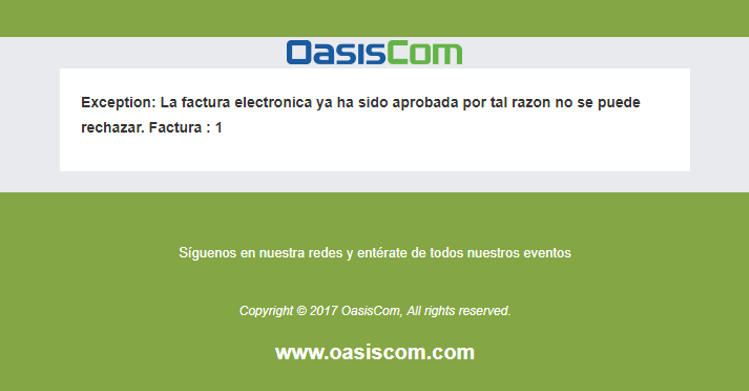

**Nota:** las plantillas de envío de correos se visualizarán con el logo de la empresa de donde el usuario se encuentre en sesión.  

## [Código QR](http://docs.oasiscom.com/Operacion/ebportal/#código-qr)

El formato de factura electrónica que se envía al adquiriente contiene un Código QR, que le permitirá ver desde un dispositivo móvil los datos de la factura.  

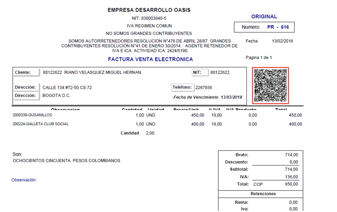

## [Envío de mensajes de texto](http://docs.oasiscom.com/Operacion/ebportal/#envío-de-mensajes-de-texto)

Generada la factura electrónica, el sistema enviará automáticamente un mensaje de texto al número del dispositivo móvil del cliente registrado en el sistema informando de la creación de la factura.  

## [Adjuntos en la factura electrónica](http://docs.oasiscom.com/Operacion/ebportal/#adjuntos-en-la-factura-electrónica)

En el envío de la factura electrónica es posible agregar archivos adjuntos, para ello, se debe parametrizar inicialmente los campos _Ebill_ y _EbillAdjunct_ en la aplicación **SEMP - Empresas**, lo cual indicará que la empresa emite facturación electrónica y podrá adjuntar archivos en la misma.  

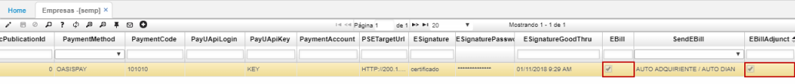

Los archivos adjuntos que se visualizarán en el correo eletrónico son:  

1. Documento **.pdf** con el formato fisico de la factura.  
2. Archivo **.zip** con la factura electrónica en formato **.xml**.  
3. Los demás archivos adjuntos que hayan sido agregados en la factura electrónica al momento de generarla.  

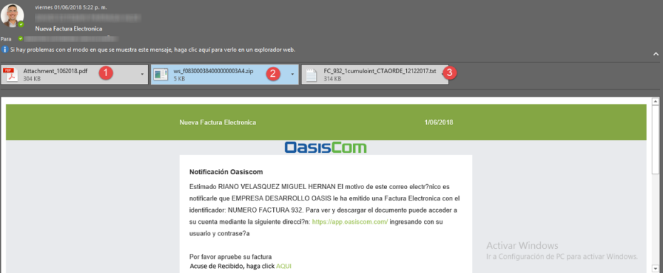

## [Integración de documentos electrónicos con OasisCom](http://docs.oasiscom.com/Operacion/ebportal/#integración-de-documentos-electrónicos-con-oasiscom)

### [Archivo XML](http://docs.oasiscom.com/Operacion/ebportal/#archivo-xml)

Mediante archivo XML el cliente puede subir documentos electrónicos a la plataforma de OasisCom o consumiendo un servicio web que provee OasisCom para que este cargue sea de forma automática.  

**Estructura**

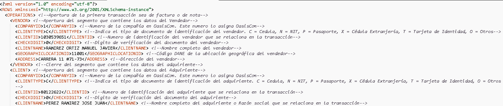
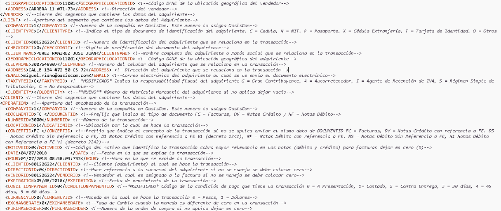

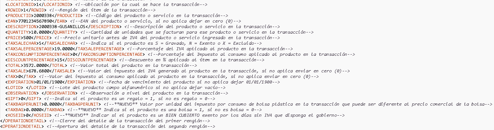
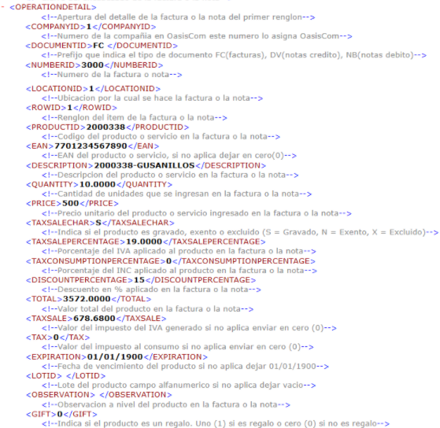
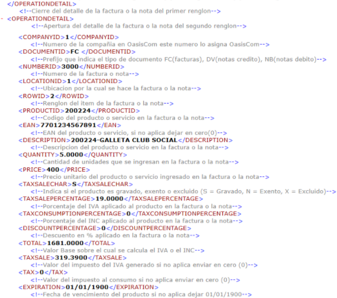

### [Archivo plano](http://docs.oasiscom.com/Operacion/ebportal/#archivo-plano)  

Cuando no se cuenta con una estructura en formato XML, OasisCom provee una estructura en formato de _archivo plano_ el cual debe ser cargado de forma manual a la plataforma de OasisCom por medio de la aplicación BINT - Interfaces.  

#### [Descargue Aquí el Archivo Plano](http://docs.oasiscom.com/Operacion/ebportal/Archivo_Plano.xlsx) 

**Nota:** al cargar el archivo plano, el sistema creará los terceros y productos en caso de que no existan previamente.  

Los datos relacionados al color:  
* **azul** corresponde al Adquiriente.   
* **color** gris del vendedor.   
* **amarillo** son los que irán diligenciados en el maestro de la aplicación FFAC - Facturas.  
* y los asociados al color **verde** en el detalle.    

  

La estructura enviada por OasisCom cuenta con comentarios en cada campo para facilitar su diligenciamiento.  

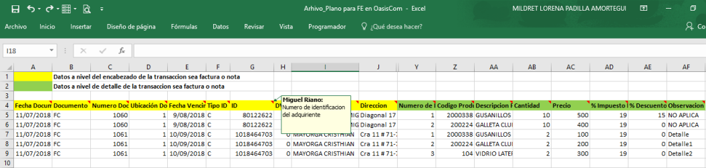  

Ingresada toda la información en el archivo de Excel, debemos eliminar los renglónes señalados en la siguiente imagen para así proceder a convertirlo en formato _.CVS_.   

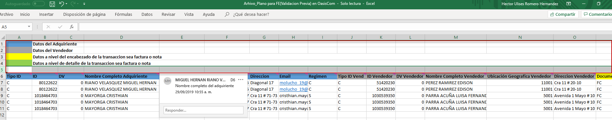  

Al eliminar los anteriores renglones deberá quedar así:  

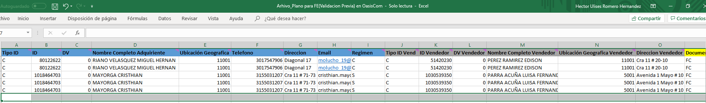 

Para convertir el archivo en formato **.CVS** vamos a _Archivo  Guardar como  Elegimos una ubicación  Asignamos un nombre  Tipo: CSV (delimitado por comas)  Guardar_.   

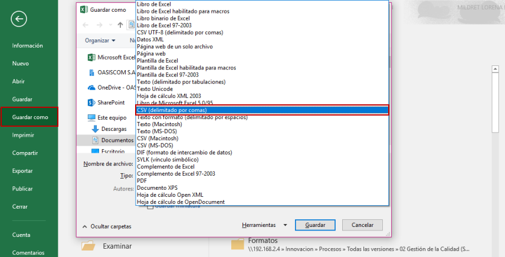

**_IMPORTANTE:_** Convertido el archivo en formato _.CVS_, este se debe abrir en el editor de texto y eliminar el último espacio en blanco.  

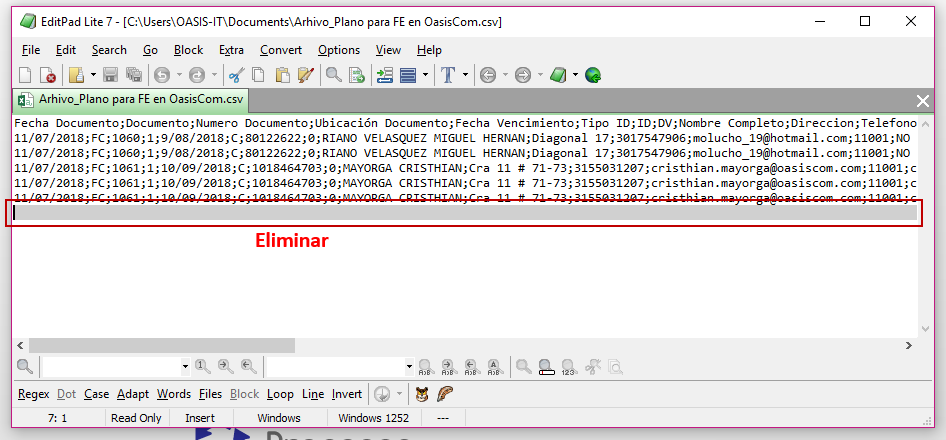

Quedando el cursor en el último caracter del último renglón.  

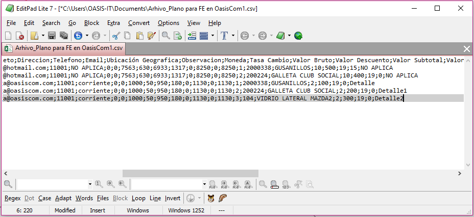

### [Instructivo Integración OasisCom](http://docs.oasiscom.com/Operacion/ebportal/Instructivo_Integracion_OasisCom_v1.0.pdf)

A continuación, se dará a conocer la data requerida para realizar la carga de documentos electrónicos en los formatos XLS o TXT para el proceso de facturación electrónica en OasisCom.  

#### _Definiciones_

Descripción de cada una de las columnas de la malla de validación:  

**Atributo:** Corresponde al nombre del campo a definir.  
**Tipo:** Identifica si los datos del campo son a nivel de maestro **(M)** o del detalle **(D)** de la transacción, factura o nota.  
**Descripción:** Breve explicación de la característica del campo en cuestión.  
**T:** Corresponde al tipo de dato del campo:  

 * **D**: Campo tipo fecha.  
 * **N:** Campo de tipo número (Entero, Decimal).  
 * **C:** Carácter o cadena de caracteres.  

**Longitud máxima:** En esta columna se describe el tamaño máximo requerido para el campo (en números).  
**Req. Valor:** Identifica si el campo es o no es obligatorio. **S** para si, **N** para no.  
**Formato:** Ejemplo de cómo debe ser llenado cada campo.  

#### _Malla de validación_

A continuación, se describe la malla de validación con la información precisa para realizar la carga de documentos electrónicos.  

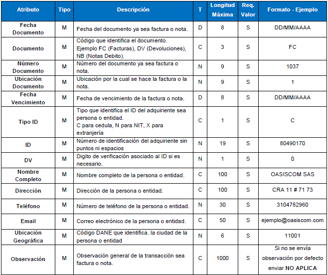
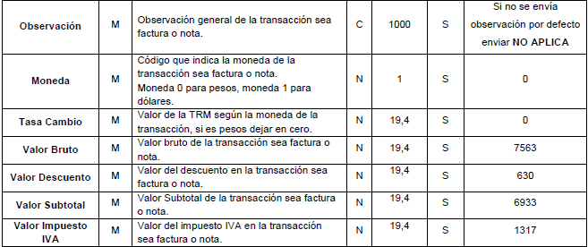
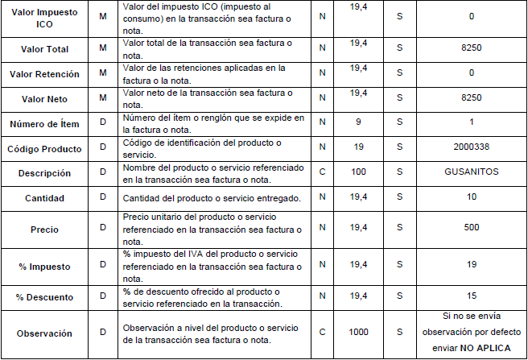
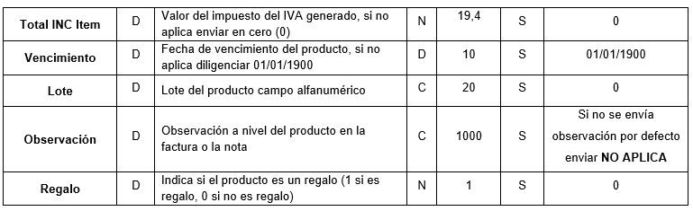  

## [Actualización RUT Hoja 2 - Facturador Electrónico](http://docs.oasiscom.com/Operacion/ebportal/#actualización-rut-hoja-2---facturador-electrónico)

El siguiente instructivo contiene el paso a paso para actualizar RUT (hoja #2) y asociar al Proveedor Tecnológico (OasisCom S.A.S) en la página de la DIAN.  

* Ingresar a la página web de la DIAN (https://muisca.dian.gov.co) y loguearse.  

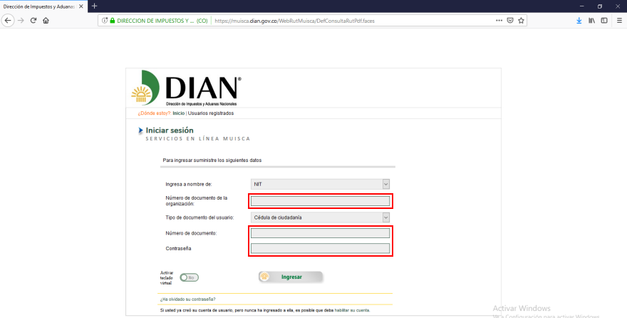

* En el menú izquierdo seleccionar la opción _Registro Único Tributario_.  

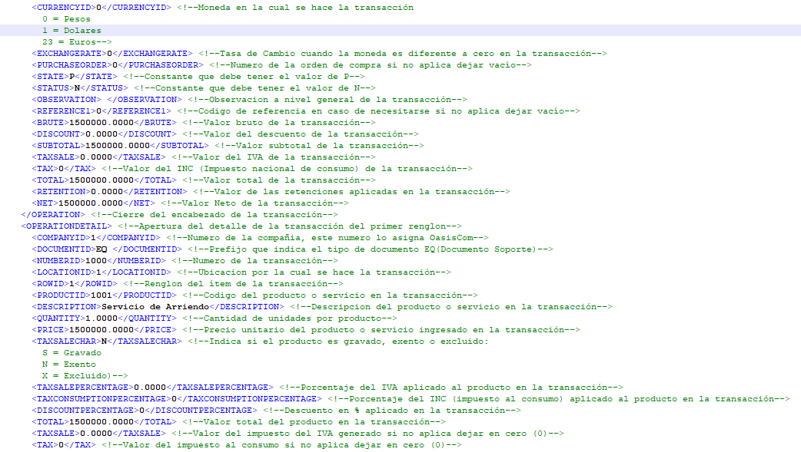

* De la lista desplegable, seleccionar la opción _Actualizar RUT_.  

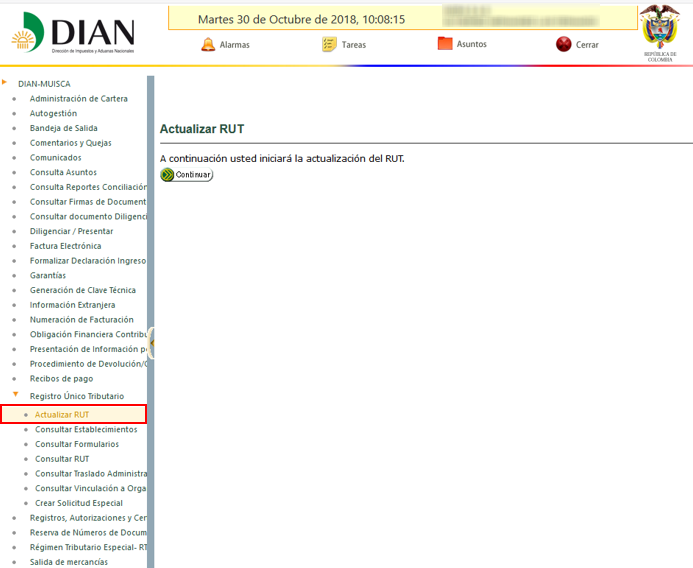

* Seguidamente dar click en el botón _Continuar_.  

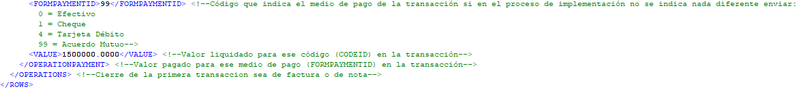

* Dar click en el botón _Continuar_.  

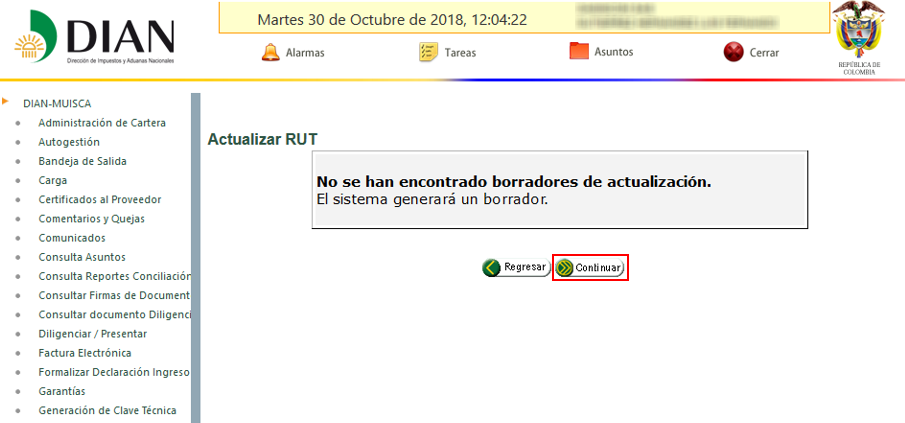

* De la lista desplegable seleccionar la **Hoja 2**.  

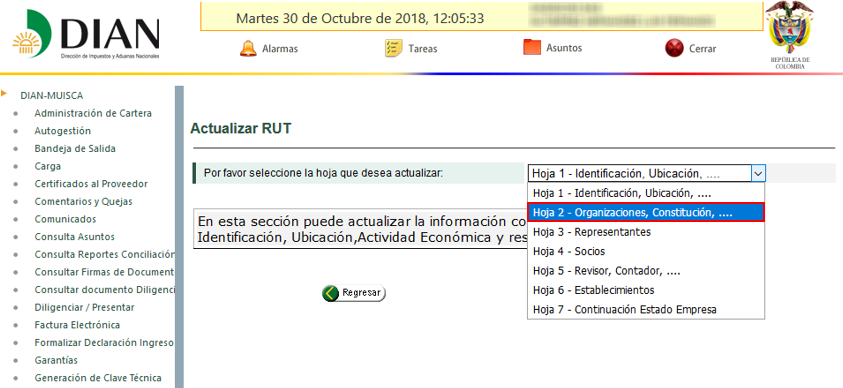

* Para cargar el documento damos click en el botón _Continuar_.  

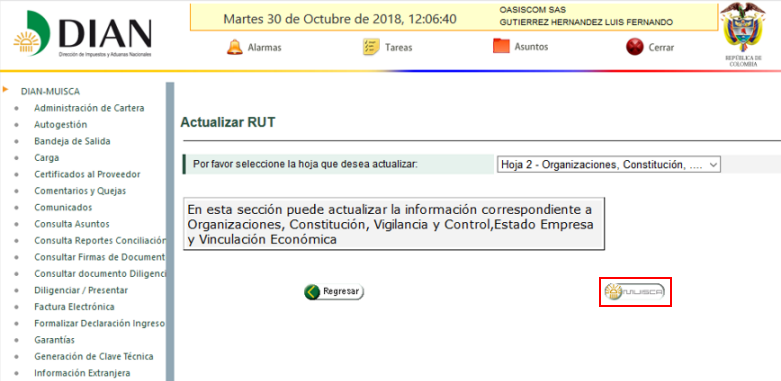

* En el formulario de la **Hoja 2**, en el renglón 89 seleccionar la opción _74 - Información Proveedor de Servicios Tecnológicos PST_.  

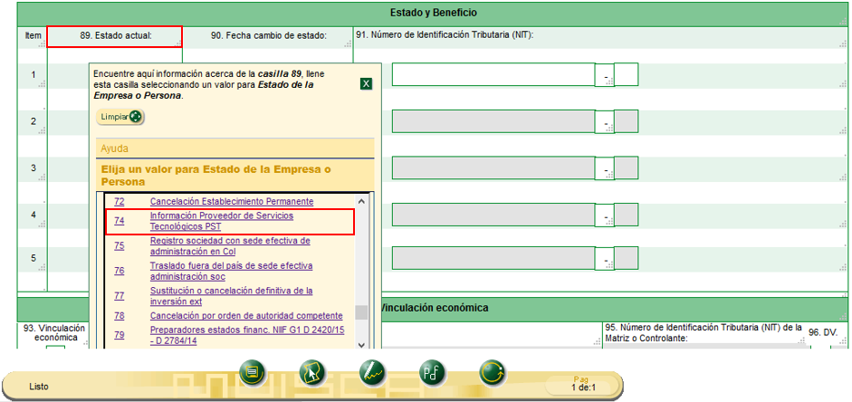

* Allí mismo, en el renglón 90 seleccionar la fecha exacta en la que se asoció al proveedor tecnológico.  

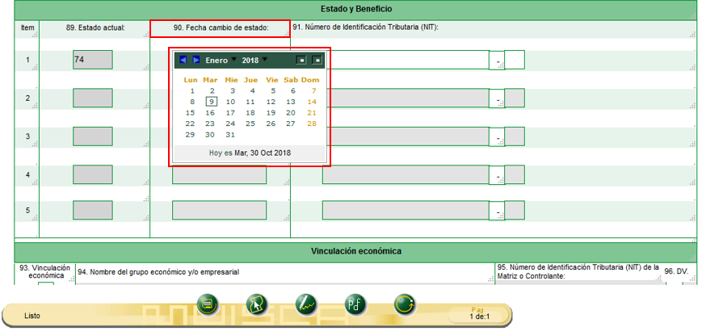

* Seguidamente, en el renglón 91 ingresar el número de NIT de OASISCOM S.A.S **830003840-5**.  

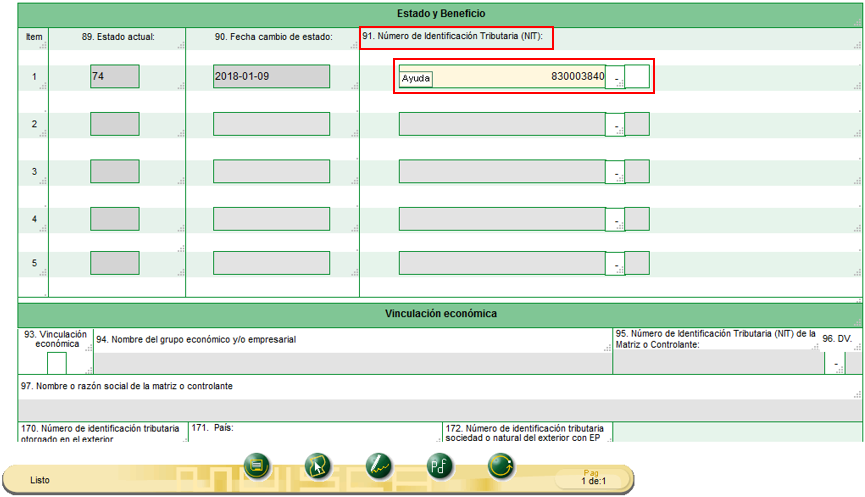

* Finalmente, guardar y firmar para formalizar el documento.  

## [Manual Facturación Electrónica - Archivo XML](http://docs.oasiscom.com/Operacion/ebportal/#manual-facturación-electrónica---archivo-xml)

A continuación, se informará el paso a paso del proceso de cargue, validación y modificación de facturación electrónica en la plataforma OASISCOM. 

Para empezar, se debe realizar el registro del usuario ingresando los datos pertinentes que solicita la plataforma OASISCOM en la página principal [**https://app.oasiscom.com**](https://app.oasiscom.com).  

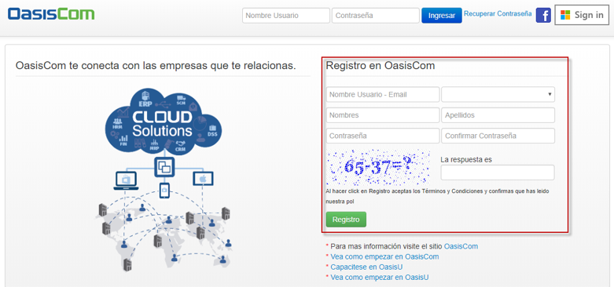

### [Cargue de Factura Electrónica - Archivo XML](http://docs.oasiscom.com/Operacion/ebportal/#cargue-de-factura-electrónica-archivo---xml)

Ingresamos con nuestro usuario y contraseña a la plataforma OASISCOM en el siguiente link https://app.oasiscom.com.  

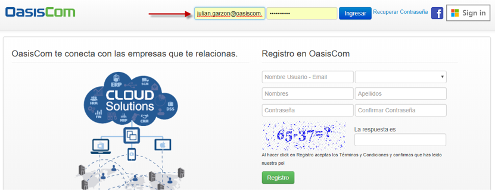

Al momento de ingresar aparecerá una interfaz como la siguiente, donde tendrá varias opciones.  

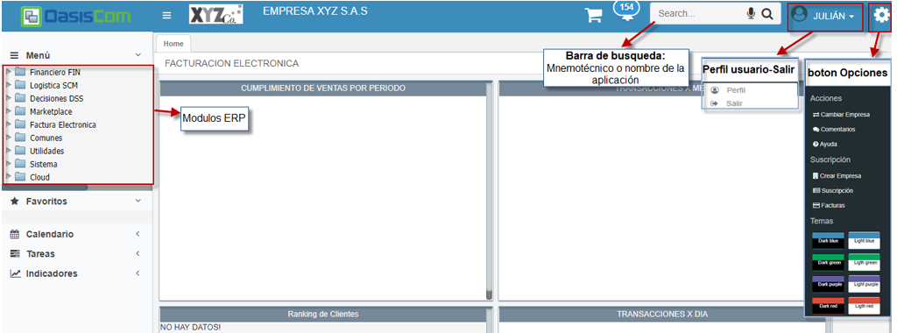

Nos ubicamos en la barra de búsqueda e ingresamos el nemotécnico **“BINT” – Interfaces**, nos aparecerá una ventana.  

Nos ubicamos en la opción **Publication** y damos click, se despliega una lista y seleccionaremos la opción **906-SUBIDA FACTURA OASISCOM XML**.  

Después de seleccionar la opción, en el campo **Operation** cargará automáticamente la opción Upload (No modificar esta opción). Luego damos click en el botón “seleccionar archivo” y buscamos el archivo XML en nuestros documentos.  

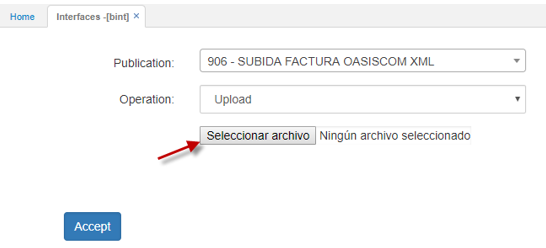

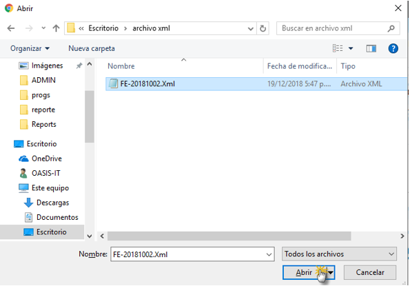

Al momento de cargar el archivo, se verá reflejado el nombre de este. A continuación, damos click en “Accept”.  

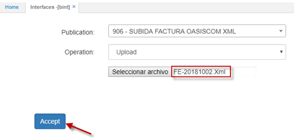

Al momento de hacer click en Aceptar, aparecerá un mensaje indicando que la operación fue satisfactoria, así:  

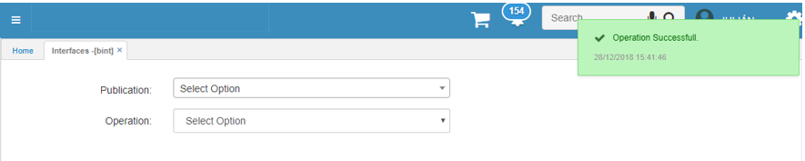

Así sabremos que la factura quedó bien cargada en el sistema.  

### [Verificación de Facturas Electrónicas](http://docs.oasiscom.com/Operacion/ebportal/#verificación-de-facturas-electrónicas)

Para realizar la verificación de las facturas, ingresaremos al nemotécnico **“EBFFAC – Facturas de Venta**. Ingresaremos esta opción en la barra de búsqueda.  

Y aparecerá la siguiente ventana:  

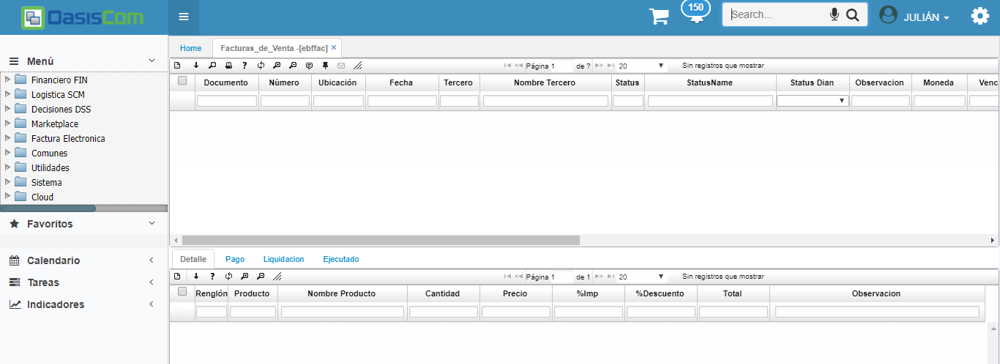

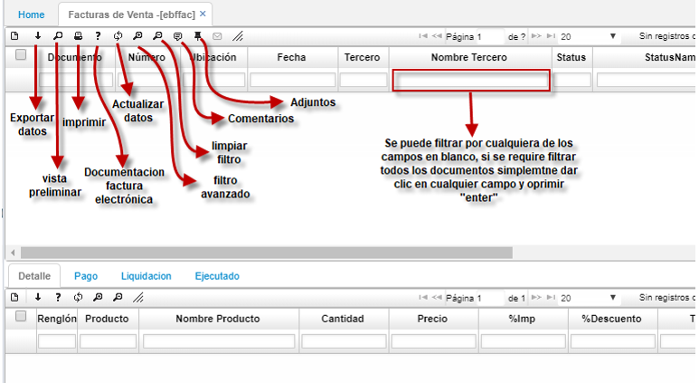

En la parte superior de la ventana se mostrará el encabezado de la factura con los valores en general y en la parte inferior se verá el detalle de la factura: Productos de la factura.  

Para realizar el filtro de todas las facturas, simplemente nos ubicamos en un campo en blanco y oprimimos la tecla **“Enter”**.  

De igual manera se puede realizar el filtro por cualquiera de los campos.  

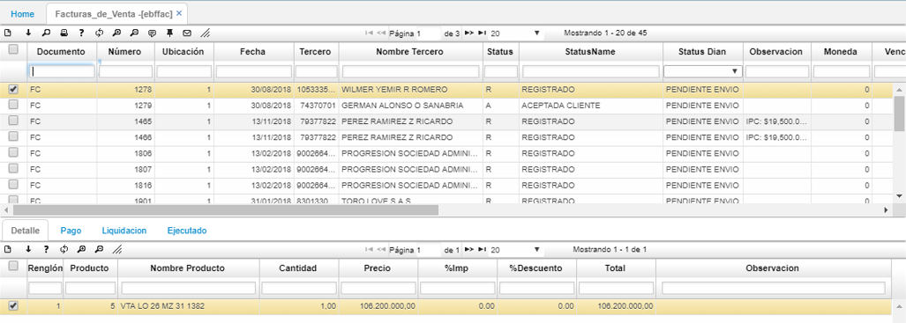

Existen los campos de verificación llamados **“status”** de los cuales se desglosan varias opciones.  

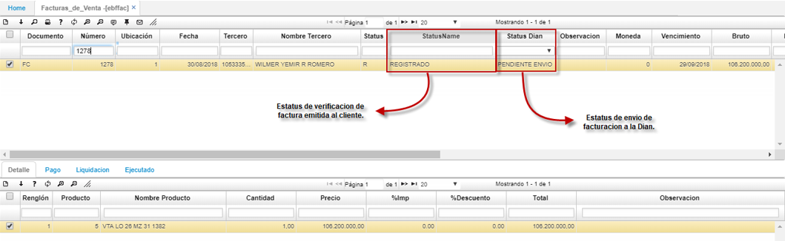

#### **Status Name**  

**Ninguno:** no se envió correo.  
**Registrado:** El correo se envió al adquiriente.  
**Apertura de correo:** Adquiriente vio el correo.  
**Acuse de recibo:** El adquiriente oprime la opción acuse de recibo a la factura.  
**Factura aceptada:** El adquiriente acepta la factura.  
**Factura rechazada:** El cliente rechaza la factura.  

#### **Status Dian**  

**Pendiente envío:** Aun no se ha enviado la factura.  
**Envío Exitoso:** La factura llegó correctamente a la Dian.  
**Error de envío:** La factura tuvo errores de envío. (Para este caso OASISCOM se encargará de revisar estas facturas y realizar el reenvío).  

En la parte superior se puede observar el encabezado de la factura y los valores totales que corresponden, y en la parte inferior se observará el detalle de la factura, en este caso los productos que se están facturando.  

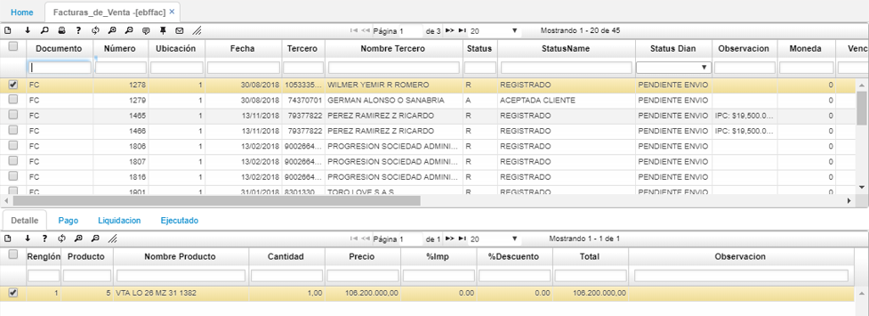

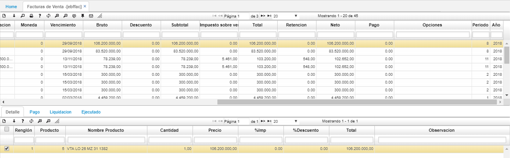

Se puede imprimir la factura seleccionada oprimiendo el botón **“vista preliminar”** o directamente desde el botón **"imprimir"**.  

### [Modificación de Datos Adquiriente](http://docs.oasiscom.com/Operacion/ebportal/#modificación-de-datos-adquiriente)

Al momento de realizar nuestros registros de facturas, la plataforma OASISCOM toma los datos del adquiriente y lo crea en la base de datos solamente, si el adquiriente no está creado o es la primera vez que se le factura por OASISCOM. Esto lo podemos verificar por la aplicación **BTER - Terceros**.  

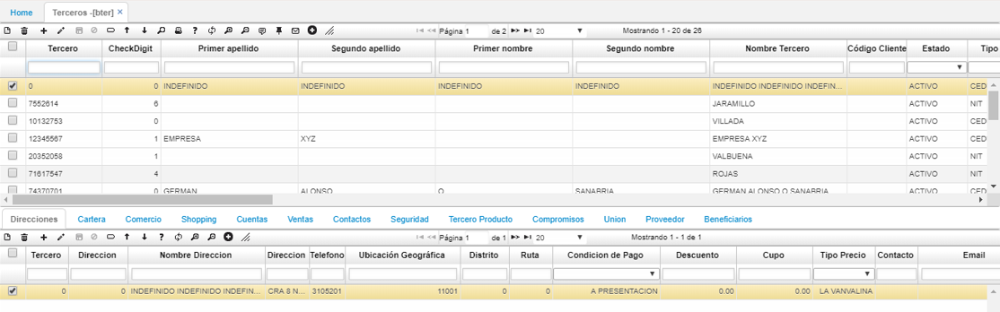

Se puede filtrar por cualquier campo o si se requiere consultar todos los terceros podemos seleccionar cualquier campo en blanco y oprimir la tecla **“Enter”**.  

Esta base de datos es muy importante, ya que los datos que se encuentren allí son los datos que se imprimirán en la factura.  

**IMPORTANTE:** Al momento de cargar las facturas, la plataforma OASISCOM, tomará los datos que se encuentran en la factura para crear el tercero solo si no está creado en la base. Si el tercero ya se encuentra en la base de datos, la plataforma OASISCOM tomará los datos que estén allí para insertarlos en la factura. La plataforma NO realiza actualización de los datos automáticamente al subir nuevas facturas.  

En el caso de que algún cliente cambie algún dato en específico como: dirección, teléfono, ciudad, o en el caso más importante de correo electrónico, debemos ir a la base de datos de los clientes **BTER - Terceros** y de allí realizar el cambio de los datos que se requieran.  

#### **Cambio de Datos en BTER - Terceros**  

Para realizar el cambio de datos de los clientes, primero debemos ir al aplicativo **BTER**, podemos filtrar específicamente por el usuario que necesitamos o podemos filtrar todos los clientes.  

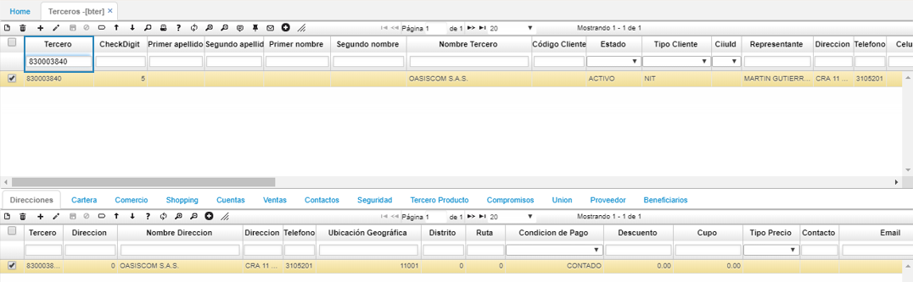

Hacemos click en el campo que se requiere hacer el cambio y se ingresa el nuevo dato.  

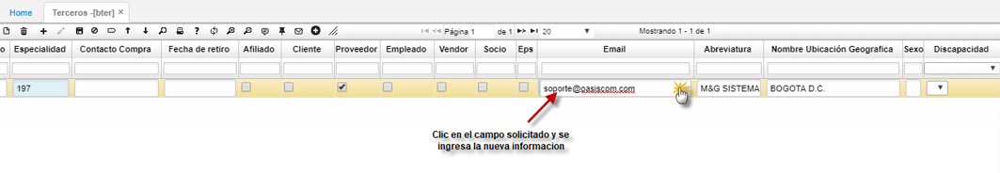

Luego podemos presionar la tecla “Enter” o con el puntero del mouse dar click en el botón **Guardar**.  

Y la información que esté guardada será la que se muestre en la factura.  

**NOTA:**  

Para referirse a los detalles técnicos sobre la generación de los archivos xml requeridos por la Dian, y el proceso de ejecución de los mismos, favor referirse a la documentación expedida por la Dian en la siguiente dirección:  
https://factura-electronica.dian.gov.co/documentacion-normatividad-16.html en la caja de herramientas.  

**********

### [FACTURACIÓN ELECTRONICA FASE II](http://docs.oasiscom.com/Operacion/ebportal/#FACTURACIÓN-ELECTRONICA-FASE-II)  

1.	INTRODUCCIÓN  
El presente documento tiene como objetivo dar a conocer el proceso de la parametrización en fase II de facturación electrónica en OasisCom.  
Le recomendamos leerlo atentamente para asegurar el correcto aprendizaje y/o resolución de dudas.  

2.	PARAMETRIZACIÓN   
**Ubicación**   
Se debe ingresar a las ubicaciones geográficas **[BUBG]**, en donde se debe configurar la ubicación geográfica según los códigos del *DANE* y verificar que a nivel padre e hijo se encuentre correcto (El campo padre debe corresponder de Municipio ? Ciudad).  

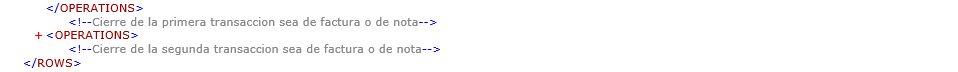  

**Documentos**  
Se ingresa al básico de documentos **[BDOC]**, se procede a crear los documentos para aprobar el Set de Pruebas FC2 (Documento para facturas), DV2 (Documento para notas crédito), NF2 (Documento para notas débito).  
Puede descargar aquí los documentos de *Maestro, Detalle y Status.*  

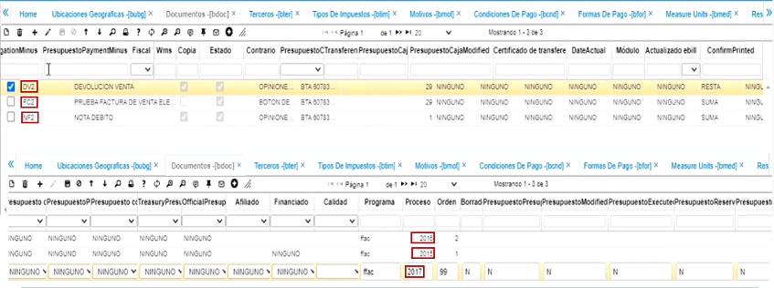  

En la parametrización de los documentos mencionados anteriormente en el maestro el campo EBILL debe estar diligenciado con una de las opciones que se visualiza.   

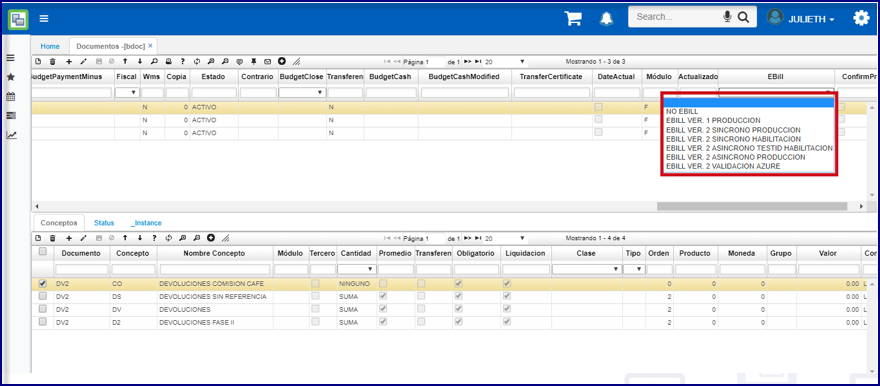  

A continuación, se describen la funcionalidad del campo Ebill:  
•	**No Ebill:** Hace referencia a los documentos que no corresponden a documentos electrónicos.  
•	**Ebill ver. 1 Producción:**  Corresponde a los documentos electrónicos que se encuentren reportando a la DIAN en Fase I.  
•	**Ebill ver. 2 Síncrono Producción:** Corresponde a los documentos electrónicos que se encuentren reportando a la DIAN en Fase II.  
•	**Ebill ver. 2 Síncrono Habilitación:** Corresponde a los documentos electrónicos reportados a la DIAN en fase de habilitación (set de pruebas). De este modo nos permite visualizar los rechazos de la transacción en caso de existir, pero no alimenta el tablero (diagrama de barras) en la página de habilitación de la DIAN.  
•	**Ebill ver. 2 Asíncrono Testid Habilitación:** Corresponde a los documentos electrónicos reportados a la DIAN en fase de habilitación (set de pruebas). Esta opción envía a la DIAN así existan rechazos sobre la transacción y alimenta el Tablero (diagrama de barras). En caso de enviar documentos y aparecer en la pagina de la DIAN rechazados aconsejamos cambiar al modo anterior (Ebill ver. 2 Síncrono Habilitación), para validar el motivo del rechazo.  
•	**Ebill ver. 2 Asíncrono Producción:**  Corresponde a los documentos electrónicos que se encuentren reportando en Fase II autorizados por la DIAN para enviar en lote (generación masiva de facturas diarias).  
•	**Ebill ver. 2 Azure:**  Corresponde a los documentos electrónicos de un cliente de OASIS ONPREMISE que se encuentre reportando sus facturas a la nube de Azure para hacer el proceso de envió al adquiriente y DIAN, tanto en habilitación como en producción.  

En el detalle se debe parametrizar el campo código externo   

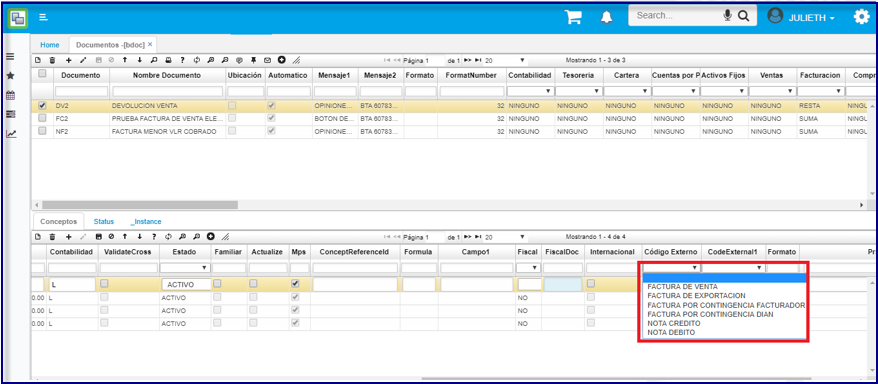  

Adicional a esto también se debe parametrizar el campo código externo1.  

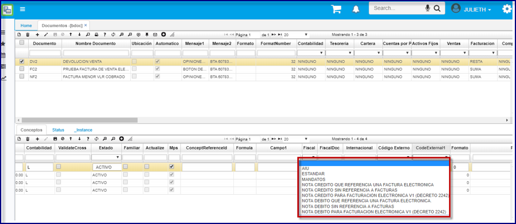  

Se recuerda que las tres primeras opciones (Aiu, Estándar, Mandatos) son para     facturas de venta y/o facturas de exportaciones.  
**Terceros**  
En el básico de terceros **[BTER]**, debe estar creado el tercero de la empresa que es facturador electrónico y el tercero de **OASISCOM.**  
Puede descargar **aquí** el tercero de OasisCom   

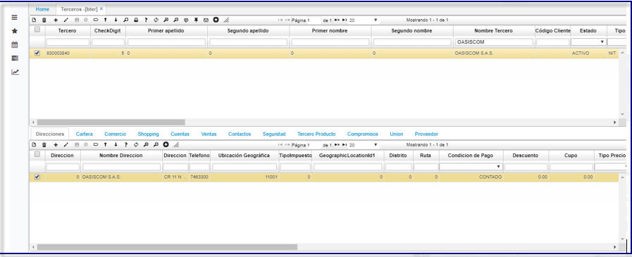  

Adicional a esto en el tercero del facturador electrónico en el campo Código Antiguo deben relacionar la matrícula mercantil de la empresa.  

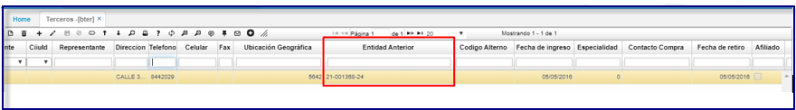  

El tercero FE debe tener relacionado el código de la ubicación geográfica donde se encuentra:  

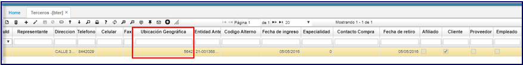  

