# FACTURA ELECTRONICA

---
### Factura Electrónica

>###### [Factura Electrónica (descargar)](http://docs.oasiscom.com/Operacion/ebportal/factura-electronica.pdf)  
>###### [Factura Electrónica Fase Dos (descargar)](http://docs.oasiscom.com/Operacion/ebportal/factura-electronica-dos.pdf)  

---

**Menú**  

1. [Correo Factura Electrónica](http://docs.oasiscom.com/Operacion/ebportal/#correo-factura-electrónica)
2. [Código QR](http://docs.oasiscom.com/Operacion/ebportal/#código-qr)  
3. [Envío de mensajes de texto](http://docs.oasiscom.com/Operacion/ebportal/#envío-de-mensajes-de-texto)  
4. [Adjuntos en la factura electrónica](http://docs.oasiscom.com/Operacion/ebportal/#adjuntos-en-la-factura-electrónica)  
5. [Integración de documentos electrónicos con OasisCom](http://docs.oasiscom.com/Operacion/ebportal/#integración-de-documentos-electrónicos-con-oasiscom)  
5.1 [Archivo XML](http://docs.oasiscom.com/Operacion/ebportal/#archivo-xml)  
5.2 [Archivo plano](http://docs.oasiscom.com/Operacion/ebportal/#archivo-plano)  
5.3 [Instructivo Integración OasisCom](http://docs.oasiscom.com/Operacion/ebportal/#instructivo-integración-oasiscom)  
5.4 [Proceso de Factura Electrónica en Oasiscom R3](http://docs.oasiscom.com/Operacion/ebportal/#proceso-de-factura-electrónica-en-oasiscom-R3)
6. [Actualización RUT Hoja 2 - Facturador Electrónico](http://docs.oasiscom.com/Operacion/ebportal/#actualización-rut-hoja-2---facturador-electrónico)  
7. [Manual Facturación Electrónica - Archivo XML](http://docs.oasiscom.com/Operacion/ebportal/#manual-facturación-electrónica---archivo-xml)  
7.1 [Cargue de Factura Electrónica - Archivo XML](http://docs.oasiscom.com/Operacion/ebportal/#cargue-de-factura-electrónica---archivo-xml)  
7.2 [Verificación de Facturas Electrónicas](http://docs.oasiscom.com/Operacion/ebportal/#verificación-de-facturas-electrónicas)  
7.3 [Modificación de Datos Adquiriente](http://docs.oasiscom.com/Operacion/ebportal/#modificación-de-datos-adquiriente)  
8. [Facturación Electrónica Fase Dos](http://docs.oasiscom.com/Operacion/ebportal/#facturación-electrónica-fase-dos)  
     

## [Correo Factura Electrónica](http://docs.oasiscom.com/Operacion/ebportal/#correo-factura-electrónica)

La plantilla de envío de facturas electrónicas contiene tres links que permiten confirmar el recibido de la factura, _Aceptarla_ o _Rechazarla_. Igualmente, para cada acción se envía una plantilla de correo como respuesta.  

Plantilla al confirmar el recibido de la factura.  

Plantilla al _Aceptar_ una factura.  

Plantilla al _Rechazar_ una factura.  

**Nota:** las plantillas de envío de correos se visualizarán con el logo de la empresa de donde el usuario se encuentre en sesión.  

## [Código QR](http://docs.oasiscom.com/Operacion/ebportal/#código-qr)

El formato de factura electrónica que se envía al adquiriente contiene un Código QR, que le permitirá ver desde un dispositivo móvil los datos de la factura.  

## [Envío de mensajes de texto](http://docs.oasiscom.com/Operacion/ebportal/#envío-de-mensajes-de-texto)

Generada la factura electrónica, el sistema enviará automáticamente un mensaje de texto al número del dispositivo móvil del cliente registrado en el sistema informando de la creación de la factura.  

## [Adjuntos en la factura electrónica](http://docs.oasiscom.com/Operacion/ebportal/#adjuntos-en-la-factura-electrónica)

En el envío de la factura electrónica es posible agregar archivos adjuntos, para ello, se debe parametrizar inicialmente los campos _Ebill_ y _EbillAdjunct_ en la aplicación **SEMP - Empresas**, lo cual indicará que la empresa emite facturación electrónica y podrá adjuntar archivos en la misma.  

Los archivos adjuntos que se visualizarán en el correo eletrónico son:  

1. Documento **.pdf** con el formato fisico de la factura.  
2. Archivo **.zip** con la factura electrónica en formato **.xml**.  
3. Los demás archivos adjuntos que hayan sido agregados en la factura electrónica al momento de generarla.  

## [Integración de documentos electrónicos con OasisCom](http://docs.oasiscom.com/Operacion/ebportal/#integración-de-documentos-electrónicos-con-oasiscom)

### [Archivo XML](http://docs.oasiscom.com/Operacion/ebportal/#archivo-xml)

Mediante archivo XML el cliente puede subir documentos electrónicos a la plataforma de OasisCom o consumiendo un servicio web que provee OasisCom para que este cargue sea de forma automática.  

**Estructura**

### [Archivo plano](http://docs.oasiscom.com/Operacion/ebportal/#archivo-plano)  

Cuando no se cuenta con una estructura en formato XML, OasisCom provee una estructura en formato de _archivo plano_ el cual debe ser cargado de forma manual a la plataforma de OasisCom por medio de la aplicación BINT - Interfaces.  

#### [Descargue Aquí el Archivo Plano](http://docs.oasiscom.com/Operacion/ebportal/Archivo_Plano.xlsx) 

**Nota:** al cargar el archivo plano, el sistema creará los terceros y productos en caso de que no existan previamente.  

Los datos relacionados al color:  
* **azul** corresponde al Adquiriente.   
* **color** gris del vendedor.   
* **amarillo** son los que irán diligenciados en el maestro de la aplicación FFAC - Facturas.  
* y los asociados al color **verde** en el detalle.    

  

La estructura enviada por OasisCom cuenta con comentarios en cada campo para facilitar su diligenciamiento.  

  

Ingresada toda la información en el archivo de Excel, debemos eliminar los renglónes señalados en la siguiente imagen para así proceder a convertirlo en formato _.CSV_.   

  

Al eliminar los anteriores renglones deberá quedar así:  

 

Para convertir el archivo en formato **.CSV** vamos a _Archivo  Guardar como  Elegimos una ubicación  Asignamos un nombre  Tipo: CSV (delimitado por comas)  Guardar_.   

  

Una vez guardado, se ingresa a la aplicación **Interfaces - BINT**, se selecciona la publicación **_961_** (SUBIDA FACTURA ELECTRÓNICA FASE II (PLANO)), se selecciona el archivo que se guardó en _.csv_ y se da click en _Aceptar y Ejecutar_ y el sisema genera un mensaje de control.    

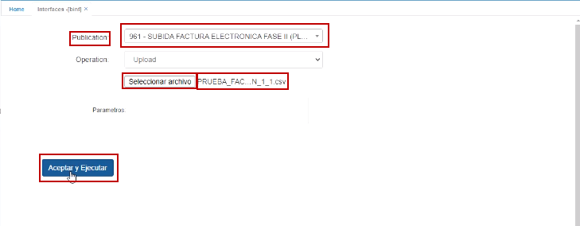  

Posteriormente, se ingresa a la aplicación **Facturas de venta - ebffac**.  En esta aplicación se valida que estén todas las facturas de acuerdo al consecutivo, estén en _Envío existoso_ y estén cargadas en **OASIS**.  

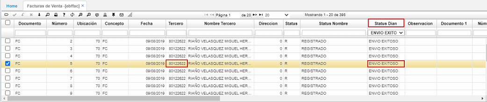

En la pestaña _Ejecutado_, se entra a validar si el envío efectivamente se realizó con éxito a la DIAN y la hora en la que se realizó el envío.  

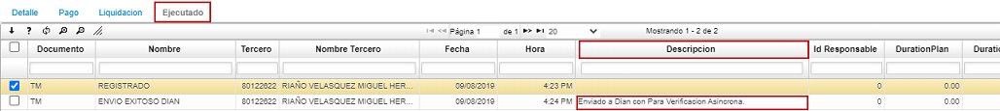

**_IMPORTANTE:_** Convertido el archivo en formato _.CSV_, este se debe abrir en el editor de texto y eliminar el último espacio en blanco.  

Quedando el cursor en el último caracter del último renglón.  

### [Instructivo Integración OasisCom](http://docs.oasiscom.com/Operacion/ebportal/Instructivo_Integracion_OasisCom_v1.0.pdf)

A continuación, se dará a conocer la data requerida para realizar la carga de documentos electrónicos en los formatos XLS o TXT para el proceso de facturación electrónica en OasisCom.  

#### _Definiciones_

Descripción de cada una de las columnas de la malla de validación:  

**Atributo:** Corresponde al nombre del campo a definir.  
**Tipo:** Identifica si los datos del campo son a nivel de maestro **(M)** o del detalle **(D)** de la transacción, factura o nota.  
**Descripción:** Breve explicación de la característica del campo en cuestión.  
**T:** Corresponde al tipo de dato del campo:  

 * **D**: Campo tipo fecha.  
 * **N:** Campo de tipo número (Entero, Decimal).  
 * **C:** Carácter o cadena de caracteres.  

**Longitud máxima:** En esta columna se describe el tamaño máximo requerido para el campo (en números).  
**Req. Valor:** Identifica si el campo es o no es obligatorio. **S** para si, **N** para no.  
**Formato:** Ejemplo de cómo debe ser llenado cada campo.  

#### _Malla de validación_

A continuación, se describe la malla de validación con la información precisa para realizar la carga de documentos electrónicos.  

  

### [Proceso de Factura Electrónica en Oasiscom R3](http://docs.oasiscom.com/Operacion/ebportal/#proceso-de-factura-electrónica-en-oasiscom-r3)  

Para iniciar el proceso de Facturación electrónica en la versión R3 de Oasiscom, se crea una factura normal con el _Documento_ correspondiente y el _Número_ de documento.  Cabe resaltar que la factura debe estar en _Estado_ **_Procesado_** para poderla transmitir a Oasiscom en Azure.

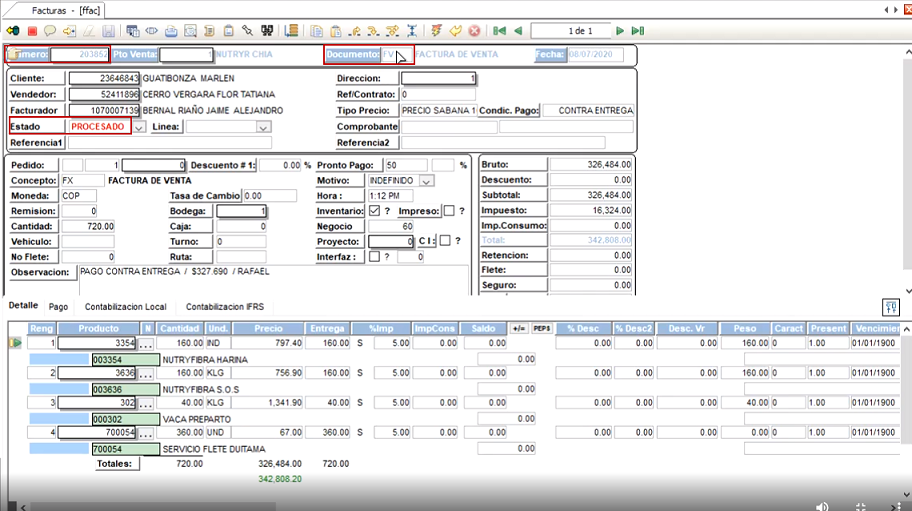

Cuando la factura ya esté hecha, ingreso a la aplicación **Log-BINT - FPFE**.  Una vez en esta aplicación, se filtra por el número de la factura.  

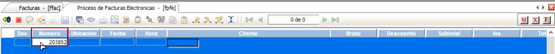  

Se utiliza el comando **Ctrl F** y aquí se evidencia la factura para poderla transmitir a Oasiscom.  Se selecciona y se oprime el primer botón de la derecha: _Marcar todo_  

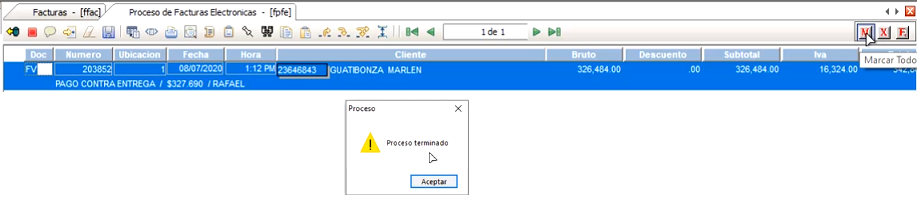  

Finalmente, se oprime el _botón_ **_Envía transacciones automáticamente_** y aparece un aviso de control diciendo que el proceso ha terminado.  

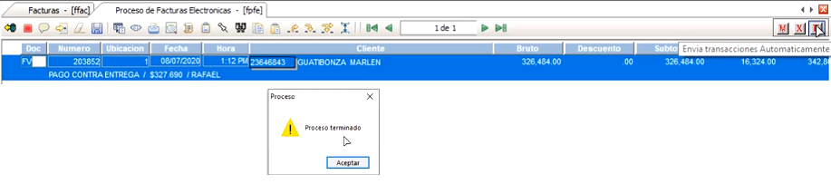  

Una vez terminado el proceso, nos dirigimos a Oasiscom e ingresamos a la aplicación **Facturas de venta - EBFFAC**

  

Aquí también se filtra por el número de la factura y se evidencia que la factura se transmitió de manera correcta y se verifica que el campo _Status DIAN_ sea **_Envío exitoso_**  

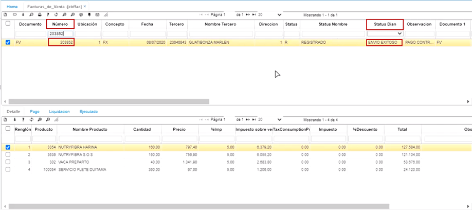  

Ahora, en esta parte, se valida cómo se pasa una factura de OasisR3 a Oasiscom descargando el archivo XML.  Una vez se tiene la factura ya lista y procesada, se pasa de nuevo a la aplicación **Log-BINT - FPFE** y se filtra por el número de factura y se hace aplica el comando **Ctrl F**.  Estando en este punto, se selecciona el registro y se da click en la opción _Marcar todo_.  Aparece el aviso de control _Proceso terminado_ y se da click en aceptar.    

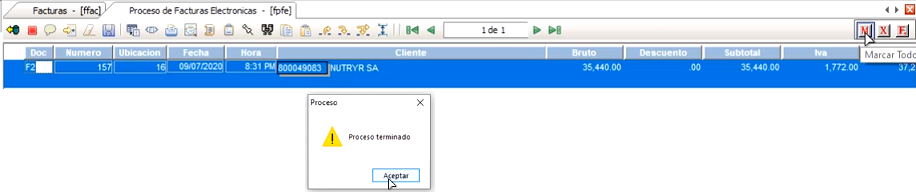  

Luego, se oprime el botón _Generar archivo XML_.  El sistema solicita que se guarde el archivo y se puede asignar el nombre que se desee.  Aparece el aviso de control _Proceso terminado_ y se da click en aceptar.  

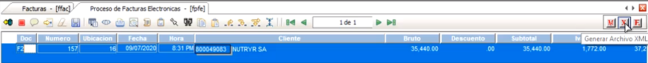  

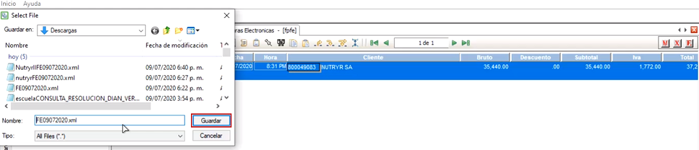

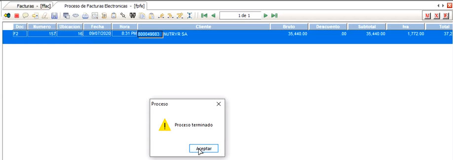  

Una vez terminado el proceso, se accede a Oasiscom y se ingresa a la aplicación **Interfaces - BINT**.  En el campo _Publicación_, se selecciona la opción **951 - Subida factura Oasiscom XML Ver 2 Ebill**, se habilita la opción para buscar el archivo y poderlo cargar. Una vez cargado el archivo, se da click en _Aceptar y Ejecutar_.  Sale un aviso de control informando que la Factura fue enviada correctamente.  

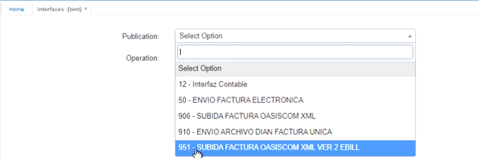  

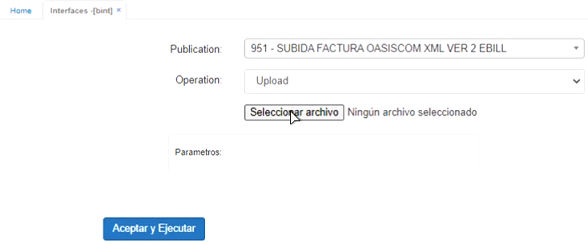  

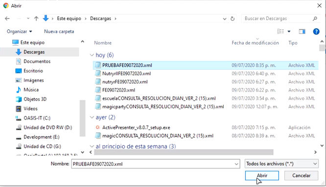  

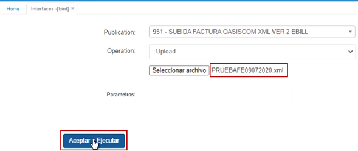  

  

Para validar esta factura, se ingresa a la aplicación **Facturas de venta - EBFFAC** y se filtra por el número del documento.  Como se puede apreciar en la ilustración, ya está cargada la factura y el campo _Status dian_ aparece como **_Envío Exitoso_**.  

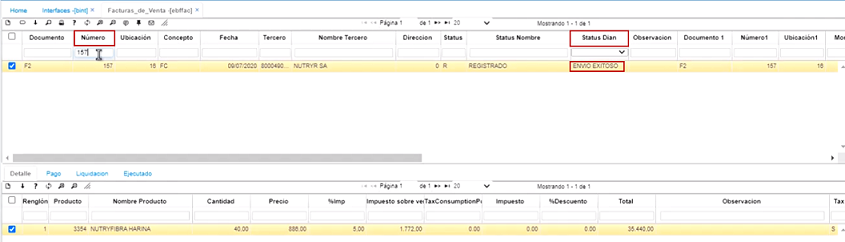 

## [Actualización RUT Hoja 2 - Facturador Electrónico](http://docs.oasiscom.com/Operacion/ebportal/#actualización-rut-hoja-2---facturador-electrónico)

El siguiente instructivo contiene el paso a paso para actualizar RUT (hoja #2) y asociar al Proveedor Tecnológico (OasisCom S.A.S) en la página de la DIAN.  

* Ingresar a la página web de la DIAN (https://muisca.dian.gov.co) y loguearse.  

* En el menú izquierdo seleccionar la opción _Registro Único Tributario_.  

* De la lista desplegable, seleccionar la opción _Actualizar RUT_.  

* Seguidamente dar click en el botón _Continuar_.  

* Dar click en el botón _Continuar_.  

* De la lista desplegable seleccionar la **Hoja 2**.  

* Para cargar el documento damos click en el botón _Continuar_.  

* En el formulario de la **Hoja 2**, en el renglón 89 seleccionar la opción _74 - Información Proveedor de Servicios Tecnológicos PST_.  

* Allí mismo, en el renglón 90 seleccionar la fecha exacta en la que se asoció al proveedor tecnológico.  

* Seguidamente, en el renglón 91 ingresar el número de NIT de OASISCOM S.A.S **830003840-5**.  

* Finalmente, guardar y firmar para formalizar el documento.  

## [Manual Facturación Electrónica - Archivo XML](http://docs.oasiscom.com/Operacion/ebportal/#manual-facturación-electrónica---archivo-xml)

A continuación, se informará el paso a paso del proceso de cargue, validación y modificación de facturación electrónica en la plataforma OASISCOM. 

Para empezar, se debe realizar el registro del usuario ingresando los datos pertinentes que solicita la plataforma OASISCOM en la página principal [**https://app.oasiscom.com**](https://app.oasiscom.com).  

### [Cargue de Factura Electrónica - Archivo XML](http://docs.oasiscom.com/Operacion/ebportal/#cargue-de-factura-electrónica-archivo---xml)

Ingresamos con nuestro usuario y contraseña a la plataforma OASISCOM en el siguiente link https://app.oasiscom.com.  

Al momento de ingresar aparecerá una interfaz como la siguiente, donde tendrá varias opciones.  

Nos ubicamos en la barra de búsqueda e ingresamos el nemotécnico **“BINT” – Interfaces**, nos aparecerá una ventana.  

Nos ubicamos en la opción **Publication** y damos click, se despliega una lista y seleccionaremos la opción **906-SUBIDA FACTURA OASISCOM XML**.  

Después de seleccionar la opción, en el campo **Operation** cargará automáticamente la opción Upload (No modificar esta opción). Luego damos click en el botón “seleccionar archivo” y buscamos el archivo XML en nuestros documentos.  

Al momento de cargar el archivo, se verá reflejado el nombre de este. A continuación, damos click en “Accept”.  

Al momento de hacer click en Aceptar, aparecerá un mensaje indicando que la operación fue satisfactoria, así:  

Así sabremos que la factura quedó bien cargada en el sistema.  

### [Verificación de Facturas Electrónicas](http://docs.oasiscom.com/Operacion/ebportal/#verificación-de-facturas-electrónicas)

Para realizar la verificación de las facturas, ingresaremos al nemotécnico **“EBFFAC – Facturas de Venta**. Ingresaremos esta opción en la barra de búsqueda.  

Y aparecerá la siguiente ventana:  

En la parte superior de la ventana se mostrará el encabezado de la factura con los valores en general y en la parte inferior se verá el detalle de la factura: Productos de la factura.  

Para realizar el filtro de todas las facturas, simplemente nos ubicamos en un campo en blanco y oprimimos la tecla **“Enter”**.  

De igual manera se puede realizar el filtro por cualquiera de los campos.  

Existen los campos de verificación llamados **“status”** de los cuales se desglosan varias opciones.  

#### **Status Name**  

**Ninguno:** no se envió correo.  
**Registrado:** El correo se envió al adquiriente.  
**Apertura de correo:** Adquiriente vio el correo.  
**Acuse de recibo:** El adquiriente oprime la opción acuse de recibo a la factura.  
**Factura aceptada:** El adquiriente acepta la factura.  
**Factura rechazada:** El cliente rechaza la factura.  

#### **Status Dian**  

**Pendiente envío:** Aun no se ha enviado la factura.  
**Envío Exitoso:** La factura llegó correctamente a la Dian.  
**Error de envío:** La factura tuvo errores de envío. (Para este caso OASISCOM se encargará de revisar estas facturas y realizar el reenvío).  

En la parte superior se puede observar el encabezado de la factura y los valores totales que corresponden, y en la parte inferior se observará el detalle de la factura, en este caso los productos que se están facturando.  

Se puede imprimir la factura seleccionada oprimiendo el botón **“vista preliminar”** o directamente desde el botón **"imprimir"**.  

### [Modificación de Datos Adquiriente](http://docs.oasiscom.com/Operacion/ebportal/#modificación-de-datos-adquiriente)

Al momento de realizar nuestros registros de facturas, la plataforma OASISCOM toma los datos del adquiriente y lo crea en la base de datos solamente, si el adquiriente no está creado o es la primera vez que se le factura por OASISCOM. Esto lo podemos verificar por la aplicación **BTER - Terceros**.  

Se puede filtrar por cualquier campo o si se requiere consultar todos los terceros podemos seleccionar cualquier campo en blanco y oprimir la tecla **“Enter”**.  

Esta base de datos es muy importante, ya que los datos que se encuentren allí son los datos que se imprimirán en la factura.  

**IMPORTANTE:** Al momento de cargar las facturas, la plataforma OASISCOM, tomará los datos que se encuentran en la factura para crear el tercero solo si no está creado en la base. Si el tercero ya se encuentra en la base de datos, la plataforma OASISCOM tomará los datos que estén allí para insertarlos en la factura. La plataforma NO realiza actualización de los datos automáticamente al subir nuevas facturas.  

En el caso de que algún cliente cambie algún dato en específico como: dirección, teléfono, ciudad, o en el caso más importante de correo electrónico, debemos ir a la base de datos de los clientes **BTER - Terceros** y de allí realizar el cambio de los datos que se requieran.  

#### **Cambio de Datos en BTER - Terceros**  

Para realizar el cambio de datos de los clientes, primero debemos ir al aplicativo **BTER**, podemos filtrar específicamente por el usuario que necesitamos o podemos filtrar todos los clientes.  

Hacemos click en el campo que se requiere hacer el cambio y se ingresa el nuevo dato.  

Luego podemos presionar la tecla “Enter” o con el puntero del mouse dar click en el botón **Guardar**.  

Y la información que esté guardada será la que se muestre en la factura.  

**NOTA:**  

Para referirse a los detalles técnicos sobre la generación de los archivos xml requeridos por la Dian, y el proceso de ejecución de los mismos, favor referirse a la documentación expedida por la Dian en la siguiente dirección:  
https://factura-electronica.dian.gov.co/documentacion-normatividad-16.html en la caja de herramientas.   

## [Facturación Electrónica Fase Dos](http://docs.oasiscom.com/Operacion/ebportal/#facturación-electrónica-fase-dos)

1.	INTRODUCCIÓN  
El presente documento tiene como objetivo dar a conocer el proceso de la parametrización en fase II de facturación electrónica en OasisCom.  
Le recomendamos leerlo atentamente para asegurar el correcto aprendizaje y/o resolución de dudas.  

2.	PARAMETRIZACIÓN   

**Ubicación**   
Se debe ingresar a la aplicación **_BUBG - Ubicaciones Geográficas_**, en donde se debe configurar la ubicación geográfica según los códigos del *DANE* y verificar que a nivel padre e hijo se encuentre correcto, quiere decir que si necesitamos crear un nuevo municipio, debo crearlo y validar que su departamento exista también para poderlos asociar.  En la ilustración, vemos que para el hijo _Unicentro_, debe existir el padre _Medellín_ y a su vez, para el hijo _Medellín_ debe existir el padre _Antioquia_.  

  

**Documentos**  
Se ingresa a la aplicación **_BDOC - Documentos_**, se procede a crear los documentos para aprobar el Set de Pruebas FC2 (Documento para facturas), DV2 (Documento para notas crédito), NF2 (Documento para notas débito), cada uno con su respectivos _Conceptos_.  Se debe tener en cuenta, que a pesar que en el proceso de inicialización, ya se encuentran creados estos tres productos,  es que siempre tengan asociado su proceso en habilitación y una vez en producción los documentos reales deben tener el proceso asociado.  Para _Facturas_ en proceso de habilitación es **2015**, para las _Notas crédito_ **2016** y para las _Notas débito_ **2017**. 

Puede descargar aquí los documentos de *Maestro, Detalle y Status.*  

  

En la parametrización de los documentos mencionados anteriormente en el maestro el campo *EBILL* debe estar diligenciado con una de las opciones que se visualiza.  Se parametriza de acuerdo a la fase o proceso en el que nos encontremos con los documentos   

  

A continuación, se describen la funcionalidad del campo Ebill:  
•	**No Ebill:** Hace referencia a los documentos que no corresponden a documentos electrónicos y por tanto, no se reportan a la DIAN.  
•	**Ebill ver. 1 Producción:**  Corresponde a los documentos electrónicos que se encuentren reportando a la DIAN en Fase I, es la fase antes de habilitación previa de factura electrónica.  
•	**Ebill ver. 2 Síncrono Producción:** Corresponde a los documentos electrónicos que se encuentren reportando a la DIAN en Fase II.  
•	**Ebill ver. 2 Síncrono Habilitación:** Corresponde a los documentos electrónicos reportados a la DIAN en fase de habilitación (set de pruebas). De este modo nos permite visualizar los rechazos de la transacción en caso de existir, pero no alimenta el tablero (diagrama de barras) en la página de habilitación de la DIAN.  
•	**Ebill ver. 2 Asíncrono Testid Habilitación:** Corresponde a los documentos electrónicos reportados a la DIAN en fase de habilitación (set de pruebas). Esta opción envía a la DIAN así existan rechazos sobre la transacción y alimenta el Tablero (diagrama de barras). En caso de enviar documentos y aparecer en la pagina de la DIAN rechazados aconsejamos cambiar al modo anterior (Ebill ver. 2 Síncrono Habilitación), para validar el motivo del rechazo.  
•	**Ebill ver. 2 Asíncrono Producción:**  Corresponde a los documentos electrónicos que se encuentren reportando en Fase II autorizados por la DIAN para enviar en lote (generación masiva de facturas diarias).  Es decir, aplica para algunas empresas que facturan un tope bastante alto, así que la DIAN les da un permiso especial para que puedan facturar en producción de manera asíncrona, es decir, mandar en batch esas facturas.
•	**Ebill ver. 2 Azure:** Es exclusivo para los clientes que tienen OASISCOM como su ERP y tienen una instalación propia, se parametriza la validación Azure para que la información viaje primero hacia la nube de OASIS para hacer el proceso de envío al adquiriente y DIAN, tanto en habilitación como en producción.  

En el detalle, hay una pestaña que se llama _Conceptos_.  En esta, aparecen cada uno de los conceptos, tanto de las facturas como de las notas. Es importante tener en cuenta la parametrización del _Código externo_ y _Código externo 1_.  Los dos deben estar parametrizados en los conceptos que usa la empresa.  Para el código externo, las posibilidades que hay, son: _Factura de venta_, _Factura de exportación_, _Factura por contingencia facturador_, _Factura por contingencia DIAN_, _Nota crédito_ o _Nota débito_, entonces aquí se parametrizan los conceptos que tiene la DIAN con respecto a las facturas, a las notas.     

  

En cuanto al campo código externo1, se define o se entra a detallar con respecto al campo anterior, a qué se refiere exactamente; es decir, las tres primeras opciones (Aiu, Estándar, Mandatos) son para facturas de venta o cualquier otro tipo de facturas.  Si en el campo anterior elegí _Nota crédito_, en este campo debo elegir si es para facturas de Fase I, si es una nota crédito de antes de ser facturador electrónico o una factura de Fase 2 que ya está reportada en la DIAN.  Es importante resaltar que si es un documento sin referencia, el _Concepto_ es **DS**, **D1** para documentos de Fase 1 y **DV** para facturas de Fase II.  De la misma forma, sucede para las notas crédito: **NS** sin referencia, **N1** para Fase I y **NF** para Fase II.  También cabe aclarar que una nota, ya sea débito o crédito, siempre va asociada a una factura

  

  
**Terceros:**  
En la aplicación **_BTER - Terceros_**, hay que tener en cuenta que al iniciar el proceso, siempre debe haber mínimo 3 terceros que son el tercero de la empresa que es facturador electrónico, el tercero cero y el tercero de **OASISCOM**  
En la aplicación **BTER**, también hay un campo que se llama _Tipo de impuestos_, en este campo es donde se le asigna al tercero su responsabilidad fiscal.   

Puede descargar **aquí** el tercero de OasisCom.

  

Adicional a esto en el tercero del facturador electrónico en el campo Código Antiguo deben relacionar la matrícula mercantil de la empresa.  

  

El tercero FE debe tener relacionado el código de la ubicación geográfica donde se encuentra:  

  

**Acciones:**  
En la aplicación **_BACC - Acciones_** debe estar creada la acción cero 0.  

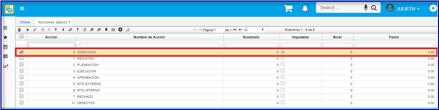  

**Tipos de Medios:**  
En la aplicación **_ABTM - Tipos de Medios_** debe estar creado el Tipo de medio cero 0.  

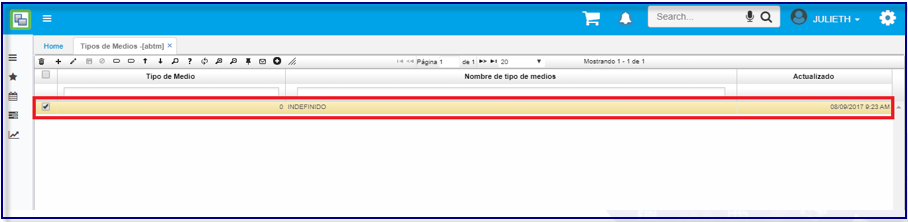  

**Contactos:**  
En la aplicación **_ACON - Contactos_** debe estar creado el contacto cero 0.  

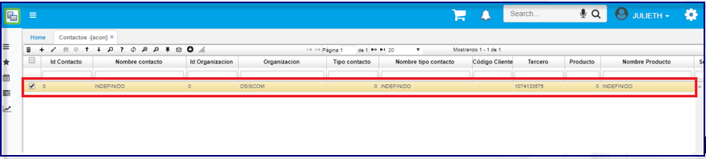  

**Tipos de Contactos:**  
En la aplicación **_ABTC - Tipos de Contacto_** debe estar creado Tipo contacto cero 0.   

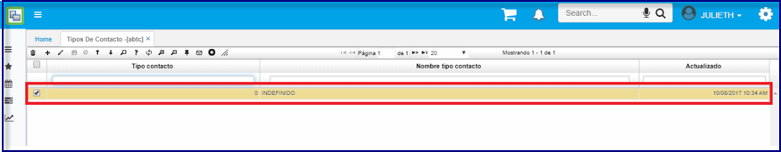  

**Tipos de Impuestos:**  
En la aplicación **_BTIM - tipos de Imuestos_** por defecto siempre se crean 5: 0 - tipo impuestos genéricos, 99 - impuesto empresa, 100 - régimen simplificado, 200 - régimen común y 300 - gran contribuyente. Si hay alguno que no esté, se puede crear, pero teniendo en cuenta que se le debe colocar también en los terceros. El tipo de impuesto 99 (para la empresa) se debe parametrizar de acuerdo con la(s) responsabilidad(es) fiscal(es) del Facturador Electrónico y asociarlo a las responsabilidades en el campo _Código externo_ (los campos que aparecen aquí, Gran contribuyente, autorretenedor, agente de retención IVA, régimen simple de tributación o sino es ninguno de estos, el No aplica, son los definidos por la DIAN y OASIS los va actualizando en el momento en que la DIAN realice algún cambio) y régimen correspondiente de la empresa creada.  

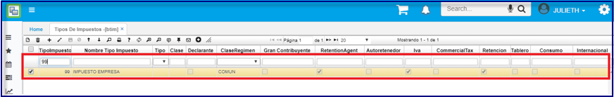  

**Motivos:**  
A pesar de que deben existir para todos los documentos, tanto para facturas como para notas débito y notas crédito, para las notas débito y crédito, estos motivos tienen una parametrización adicionalen el campo _Código externo_ y debe referenciar a qué motivo corresponde esa nota que estoy haciendo.  Los 5 primeros corresponden a los motivos que se deben asociar a los documentos de las notas crédito (Devolución parcial de los bienes y/o no aceptación parcial del servicio, anulación de factura electrónica, rebaja o descuento parcial o total, ajuste de precio, otros-notas crédito) y los siguientes 4 corresponden a los motivos que se deben asociar a las notas débito (intereses, gastos por cobrar, cambio del valor, otros-notas débito).  En la aplicación **_BMOT - Motivos_** deben de estar parametrizados los motivos de cada documento en el campo Código externo.   

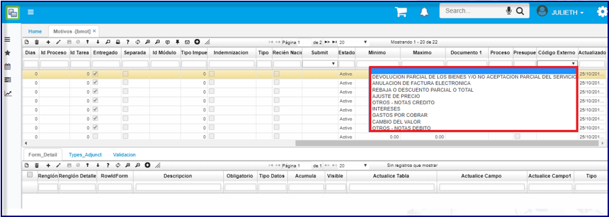  

**Condiciones de Pago:**  
Ya hay unas creadas por defecto o parametrizadas previamente en el proceso de implementación; en la aplicación **_BCND - Condicones de Pago_** debe de estar parametrizado el campo Código externo.  En el campo _Código externo_ debe decir si es **Crédito** o **Contado**.

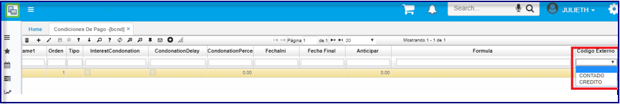  

**Formas de Pago:**  
También se tienen ya unas definidas, también se pueden crear más o validar si las que están creadas se usan. En la aplicación **_BFOR - Formas de Pago_** debe estar parametrizado el campo código externo. Las opciones que nos da este campo _Código externo_ son: **Efectivo, Tarjeta crédito, tarjeta débito, cheque, acuerdo mutuo (otro)**.  

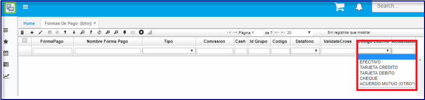  

**Unidades de Medida:**  
También existen unas por defecto pero se podrían dejar solamente las que utiliza la empresa. En la aplicación **_BMED - Unidades de Medida_** debe de estar parametrizado el campo código externo.  

  

La anterior fue la parametrización básica y ahora se realiza una parametrización más específica

**Resoluciones:**  
En la aplicación **_FRES - Resoluciones_** Deben de estar creadas cada una de las resoluciones según datos de la DIAN para los documentos de facturación electrónica teniendo en cuenta los campos.  Tanto en el proceso de habilitación como en producción, se debe tener en cuenta que se debe parametrizar absolutamente toda la información que se tiene sobre la resolución.  

•	Documento: Documento de Factura al que pertenece la resolución (FC2, FC, etc.).    
•	Ubicación: Código de la Ubicación en Oasis (1 cuando hay una sola ubicación).    
•	Nombre de la ubicación: El sistema lo trae por defecto.  
•	Caja: Siempre dejar uno (1).  
•	ResolutionId: Número de la Resolución expedida en la DIAN.    
•	Prefijo: Prefijo asociado a la resolución, en caso de no tener se deja vacío.    
•	Inicial: Número del rango inicial de resolución.    
•	Final: Número final de resolución.    
•	Pronunciamiento: Clave técnica otorgada por la DIAN en cada resolución.    
•	F. Inicial Resolución: Fecha Inicial de la resolución.    
•	F. Final Resolución: Fecha Final de la resolución.    
•	Fecha Final: Fecha Final de la resolución (la misma fecha del campo anterior, esto sirve para algunos procesos internos del sistema).    
•	Estado: La resolución que está vigente, siempre debe estar en estado Activo.  En el momento en que se acabe la resolución por fecha o por rango y se cree una nueva, entonces se crea un nuevo registro (+) y cuando se termine de crear, el anterior se pasa a estado Procesado.  

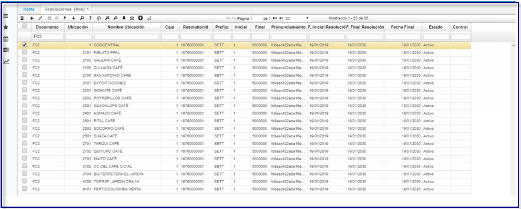  

**Empresas:**  
En la aplicación **_SEMP - Empresas_** parametrizar el TestSetId dado por la Dian para las pruebas de habilitación en el campo TestId. A este TestId es que las facturas que yo haga de prueba, va a ir a alimentar ese dashboard, entonces es como la asociación que tienen entre el proceso de habilitación del proveedor tecnológico con la DIAN. Cuando se pasa al proceso de producción ya no es necesario.   

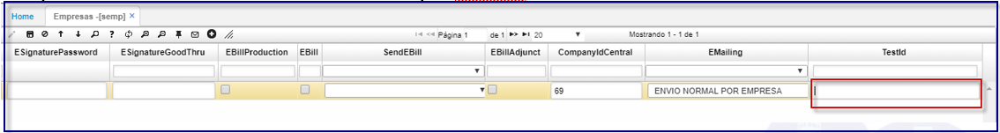  

Es importante tener en cuenta que a pesar de que los correos de salida se hacen a través de un servidor masivo de OASIS, es importante tener en cuenta que en el campo _EmailOutput_, se debe digitar un correo electrónico que se usa de máscara para que los correos que les llegan a sus clientes, les lleguen como si este correo los enviara para que se pueda tener toda la trazabilidad.    

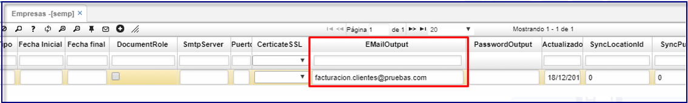  

Se debe relacionar la información de la empresa como dirección, teléfonos, ciudad, etc. para la información que se visualiza en el formato (Representación Gráfica de las transacciones).  

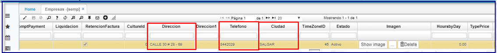  

**Procesos:**  
En la aplicación **_SPRC - Procesos_**, se tienen los procesos mencionados con anterioridad, es decir, 2015, 2016 y 2017.  Estos procesos, mientras se está en fase de habilitación, deben tener referenciado el Documento de pruebas **FC2, DV2, NF2**.  Es muy importante que todos tengan sus detalles correspondientes para que el proceso haga las actualizaciones de Status correspondientes.  Una vez se habilitan, terminan su proceso de Pruebas, en el momento de entrar a producción, se relaciona el documento real.  Si hay que crear un nuevo proceso, por ejemplo 2018, en el detalle toca asociar los Status.  

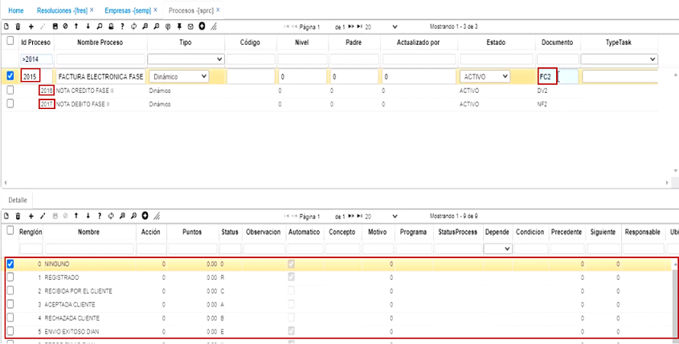

