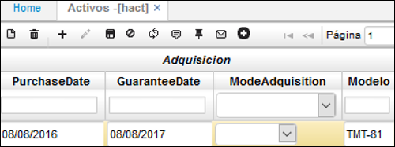

# HACT - Activos

En la aplicación HACT se valida la creación de los activos fijos ingresados previamente en la aplicación [**HMOV - Movimientos**](http://docs.oasiscom.com/Operacion/erp/activos/hmovimient/hmov) y se editan las características del mismo.  

En la aplicación HACT consultamos por el número de activo asignado en [**HMOV - Movimientos**](http://docs.oasiscom.com/Operacion/erp/activos/hmovimient/hmov) y damos click en el botón _editar_.

Procedemos a ingresar las caracteristicas del activo fijo.  

**Código alterno:** código interno que la empresa le tenga al activo fijo registrado.  
**Tipo:** seleccionar de la lista desplegable, el tipo de activo que se registra.  
**Estado:** Activo.  
**Brand:** Marca del activo fijo.  

Deslizamos la ventana hacia la derecha y diligenciamos los campos pertinentes.  

##### Sección Adquisición  

**Fecha de compra:** fecha en la cual se compró el activo fijo.  
**Fecha de la garantía:** fecha en la cual se cumple la garantía.  
**Modelo:** modelo del activo fijo.  

Para las siguientes secciones: vehículos, activos intangibles, inmuebles, muebles y enseres, los campos se diligencian dependiendo el activo fijo que se ingrese, es decir, si por ejemplo el activo fijo que se registra es un vehículo, se escribe la palabra yes en el campo vehículo y se diligencian los campos siguientes de la sección Vehículos, al guardar el registro, el sistema muestra un Check en estado activo en el campo Vehículo y no la palabra Yes. Veamos un ejemplo en la siguiente imagen.  

Finalizada la edición de las características del activo fijo en el maestro, nos dirigimos a la pestaña del detalle llamada **_Distribución_**, dicho detalle también ha sido creado por el registro hecho anteriormente en la aplicación  [**HMOV - Movimientos**](http://docs.oasiscom.com/Operacion/erp/activos/hmovimient/hmov).  

El detalle especifica la depreciación del activo fijo para el libro 0 (Contabilidad nacional) y el libro 1 (IFRS).  

En el detalle se debe indicar para los dos libros contables, si el activo fijo registrado se va a depreciar, el tipo de depreciación, la fecha en la que inicia su depreciación y el estado del activo.  

Igualmente, se permite elegir el estado en el que se encuentra el activo fijo, ya sea: _Activo, Depreciado, Retirado, Anulado_.  

Finalmente, damos click en el botón  _Guardar_ del detalle.  