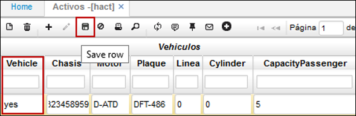
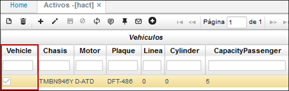
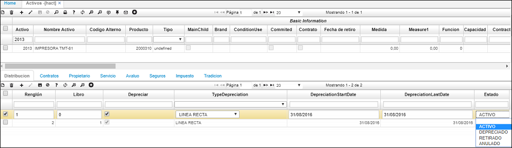
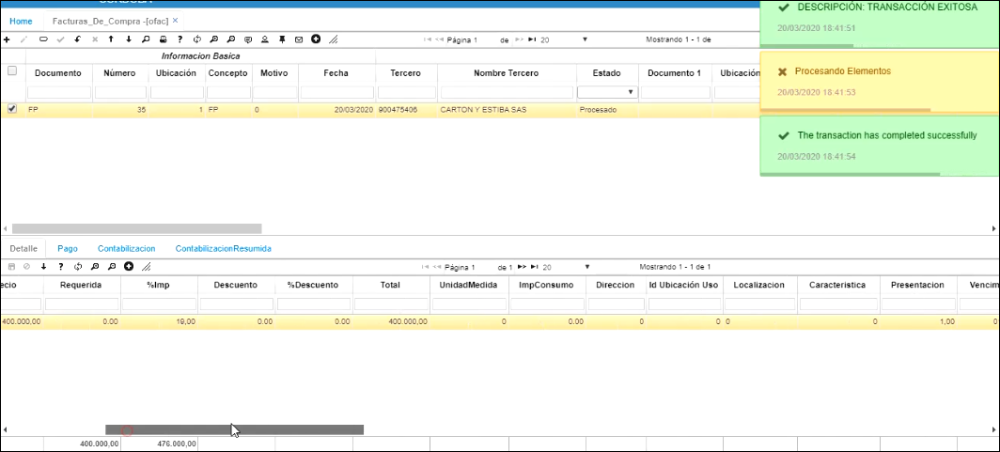
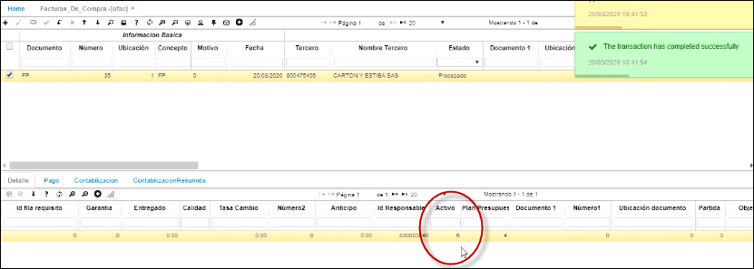

# HACT - Activos

En la aplicación HACT se valida la creación de los activos fijos ingresados previamente en la aplicación [**HMOV - Movimientos**](http://docs.oasiscom.com/Operacion/erp/activos/hmovimient/hmov) y se editan las características de este.

En la aplicación HACT consultamos por el número de activo asignado en [**HMOV - Movimientos**](http://docs.oasiscom.com/Operacion/erp/activos/hmovimient/hmov) y damos clic en el botón _editar_.

Procedemos a ingresar las características del activo fijo.

**Código alterno:** código interno que la empresa le tenga al activo fijo registrado.
**Tipo:** seleccionar de la lista desplegable, el tipo de activo que se registra.
**Estado:** Activo.
**Brand:** Marca del activo fijo.

Deslizamos la ventana hacia la derecha y diligenciamos los campos pertinentes.

##### Sección Adquisición

**Fecha de compra:** fecha en la cual se compró el activo fijo.
**Fecha de la garantía:** fecha en la cual se cumple la garantía.
**Modelo:** modelo del activo fijo.

Para las siguientes secciones: vehículos, activos intangibles, inmuebles, muebles y enseres, los campos se diligencian dependiendo el activo fijo que se ingrese, es decir, si por ejemplo el activo fijo que se registra es un vehículo, se escribe la palabra *Yes* en el campo vehículo y se diligencian los campos siguientes de la sección Vehículos. Al guardar el registro, el sistema muestra un *Check* en estado activo, en el campo Vehículo y no la palabra Yes. Veamos un ejemplo en la siguiente imagen.

Finalizada la edición de las características del activo fijo en el maestro, nos dirigimos a la pestaña del detalle, se denomina **_Depreciación_**, dicho detalle también ha sido creado por el registro hecho anteriormente en la aplicación  [**HMOV - Movimientos**](http://docs.oasiscom.com/Operacion/erp/activos/hmovimient/hmov).

El detalle especifica la depreciación del activo fijo para el libro 0 (Contabilidad nacional) y el libro 1 (IFRS).

En el detalle se debe indicar para los dos libros contables, si el activo fijo registrado se va a depreciar, el tipo de depreciación es la fecha en la que inicia su depreciación y el estado del activo.

Igualmente, se permite elegir el estado en el que se encuentra el activo fijo, ya sea: _Activo, Depreciado, Retirado, Anulado_.

Finalmente, damos clic en el botón  _Guardar_ del detalle.

En la pestaña **_Distribución_** se distribuye el gasto de la depreciación para diferentes centros de costo.

  

# Entrada del activo desde OFAC  

Desde la aplicación OFAC se hace el ingreso del activo cuando se compra.  

  

Una vez procesado, el sistema genera un consecutivo que se le asigna al activo fijo

Después de procesado el ingreso y validada la contabilización, se entra a la aplicación HACT para completar la hoja de vida del activo fijo que acabamos de comprar.  Se ingresa con el número de consecutivo que asignó el sistema

En el maestro se escriben los datos dependiendo del activo que sea, por ejemplo, si es un vehículo, si es un activo si es un activo intangible, si es un inmueble o si es un mueble y enser

![])hact14.png)

y diligenciar los datos que corresponden, en la parte inferior vemos características de depreciación, esto lo toma el sistema de la parametrización del grupooo contable

por último, en el campo distribución, vamos a indicarle al activo fijo a qué centro de costo va el gasto. Se guarda el registro.
a hoja
