# INVENTARIO FISICO

**TABLA DE CONTENIDO**  	  
  **ESCENARIOS**
* **. ESPECIFICACION DE ESCENARIOS**	  
* **1.	ESCENARIO 1:** **Inventario Fisico.**
1.1.	Preparación inventario.   
1.2.	Plantilla para conteo Físico IRIF.  
1.3.	Registro de conteos.  
1.4.	Calcula diferencias IFCD.  
1.5.	Diferencias IFDI.  
1.6.	Genera Ajustes IFAJ.  
* **2.	ESCENARIO 2:  Inventario Fisico Movil	**
2.1.	Prepara Inventario Fisico IFPI.  
2.2.	Asignación de responsable IFIS.  
2.3.	Calcualo de Diferencias.  
2.4.	Diferencias IFDI.  
2.5.	Genera Ajustes IFAJ.  

***********

* ESCENARIO 1	Inventario Fisico  
* ESCENARIO 2	Inventario Fisico Movil  

1.	ESCENARIO 1:  Inventario Fisico  

**1.1.**	**Preparación inventario.**  

Mediante la aplicación **IFPI** se genera la preparación del inventario a realizar. Este proceso se debe ejecutar el mismo día en que se vaya a realizar el inventario.  

  

* Para ejecutar el proceso de preparación de inventario periódico ingresamos los siguientes datos:  

**Fecha:** fecha actual en la que se va a realizar el inventario.  
**Ubicación:** ingresar o seleccionar del zoom la ubicación (bodega) en la cual se encuentran los productos.  
**Línea:** si el inventario se va a realizar por la línea de producto, ingresar la línea correspondiente.  
**Proceso:** seleccionar de la lista desplegable la opción Periódico.  
**Tipo Producto:** seleccionar de la lista desplegable la opción Terminado.  
Ingresados los datos, damos click en el botón Generar     y el sistema arrojará un mensaje indicando que el proceso se realizó satisfactoriamente.  

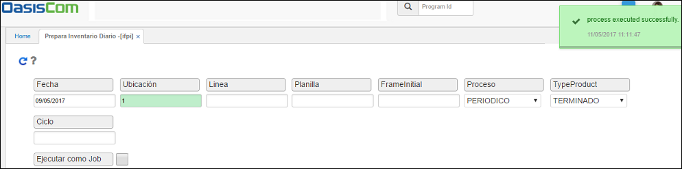  

Una vez preparado el inventario físico, el siguiente paso es el registro de conteos, para esto se presentan las opciones por la plantilla de conteos.  

**1.2.**	**Plantilla para conteo Físico IRIF**.  

En la aplicación **IRIF** se podrá descargar la planilla para conteo físico que servirá de referencia al realizar el inventario periódico, en la planilla se podrán observar los productos a los cuales se les realizará inventario de acuerdo al filtro de consulta, igualmente, cuenta con espacios en donde los usuarios podrán ingresar las cantidades de productos por cada uno que se encuentren en el inventario.  
Para consultar la planilla de conteo, filtraremos por la ubicación en donde se encuentran los productos y la fecha en la cual se realiza el inventario. Dicha ubicación y fecha deberán ser las mismas con las que se generó el inventario en la aplicación **IFPI** - **Prepara Inventario Diario**.  

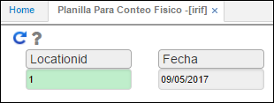  

Al consultar dando click en el botón Generar    , el sistema arrojará la planilla, la cual cuenta con tres campos (Cont 1, Cont 2, Cont 3) en los cuales los usuarios responsables de realizar el inventario ingresarán las cantidades contadas por producto. La planilla podrá ser descargada en formato de Excel, PDF o Word).  

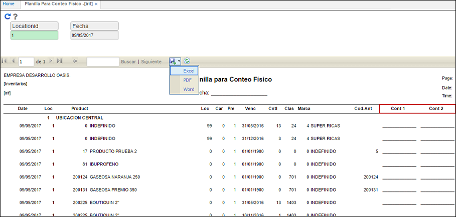  

**1.3.**	**Registro de conteos.**  

En esta aplicación se debe registrar los conteos realizados del inventario, al ingresar se debe consultar por fecha y ubicación.  

  

__
  

En el campo _Cantidad 1_ se ingresará por cada artículo el número de productos encontrados en el inventario realizado. Si el inventario lo va a realizar más de una persona, los usuarios ingresarán las cantidades en los campos Cantidad 2 y Cantidad 3. Estos datos corresponden a la información que se ingresó en la planilla descargada.  
Al ingresar un número en el campo Cantidad 1, es necesario dar click en el botón Guardar de la barra de herramientas u oprimir la tecla Enter para que el registro sea guardado.  

**1.4.**	**Calcula diferencias IFCD.**

En el proceso de calculo de diferencias el sistema toma los registros de conteos, y lo comprara con el saldo del inventario.  

Se ingresarán los datos de fecha y ubicación.  

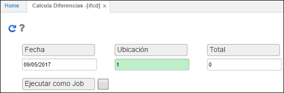  

**Fecha:** ingresar la fecha en la que se realizó el inventario físico.  
**Ubicación:** seleccionar la ubicación en la que se encuentran los productos inventariados.  
**Total:** ingresar el número 0.  

Ingresados los datos damos click en el botón Generar   y el sistema arrojará un mensaje de control informando que el proceso fue ejecutado satisfactoriamente.  

__
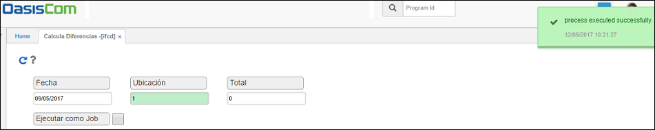  

**1.5.	Diferencias IFDI.**

Esta pantalla muestra las diferencias obtenidas entre el conteo físico y la cantidad real. Puede tenerse un sobrante (positivo) o un faltante (negativo).  

  

**1.6.	Genera Ajustes IFAJ**  

La aplicación **IFAJ,** permite generar los ajustes correspondientes al inventario realizado de acuerdo con las diferencias encontradas anteriormente al ejecutar la aplicación **IFCD**- _Calcula Diferencias_.  
Estos ajustes son generados en estado _Activo_ en la aplicación **IMOV**- _Movimiento de inventarios_, por lo cual, deben ser procesados tanto las entradas por ajuste como las salidas según corresponda.  

Para la generación de este proceso se ingresará la fecha en la cual se realizó el inventario y la ubicación donde se encuentran los artículos inventariados.  

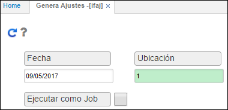  

Ingresados los datos damos click en el botón Generar    , el sistema arrojará un mensaje de control indicando que el proceso se generó satisfactoriamente.  

  

Generado el proceso, el sistema creará los documentos de ajuste en la aplicación **IMOV - Movimiento de inventarios** los cuales deben ser procesados, estos pueden ser documentos:  
* **EN - Entradas del inventario** por concepto **EA - Entrada por ajuste o documentos.**  
* **SA - Salidas del inventario por concepto SA - Salida por ajuste.**  

**2.	_ESCENARIO_2:_  _Inventario_Fisico_Movil_**.  

Para realizar el proceso de inventario físico desde la aplicación móvil, se deben realizar los siguientes pasos.  

**2.1.	Prepara Inventario Fisico IFPI.**  

Este paso es igual a la preparación del inventario físico del Escenario 1.  

**2.2.	Asignación de responsable IFIS:**  

En esta aplicación **IFIS** se deberá realizar la asignación del responsable o del usuario que va a realizar el conteo de los productos.  

  

Se puede realizar la asignación del tercero uno a uno a masivamente.  
Para hacerlo uno a uno a cada producto en el campo **ID Responsable** se debe colocar el numero de documento del tercero que va a contar ese producto.  
Para hacer la asignación del responsable masivamente se debe realizar de la siguiente manera.  

-	Se seleccionan los registros que se desean actualizar masivamente.  

  

Damos Clic en el botón de actualiza responsable.  

  

Al dar clic en este botón nos abrirá la siguiente ventana.  

  

Nos vamos a la parte inferior de esta ventana donde se encuentra el campo Responsable.  

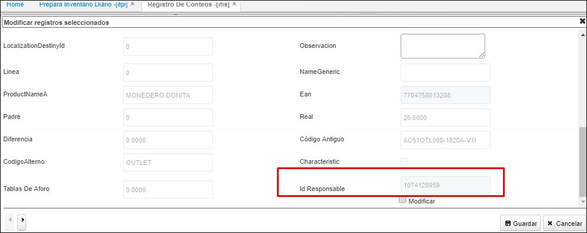  

Marcamos el Flac de modificar.  

  

Cuando lo marcamos nos habilita el campo de responsable. En este campo colocamos la cedula que queremos que actualice masivamente.  

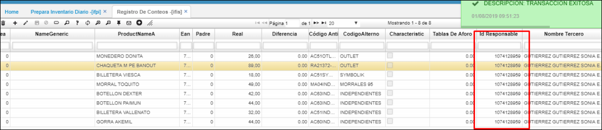  

El sistema actualiza automáticamente la cedula a ese tercero.  

En caso de que sean diferentes responsables, se deberá realizar filtros dentro de la consulta para poder asignar responsables masivamente, es decir. Un responsable contara los productos de la clasificación Morrales, y otro recurso contara los productos por clasificación Billeteras.  

Una vez asignado el responsable a cada producto podemos seguir con el siguiente paso que es realizar el conteo por medio de nuestro dispositivo Movil.  

Abrimos la aplicación en nuestro celular.  

    

* Ingresamos el nuestro usuario y clave.  

* Nos vamos a la aplicación Registro de conteos MIFIS.  

  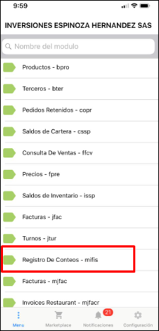  

Una vez ingresemos a esta aplicación en el campo ubicación seleccionamos la ubicación que tenemos asignada.  

 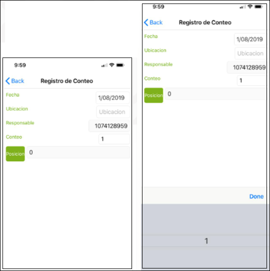  

Una vez seleccionada la ubicación el sistema en el campo Localizcion nos mostrara la localizacion a la cual nos debemos dirigir a iniciar nuestro conteo, para las ubicaciones que no manjean localizaciones dentro de la bodega nos motrara 0.  

 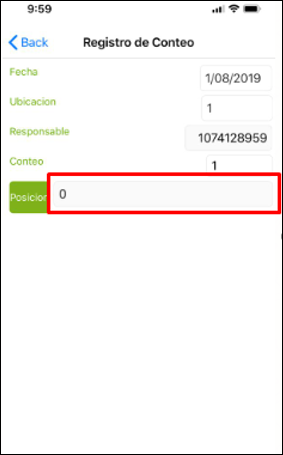  

Para continuar el sistema nos pide leer el codigo de barras de la localizacion indicada.  
Para esto debemos dac clic o tocar la pantalla de nuestro celular en el campo localizacion.  

 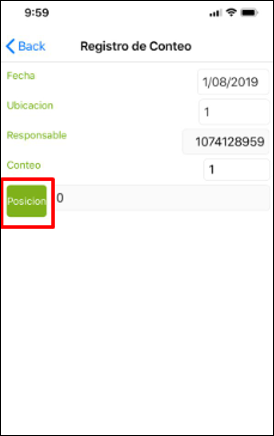  

Esto activara la camara de nuestro celular.  

Debemos leer el codigo de barras de la localizacion, para este caso nuestra localizacion es cero.  

 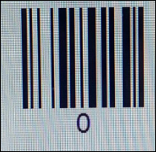  

Una vez el sistema valide la localizacion sea correcta. Mostrara el listado de productos a contar. Esto no quiere decir que estos se deban leer en el orden que el sistema muestra, se leen los productos uno a uno que se encuentren.  

   

Para inicar el conteo damos clic o tomamos la pantalla en el boton verde de producto para que nos active la camara del celular.  

   

Asi se debera realizar el conteo o lectura del codigo de barras de cada producto.  

Continuamos con los pasos ya descritos anteriomente.  

**2.3.	Calcualo de Diferencias.**  

Este paso es el mismo descrito en el primer escenario.  

**2.4.	Diferencias IFDI.**  

Este paso es el mismo descrito en el primer escenario.  

**2.5.	Genera Ajustes IFAJ.  

Este paso es el mismo descrito en el primer escenario.  

