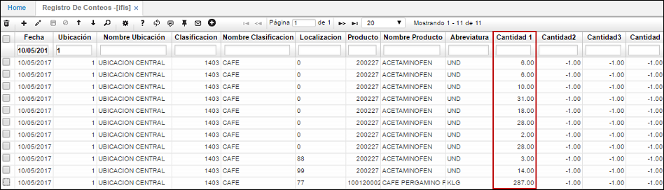

# INVENTARIO FISICO

TABLA DE CONTENIDO	2
2. ESCENARIOS	3
3. ESPECIFICACION DE ESCENARIOS	4
1.	ESCENARIO 1:  Inventario Fisico	4
1.1.	Preparación inventario.	4
1.2.	Plantilla para conteo Físico IRIF.	5
1.3.	Registro de conteos	6
1.4.	Calcula diferencias IFCD.	7
1.5.	Diferencias IFDI.	8
1.6.	Genera Ajustes IFAJ	8
2.	ESCENARIO 2:  Inventario Fisico Movil	10
2.1.	Prepara Inventario Fisico IFPI.	10
2.2.	Asignación de responsable IFIS:	10
2.3.	Calcualo de Diferencias.	19
2.4.	Diferencias IFDI	19
2.5.	Genera Ajustes IFAJ	19

***********

ESCENARIO 1	Inventario Fisico  
ESCENARIO 2	Inventario Fisico Movil  

1.	ESCENARIO 1:  Inventario Fisico  

1.1.	Preparación inventario.  

Mediante la aplicación **IFPI** se genera la preparación del inventario a realizar. Este proceso se debe ejecutar el mismo día en que se vaya a realizar el inventario.  

  

Para ejecutar el proceso de preparación de inventario periódico ingresamos los siguientes datos:  
Fecha: fecha actual en la que se va a realizar el inventario.  
Ubicación: ingresar o seleccionar del zoom la ubicación (bodega) en la cual se encuentran los productos.  
Línea: si el inventario se va a realizar por la línea de producto, ingresar la línea correspondiente.  
Proceso: seleccionar de la lista desplegable la opción Periódico.  
Tipo Producto: seleccionar de la lista desplegable la opción Terminado.  
Ingresados los datos, damos click en el botón Generar   y el sistema arrojará un mensaje indicando que el proceso se realizó satisfactoriamente.  

  

Una vez preparado el inventario físico, el siguiente paso es el registro de conteos, para esto se presentan las opciones por la plantilla de conteos.  

1.2.	**Plantilla para conteo Físico IRIF**.  

En la aplicación **IRIF** se podrá descargar la planilla para conteo físico que servirá de referencia al realizar el inventario periódico, en la planilla se podrán observar los productos a los cuales se les realizará inventario de acuerdo al filtro de consulta, igualmente, cuenta con espacios en donde los usuarios podrán ingresar las cantidades de productos por cada uno que se encuentren en el inventario.  
Para consultar la planilla de conteo, filtraremos por la ubicación en donde se encuentran los productos y la fecha en la cual se realiza el inventario. Dicha ubicación y fecha deberán ser las mismas con las que se generó el inventario en la aplicación **IFPI** - **Prepara Inventario Diario**.  

  

Al consultar dando click en el botón Generar    , el sistema arrojará la planilla, la cual cuenta con tres campos (Cont 1, Cont 2, Cont 3) en los cuales los usuarios responsables de realizar el inventario ingresarán las cantidades contadas por producto. La planilla podrá ser descargada en formato de Excel, PDF o Word).  

  

1.3.	Registro de conteos.  

En esta aplicación se debe registrar los conteos realizados del inventario, al ingresar se debe consultar por fecha y ubicación.  

  

__
  

