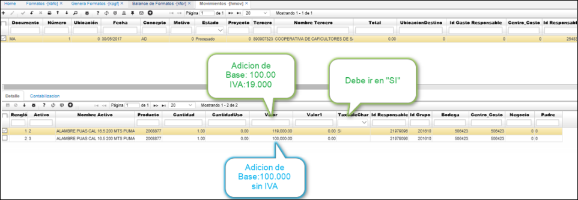
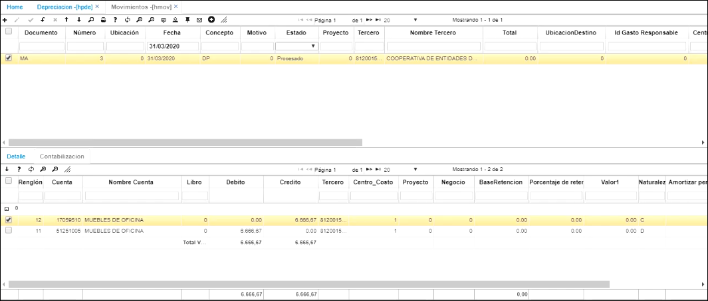

# Movimientos - HMOV

## [Manejo de IVA en Activos Fijos](http://docs.oasiscom.com/Operacion/erp/activos/hmovimient/hmov#manejo-de-iva-en-activos-fijos)

De acuerdo con la normatividad vigente el rubro cancelado por concepto de IVA en los activos fijos hace parte del valor del activo, pero también se debe tener presente dicho valor para la generación de medios magnéticos.

De acuerdo con lo anterior, OASISCOM presenta el siguiente documento que nos ayudará a entender y parametrizar el sistema para que cumpla los dos requerimientos.  

Anteriormente vimos el _Escenario 1_ en la aplicación [**OFAC - Facturas de Compra**](http://docs.oasiscom.com/Operacion/scm/compras/ofactura/ofac#manejo-de-iva-en-activos-fijos), ahora veremos el _Escenario 2_ correspondiente al ingreso de activos fijos por la aplicación HMOV.  

## Ingreso de Activo Fijo por HMOV

Para este caso utilizaremos como ejemplo los mismos activos vistos en el _Escenario 1_. Realizamos un movimiento de activos fijos por la aplicación HMOV.  

En el detalle se agregarán los dos activos, al activo 2 se le realiza una adición por valor 119.000 (incluyendo IVA) correspondiendo a la base de 100.000 más el valor del IVA 19.000, igualmente en el campo _TaxSaleChar_ debe estar seleccionada la opción **SI**.

Al activo 3 se le realizó una adición por valor de 100.000 sin IVA.  

Al procesar el documento vemos la razón. 

El sistema al igual que en la compra causa el valor del IVA en un registro aparte, pero a la cuenta del activo.  

Seguidamente, si consultamos los activos en la aplicación [**HSSP - Saldos de Activos**](http://docs.oasiscom.com/Operacion/erp/activos/hsaldo/hssp#ingreso-de-activo-fijo-por-hmov) veremos que estos se vieron aumentados en las cifras correspondientes al movimiento. (_Ver aplicación_)

Realizado el movimiento, se genera nuevamente los medios magnéticos en la aplicación [**KPGF - Genera Formatos**](http://docs.oasiscom.com/Operacion/erp/contabilidad/kproceso/kpgf#generación-de-medios-magnéticos-correspondientes-al-ingreso-de-activo-fijo-por-compras) tal como se hizo para el _escenario 1_ de ingreso de activo fijo por el módulo de Compras, luego al consultar en la aplicación [**KFOR - Balance de Formatos**](http://docs.oasiscom.com/Operacion/erp/contabilidad/kformatos/kfor#verificación-de-la-información-generada-en-los-medios-magnéticos-correspondientes-al-ingreso-de-activo-fijo-por-hmov) vemos como la información se actualiza a los nuevos valores. (_Ver KFOR - Balance de Formatos_)  

De esta manera se evidencia la parametrización que se debe realizar para que el sistema OASISCOM cause y lleve control del IVA en los Activos Fijos.  

##  Movimiento de Depreciación de un Activo fijo  

Después de ejecutar el proceso de generación de la depreciación automática en [**HPDE**](http://docs.oasiscom.com/Operacion/erp/activos/hproceso/hpde#Depreciación)  

  

**Documento:**  MA, que corresponde a Movimientos de activos fijos  
**Fecha:**  La depreciación se va a crear con la fecha del último día del mes  
**Concepto:** DP, que corresponde a depreciación  

En la parte inferior, en la pestaña detalle, nos va a traer cada uno de los activos fijos que se deben depreciar al mes de marzo (en este ejemplo), con su respectiva cuota.  Se debe realizar validación y posteriormente, procesar el documento.  

  
  

Una vez procesado, se revisa la contabilización en la pestaña Contabilización.  

  

En la parte derecha se puede filtrar el activo fijo  

  

Verificamos que acreditó a la cuenta de depreciación y debitó a la cuenta del gasto  

