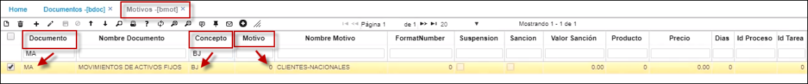
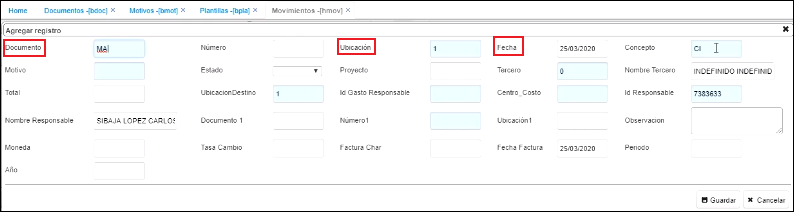
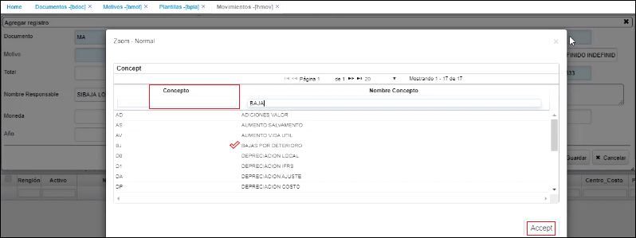
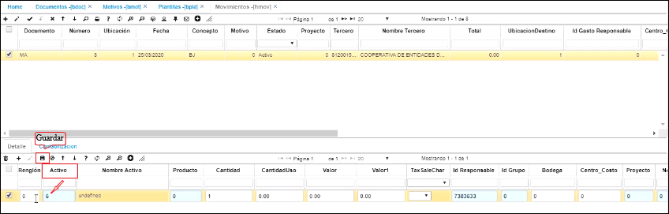
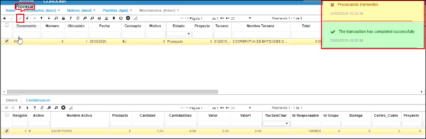
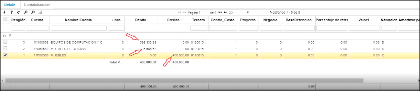

# Movimientos - HMOV  

En esta aplicación, se pueden ver las operaciones o registros que afectan los activos fijos.  

Los siguientes procesos se encuentran documentados en esta aplicación:

  * [**Manejo de IVA en Activos Fijos**](http://docs.oasiscom.com/Operacion/erp/activos/hmovimient/hmov#manejo-de-iva-en-activos-fijos)  
  * [**Ingreso de Activo Fijo por HMOV**](http://docs.oasiscom.com/Operacion/erp/activos/hmovimient/hmov#ingreso-de-activo-fijo-por-HMOV)  
  * [**Movimiento de depreciación de un activo fijo**](http://docs.oasiscom.com/Operacion/erp/activos/hmovimient/hmov#movimiento-de-depreciación-de-un-activo-fijo)  
  * [**Parametrización para movimientos de activos fijos**](http://docs.oasiscom.com/Operacion/erp/activos/hmovimient/hmov#parametrización-para-movimientos-de-activos-fijos)  
  * [**Movimientos de activos fijos**](http://docs.oasiscom.com/Operacion/erp/activos/hmovimient/hmov#movimientos-de-activos-fijos)

## [**Manejo de IVA en Activos Fijos**](http://docs.oasiscom.com/Operacion/erp/activos/hmovimient/hmov#manejo-de-iva-en-activos-fijos)

De acuerdo con la normatividad vigente el rubro cancelado por concepto de IVA en los activos fijos hace parte del valor del activo, pero también se debe tener presente dicho valor para la generación de medios magnéticos.

De acuerdo con lo anterior, OASISCOM presenta el siguiente documento que nos ayudará a entender y parametrizar el sistema para que cumpla los dos requerimientos.  

Anteriormente vimos el _Escenario 1_ en la aplicación [**OFAC - Facturas de Compra**](http://docs.oasiscom.com/Operacion/scm/compras/ofactura/ofac#manejo-de-iva-en-activos-fijos), ahora veremos el _Escenario 2_ correspondiente al ingreso de activos fijos por la aplicación HMOV.  

## [**Ingreso de Activo Fijo por HMOV**](http://docs.oasiscom.com/Operacion/erp/activos/hmovimient/hmov#ingreso-de-activo-fijo-por-HMOV)

Para este caso utilizaremos como ejemplo los mismos activos vistos en el _Escenario 1_. Realizamos un movimiento de activos fijos por la aplicación HMOV.  

En el detalle se agregarán los dos activos, al activo 2 se le realiza una adición por valor 119.000 (incluyendo IVA) correspondiendo a la base de 100.000 más el valor del IVA 19.000, igualmente en el campo _TaxSaleChar_ debe estar seleccionada la opción **SI**.

Al activo 3 se le realizó una adición por valor de 100.000 sin IVA.  

Al procesar el documento vemos la razón. 

El sistema al igual que en la compra causa el valor del IVA en un registro aparte, pero a la cuenta del activo.  

Seguidamente, si consultamos los activos en la aplicación [**HSSP - Saldos de Activos**](http://docs.oasiscom.com/Operacion/erp/activos/hsaldo/hssp#ingreso-de-activo-fijo-por-hmov) veremos que estos se vieron aumentados en las cifras correspondientes al movimiento. (_Ver aplicación_)

Realizado el movimiento, se genera nuevamente los medios magnéticos en la aplicación [**KPGF - Genera Formatos**](http://docs.oasiscom.com/Operacion/erp/contabilidad/kproceso/kpgf#generación-de-medios-magnéticos-correspondientes-al-ingreso-de-activo-fijo-por-compras) tal como se hizo para el _escenario 1_ de ingreso de activo fijo por el módulo de Compras, luego al consultar en la aplicación [**KFOR - Balance de Formatos**](http://docs.oasiscom.com/Operacion/erp/contabilidad/kformatos/kfor#verificación-de-la-información-generada-en-los-medios-magnéticos-correspondientes-al-ingreso-de-activo-fijo-por-hmov) vemos como la información se actualiza a los nuevos valores. (_Ver KFOR - Balance de Formatos_)  

De esta manera se evidencia la parametrización que se debe realizar para que el sistema OASISCOM cause y lleve control del IVA en los Activos Fijos.  

## [**Movimiento de depreciación de un activo fijo**](http://docs.oasiscom.com/Operacion/erp/activos/hmovimient/hmov#movimiento-de-depreciación-de-un-activo-fijo)  

Después de ejecutar el proceso de generación de la depreciación automática en [**HPDE**](http://docs.oasiscom.com/Operacion/erp/activos/hproceso/hpde#Depreciación)  

  

**Documento:**  MA, que corresponde a Movimientos de activos fijos  
**Fecha:**  La depreciación se va a crear con la fecha del último día del mes  
**Concepto:** DP, que corresponde a depreciación  

En la parte inferior, en la pestaña detalle, nos va a traer cada uno de los activos fijos que se deben depreciar al mes de marzo (en este ejemplo), con su respectiva cuota.  Se debe realizar validación y posteriormente, procesar el documento.  

  
  

Una vez procesado, se revisa la contabilización en la pestaña Contabilización.  

  

En la parte derecha se puede filtrar el activo fijo  

  

Verificamos que acreditó a la cuenta de depreciación y debitó a la cuenta del gasto  

  

## [**Parametrización para movimientos de activos fijos**](http://docs.oasiscom.com/Operacion/erp/activos/hmovimient/hmov#parametrización-para-movimientos-de-activos-fijos)  

Primero, se debe ingresar por la aplicación **BDOC - Documentos** y se consulta por el campo **_Documento_** **MA** que corresponde a Activos fijos  

  

En el detalle, se pueden visualizar cada uno de los conceptos que se pueden generar en el módulo, por ejemplo: aumentar el valor del activo, aumentar su vida útil, realizar una baja, entre otros.  

  

Cada uno de los activos debe tener un motivo asociado, lo cual se realiza en la aplicación **BMOT - Motivos**. Ingresamos a esta aplicación; se consulta por el campo **_Documento_** **MA** que corresponde a Movimiento de activos y en la ilustración, tomaremos como ejemplo en el campo **_Concepto_** **BA** correspondiente a Bajas y se verifica que exista su **_Motivo_**  

  

Se continúa con la aplicación **BPLA - Plantillas**, donde se le indica al sistema cómo debe contabilizar cada uno de los movimientos generados.  Se consulta en el campo **_Documento_** **MA** de Movimientos de activos, y en el ejemplo de la ilustración, vamos a utilizar en el campo **_Concepto_** **BA** de Baja de activo, en el campo **_Código_** se le dice al sistema qué código debe causar, por ejemplo, Activo fijo, depreciación, una pérdia o utilidad según corresponda, en el campo **_Cuenta_** se registra la cuenta contable siempre y cuando sea la misma para todos los activos fijos, en caso de que no, se registra 0 (cero) y en el campo **_Depende_** se le dice que depende del activo fijo;  se registra la naturaleza que corresponda y en el campo **_Obligatorio_** se dice si se deben causar esos código o no, por ejemplo, el activo ya se depreció en su totalidad y por lo tanto únicamente se debe causar la cuenta del activo fijo con su respectiva depreciación, en caso de que el activo no se haya depreciado en su totalidad, el valor restante se debe llevar a una pérdida o utilidad según corresponda y por lo tanto los campos correspondientes a utilidad o pérdida no se marcan como obligatorios  

  

## [**Movimientos de activos fijos**](http://docs.oasiscom.com/Operacion/erp/activos/hmovimient/hmov#movimientos-de-activos-fijos)  

Cuando ya se ha realizado esta parametrización, se ingresa a la aplicación **HMOV - Movimientos** en donde se realizarán cada uno de los movimientos de activos fijos.  Se adiciona un nuevo registro (+), en el campo **_Documento_** se coloca **MA** de Movimientos de activos, en los campos **_Ubicación_** y **_Fecha_** las que correspondan, en el campo **_Concepto_** haciendo doble clic, se selecciona el concepto que se requiera causar, en la ilustración se utiliza el de **BJ** que corresponde a Baja por deterioro, en el campo **_Tercero_** se selecciona el tercero que corresponda, en el campo **_Observación_** se coloca una observación si se requiere y se guarda el registro.  

  
  
  
  
  

En la parte inferior, en el detalle, adicionamos un registro (+), adicionamos el activo que al que se quiere dar de baja y se guarda el registro.  No es necesario diligenciar alguno de los campos siguientes.    

  

Posteriormente, se procesa el documento  

  

Finalmente se verifica su respectiva contabilización y efectivamente el sistema acreditó la cuenta del activo fijo, debitó la depreciación y el restante lo llevó a una cuenta del gasto de acuerdo a la parametrización realizada en la aplicación **BPLA - Plantillas**.  

  

En esta aplicación se pueden realizar los diferentes movimientos: adicionar valor, vida útil, disminuir valor, vida útil, entre otros.  Es importante conocer qué concepto se va a causar para saber cómo diligenciar el detalle, por ejemplo, en la baja, únicamente es necesario traer el activo fijo; si se va a aumentar el valor, es necesario traer el activo fijo y en el campo **_Valor_** indicar el valor que se va a adicionar; si se quiere adicionar la vida útil, en el campo **_CantidadUso_** se deben registrar los meses que se van a adicionar; lo mismo para realizar una disminución: disminución de meses o disminución de valor.  

